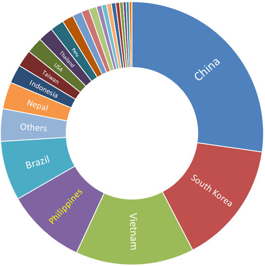
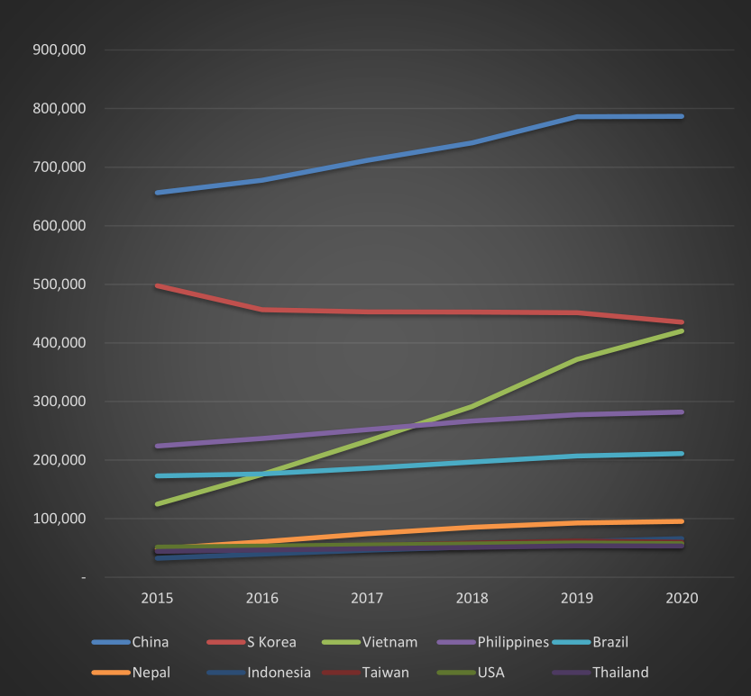
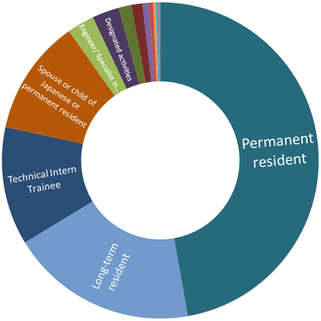
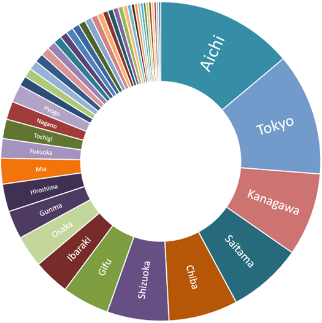
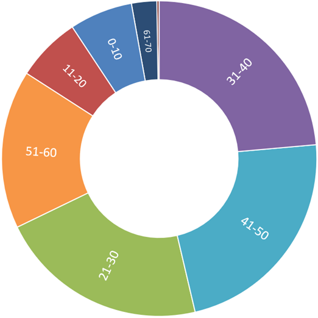
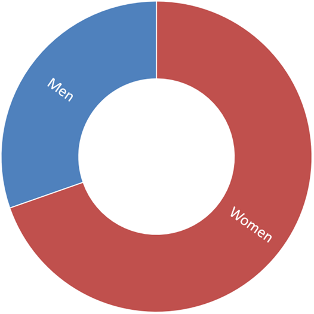

Recently I came upon this [question-and-answer](https://detail.chiebukuro.yahoo.co.jp/qa/question_detail/q1231164437) at Yahoo Japan [Chiebukuro](https://chiebukuro.yahoo.co.jp/):

>**Q: Why are there so many Filipinos in Japan?**
>
>According to the website of the Ministry of Foreign Affairs, there are about 200,000 Filipinos in Japan. Compared to about 40,000 Thais, about 25,000 Indonesians, and about 36,000 Vietnamese, I think there are a lot more Filipinos, but is there any reason for that?
>
>Is there any special exchange between Japan and the Philippines? 

>**A: During the Marcos administration**, the Philippines encouraged workers to seek employment overseas and it was common for Filipinos to have relatives who have had experience of working abroad.
>
>In the case of the Philippines, the percentage of people who can speak English is the highest in Asia, and the fact that language was not a hindrance when seeking work overseas was also the reason why Filipinos went abroad to work.
>
>Among the migrant workers at that time, most of the men worked in construction sites in the Middle East and the women worked as housekeepers in Hong Kong and Singapore. Since many housekeepers were required to be married, the overwhelming choice for young Filipino women was to go to work in Japan.
>
>In Japan, we welcomed Filipino women due to labor shortages in the hospitality industry.
>
>Filipino women who can sing and dance were recruited as *tarento* with entertainment visa and employed as entertainers while waiting on customers. Filipino women, who love singing and dancing, responded well and the number of people who wanted to work in Japan increased.
>
>The Philippine government also responded and issued entertainer certificates, and those with certificates were almost unconditionally issued a Japanese entertainer visa. Now unmarried women, about 50,000 to 60,000 each year, have been coming to Japan for more than 20 years.
>
>Besides being able to speak English, Filipinos learn Japanese quickly, so they were in great demand.
>
>Also, because many worked in the restaurant and entertainment business, they had frequent contact with Japanese people. And because many Japanese women at that time had a very choosy attitude regarding marriage, preferring highly-educated men with well-paying jobs, many Japanese men took interest with Filipino women and marriage between Japanese and Filipinos became very common. Every year, nearly 10,000 couples of Japanese men and Filipino women tie the knot.
>
>That is why there are so many Filipinos in Japan.
>
>That is also the reason why about 80% of Filipinos living in Japan are women.

This was in 2009. Whether the figures above are accurate or not, they have certainly changed drastically in the twelve years that have passed since then.

## Filipinos in Japan in 2020

According to the [latest figures](http://www.moj.go.jp/isa/policies/statistics/toukei_ichiran_touroku.html) from the [Immigration Services Agency](http://www.moj.go.jp/isa/) of Japan, there are now **282,023 Filipino citizens** residing in the country. They comprise the fourth largest foreign group, behind China (786,830), South Korea (435,459) and Vietnam (420,415).

###### **The largest groups of foreign residents in Japan**

**China** and **South Korea**, partly due to their proximity and historical ties to Japan, have always been the largest groups of foreigners in the country.

**Vietnam**, on the other hand, has largely surpassed the Philippines because of the sheer numbers of technical intern trainees that they send to the country compared to the Philippines: Vietnam's 219,501 technical intern trainees is six times the Philippines' 35,032.

In fifth place is **Brazil**, home to the largest Japanese population outside Japan. Beginning around 1980s Japanese Brazilians started coming to Japan as contract workers and many have made Japan their permanent residence ever since. There were more Brazilians in Japan than Filipinos before technical intern trainees started arriving from the Philippines.

As can be seen on the graph below, China has a significant lead over other foreigners in Japan and is still growing. South Korea keeps second place ranking, although its numbers are slowing decreasing. 

###### **Population of select groups of foreigners in Japan over time**

Vietnam comes from out of nowhere in the middle of the last decade and overtakes Brazil (2016) and the Philippines (2017) and is on course to bump South Korea from second place if stays on its present trajectory.

Meanwhile, Philippines and Brazil keep their slow and steady increase in population to occupy fourth and fifth, respectively.

Lastly, **Nepal** conspicuously manages to leave the 50,000-something pack and increase its local population although it still has not managed to break the 100,000 mark.

## Filipinos in Japan by status of residence (visa)

Of the more than 280,000 Filipinos in Japan, almost half (131,000) are **permanent residents**. Spouses and children of Japanese or former long-term visa holders make up most of this group.

###### **The largest groups of Filipinos in Japan**

**Long-term residents** (53,000), the second group, are overwhelmingly made up of *Nikkeijin*, descendants of Japanese who immigrated to the Philippines during the first half of the last century. A sizable portion of this group have become permanent residents.

**Technical intern trainees** (33,500), at third, are a relatively recent arrival. Typically holding 3-year visas, they return to the Philippines after completing their "training" at Japanese companies. The recently enacted "Specified skilled worker" visa may enable former trainees to stay much longer and may even pave the way to a permanent residence.

**Spouses and children of Japanese and permanent residents**, at fourth, have their own group. Many members of this group eventually become permanent residents. Spouses of Japanese are overwhelmingly women, a product of the entertainer visa boom mentioned in the Q&A above.

Finally, at fifth are holders of **Engineer/Specialist in humanities/International services** visa. Filipinos with this visa work in white-collar jobs, in the fields of science, technology and humanities.

**Entertainers**, ubiquitous during the last century, have virtually disappeared (or have simply become spouses of Japanese and/or permanent residents). 

## Where Filipinos in Japan live

The population of Filipinos in Japan is concentrated in metropolitan areas and centers of industrial production.

###### **Filipinos in Japan by prefecture**

**Aichi** (capital Nagoya City) takes the number one spot for the prefecture with the largest population of Filipinos. This area in central Japan is a manufacturing powerhouse, number one in the country in shipment value of manufactured goods (2018).

Toyota, the largest listed company in Japan by market capitalization, is headquartered in Aichi (in Toyota City). Other companies like Brother Industries, Denso, and Makita also have headquarters in the prefecture, while others like Fuji Heavy Industries, Mitsubishi Motors, Sony, and Volkswagen has plants in the area.

All this manufacturing activity needs workers and Filipinos, long-term residents and technical intern trainees, readily fill the demand.

The next four prefectures with the most Filipino residents, **Tokyo**, **Kanagawa**, **Saitama** and **Chiba**, are part of the Greater Tokyo Area, the most populous metropolitan area in the world.

## Filipinos in Japan: the top 50 cities

**Tokyo** (the 23 wards of central Tokyo) takes the top spot, while the nearby cities of **Yokohama** and **Kawasaki**, both in Kanagawa Prefecture but part of the same metropolitan area, take third and fourth respectively.

At second spot is **Nagoya**, capital of Aichi Prefecture and Japan's fourth largest city. Having the largest concentration of Filipinos in Japan, Aichi has 11 cities in this list, more than any other prefecture.

**Osaka**, part of the second largest metropolitan area of Japan, comes in at number five.

**Hamamatsu** in Shizuoka Prefecture, at number 6, is famous for its production of musical instruments and motorcycles. Kawai, Roland, Yamaha and Suzuki Motors have headquarters here.

Seventh and eight is **Toyohashi**, Aichi and **Kani**, Gifu. Kani borders Aichi Prefecture and both cities' local economies are dominated by the production of automotive-related components for companies like Toyota, Mitsubishi, Suzuki, and Honda.

The cities of **Chiba** in Chiba Prefecture and **Kawaguchi** in Saitama Prefecture, at ninth and tenth, are part of the Tokyo metropolitan area.

###### **Table: the top 50 Japan cities where Filipinos live**

|Rank|City, Prefecture    |Population|
|----|--------------------|----------|
|1   |Tokyo, Tokyo        | 25,541   |
|2   |Nagoya, Aichi       | 9,539    |
|3   |Yokohama, Kanagawa  | 8,695    |
|4   |Kawasaki, Kanagawa  | 4,756    |
|5   |Osaka, Osaka        | 4,299    |
|6   |Hamamatsu, Shizuoka | 4,121    |
|7   |Toyohashi, Aichi    | 4,035    |
|8   |Kani, Gifu          | 3,705    |
|9   |Chiba, Chiba        | 2,785    |
|10  |Kawaguchi, Saitama  | 2,638    |
|11  |Matsusaka, Mie      | 2,481    |
|12  |Saitama, Saitama    | 2,305    |
|13  |Minokamo, Gifu      | 2,250    |
|14  |Hiroshima, Hiroshima| 2,180    |
|15  |Gifu, Gifu          | 2,083    |
|16  |Sagamihara, Kanagawa| 2,068    |
|17  |Toyota, Aichi       | 2,016    |
|18  |Anjo, Aichi         | 1,915    |
|19  |Okazaki, Aichi      | 1,850    |
|20  |Yaizu, Shizuoka     | 1,835    |
|21  |Ichihara, Chiba     | 1,830    |
|22  |Matsudo, Chiba      | 1,795    |
|23  |Isesaki, Gunma      | 1,746    |
|24  |Fukuyama, Hiroshima | 1,701    |
|25  |Ichinomiya, Aichi   | 1,682    |
|26  |Ota, Gunma          | 1,641    |
|27  |Yokosuka, Kanagawa  | 1,638    |
|28  |Ichikawa, Chiba     | 1,570    |
|29  |Kamagori, Aichi     | 1,500    |
|30  |Komaki, Aichi       | 1,470    |
|31  |Kobe, Hyogo         | 1,447    |
|32  |Tsu, Mie            | 1,432    |
|33  |Shizuoka, Shizuoka  | 1,410    |
|34  |Nishio, Aichi       | 1,402    |
|35  |Hachioji, Tokyo     | 1,349    |
|36  |Fukuoka, Fukuoka    | 1,323    |
|37  |Funabashi, Chiba    | 1,309    |
|38  |Kasugai, Aichi      | 1,294    |
|39  |Kariya, Aichi       | 1,260    |
|40  |Iwata, Shizuoka     | 1,244    |
|41  |Kyoto, Kyoto        | 1,232    |
|42  |Joso, Ibaraki       | 1,231    |
|43  |Soka, Saitama       | 1,231    |
|44  |Kurume, Fukuoka     | 1,183    |
|45  |Numazu, Shizuoka    | 1,164    |
|46  |Onomichi, Hiroshima | 1,110    |
|47  |Maebashi, Gunma     | 1,016    |
|48  |Fuji, Shizuoka      | 1,015    |
|49  |Koshigaya, Saitama  | 1,010    |
|50  |Kashiwa, Chiba      | 1,003    |

## Filipinos in Japan by age group

In 2020, almost 30 percent of Japanese are aged 65 and above, and the rapidly aging society puts a strain on the economy and exacerbates the already chronic labor shortage. Foreign contract workers, now mostly in the form of technical intern trainees from Southeast Asia and Nepal, fill the demand for blue-collar jobs.

Not surprisingly, of the 282,000 Filipinos in Japan, 237,000 or 84% are in prime working age from 21 to 60. The age groups of 21-30 (60,600), 31-40 (66,500), and 41-50 (64,100) share almost equal portions of the population pie, while the 51-60 bracket (45,800) is not so far behind.

###### **Filipinos in Japan by age group**

## Filipinos in Japan by gender

196,400 of the 282,000 Filipinos in Japan are women, while 85,600 are men. The Filipino population in Japan is skewed in favor of women, 70% to 30%, perhaps a legacy of the visa boom of 1980s and 90s when young Filipino women came to Japan in search of work in the entertainment business, married Japanese men and eventually stayed.

###### **Filipinos in Japan by gender**

