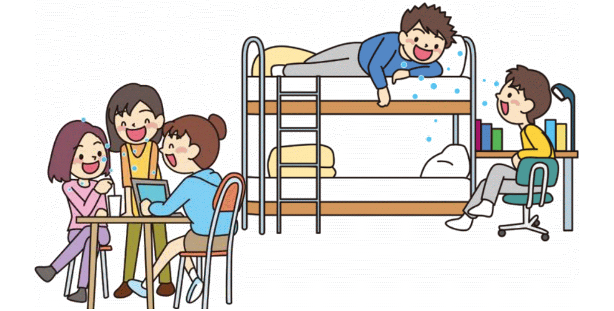
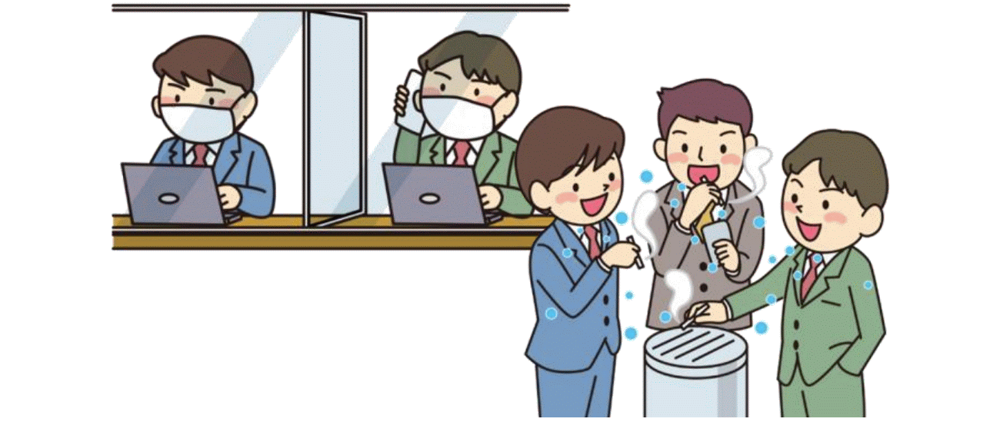

{}
Ang laman ng webpage na ito ay nilakip mula sa lathalain ng Ministry of Health, Labor and Welfare. Maaaring i-download ang PDF mula sa sumusunod na link: Nihongo, **[English](https://corona.go.jp/prevention/pdf/en.5situations.pdf)**.
{}

## Pagtitipon kung saan may alak na iniinom

- Ang pag-inom ng alak ay nagpapaganda sa mood at sa parehong oras ay nagpapababa ng atensyon. Bukod pa dito ay humihina naman ang pandinig na humahantong sa pagsasalita sa mas malakas na boses. 
- Tumataas ang panganib ng impeksyon kapag maraming tao ang nasa isang maliit ng lugar sa loob ng matagal na oras.
- Nagpapataas din ng panganib ng impeksyon ang pagbabahagi ng mga baso at chopstick.

## Mahabang oras ng pagkain sa malaking grupo ng tao

- Ang mahabang oras na pagkain, dinner reception, at pag-inom ng alak sa gabi ay nagpapataas ng panganib ng impeksyon kumpara sa maiksing oras lamang na pagkain.
- Tumataas din ang panganib ng impeksyon sa pagkain at pag-inom ng malaking grupo ng tao, kagaya ng 5 o pataas, dahil kailangang magsalita ng malakas sa loob ng grupo at mas madaling kumalat ang maliliit ng patak ng laway.

## Pag-uusap nang walang mask

- Ang malapitang pag-uusap nang walang mask ay nagpapataas ng panganib ng impeksyon mula sa virus sa hangin o micro-droplet.
- Naobserbahan na ang mga kaso ng impeksyon dulot ng walang mask sa pagtitipon ng mga tao sa karaoke booth.
- Mag-ingat sa pagbiyahe sa loob ng kotse o bus.

## Pagtira sa maliit na limitadong lugar

- Ang pagtira sa isang maliit na limitadong lugar ay nagpapataas ng panganib ng impeksyon dahil ang saradong lugar ay ginagamit ng maraming tao sa loob ng mahabang oras.
- May mga ulat ng panaghihinalaang impeksyon sa mga karaniwang lugar na kagaya ng dormitoryo at mga liguan.

## Pagpalipat-lipat ng lugar

- When you move to another location, such as when you take a break in a workplace, the risk of infection may increase due to the feeling of relaxation and changes of the environment.
- Pinaghihinalaang kaso ng impeksyon ay nakita sa mga break room, smoking area at silid palitan.

