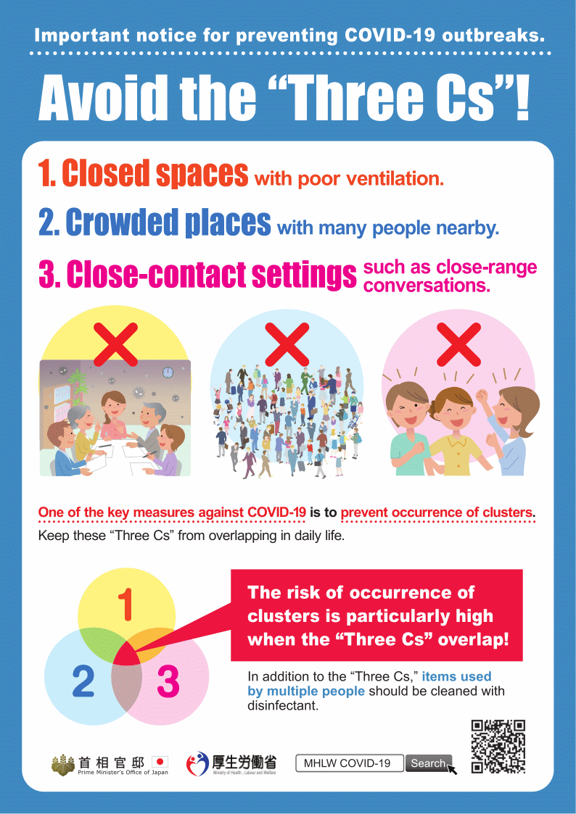

{}
**Poster mula sa Ministry of Health, Labor and Welfare** na naghihikayat sa mga mamamayan na iwasan ang:
1. Kulong na lugar na mahina ang bentilasyon;
2. Masikip na lugar na maraming tao; at
3. Sitwasyon na may malapitang kontak sa ibang tao.

Maaaring i-download ang PDF para i-print dito: **[Nihongo](https://www.mhlw.go.jp/content/10900000/000614802.pdf)**, **[English](https://www.mhlw.go.jp/content/10900000/000619576.pdf)**.
{}

