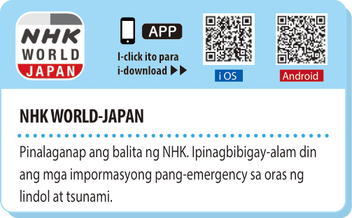

<h3 class= "-text-red"><strong>Japan Meteorological Agency</strong></h3>

Impormasyon tungkol sa sakuna (**[Nihongo](https://www.data.jma.go.jp/multi/index.html?lang=jp)**, **[English](https://www.data.jma.go.jp/multi/index.html?lang=en)**, **[Tagalog](https://www.data.jma.go.jp/multi/index.html?lang=ph)**)

<h3 class= "-text-red"><strong>Stay Safe with NHK WORLD-JAPAN</strong></h3>

Iba't-ibang serbisyo para sa kahandaan sa sakuna (**[English](https://www3.nhk.or.jp/nhkworld/en/special/staysafe/)**)

## Web apps

