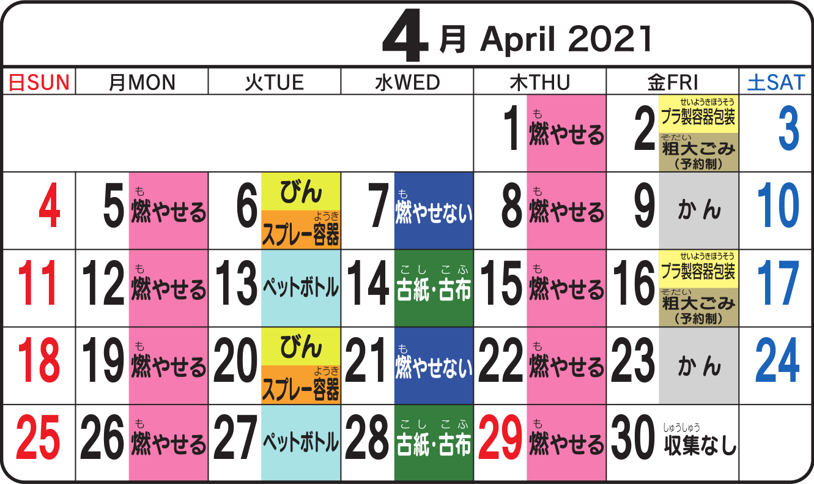

{}
**MAG-INGAT**: Kailangang ilabas ang basura nang hindi lalampas sa <strong>8:00</strong> o <strong>8:30</strong> sa umaga, depende sa lugar. Kung hindi sigurado ay ilabas ito bago mag-8:00. <strong>Huwag ilalabas ang basura sa gabi</strong> bago ang tamang araw ng tapunan dahil baka ikalat ng mga uwak at iba pang hayop.
{}

Ang city hall o munisipyo ay gumagawa ng Garbage Disposal Calendar kasama ng booklet o papel tungkol sa paghihiwalay ng basura. Karamihang binibigay ito ng real estate agent sa nangungupahan ng apartment sa oras na lilipat siya sa bahay o apartment.

Para sa matagal nang naninirahan sa isang lugar, ipinapadala naman ito direkta ng city hall o munisipyo sa tirahan.

- Sa example sa itaas ay makikita na ang pinakamadalas na tinatapon na basura ay ang **[Burnable Garbage](../kinds-of-garbage/#burnable-garbage)** (Moyaseru Gomi 燃やせるごみ). Tinatapon ito tuwing Lunes at Huwebes.

- Sa Martes naman ay sabay (pero magkahiwalay ng lalagyan) na tinatapon ang **[Bote](../kinds-of-garbage/#bottles)** (Bin びん) at Spray Container (Supurei Yōki スプレー容器) dawalang beses sa isang buwan. Ang **[PET bottles](../kinds-of-garbage/#pet-bottles)** (Pettobotoru ペットボトル) ay may sariling araw ng pagtatapon, dawalang beses din sa isang buwan.

- Sa Miyerkules ay nagpapalitan na tinatapon ang **[Non-burnable Garbage](../kinds-of-garbage/#non-burnable-garbage)** (Moyasenai Gomi 燃やせないごみ) at **[Lumang Papel](../kinds-of-garbage/#recyclable-paper)**/Lumang Damit (Koshi/Kofu 古紙・古布).

- Sa Biyernes ay sabay na tinatapon ang **[Plastic Container and Packaging](../kinds-of-garbage/#plastic-container-and-packaging)** (Purasei Yōki Hōsō プラ製容器包装) at **[Oversized Garbage](../kinds-of-garbage/#oversized-garbage)** (Sodai Gomi 粗大ごみ). (Ang pagtatapon ng Oversized Garbage ay karamihang pinapaalam mula sa garbage disposal service center.) Sa Biyernes din tinatapon ang mga **[Lata](../kinds-of-garbage/#cans)** (Kan かん).

- Sa Sabado at Linggo ay walang schedule ng pick-up ng basura.

{}
**CHECK:** Ang iba’t-ibang lungsod, bayan o kahit baranggay ay may kanya-kanyang paraan at schedule ng pagtatapon ng basura. Humingi ng Garbage Disposal Calendar sa sariling sa city hall o munisipyo (at ayon sa inyong baranggay kung may iba't-ibang collection schedule ang lugar na tinitirhan).
{}