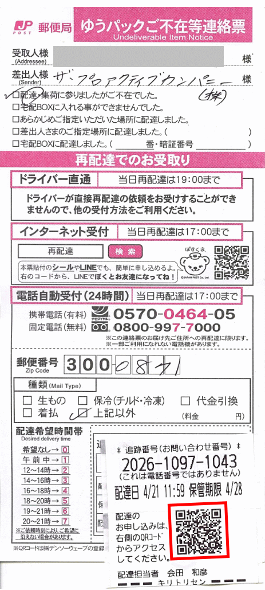
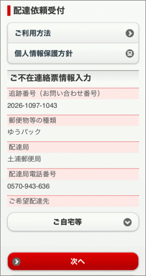
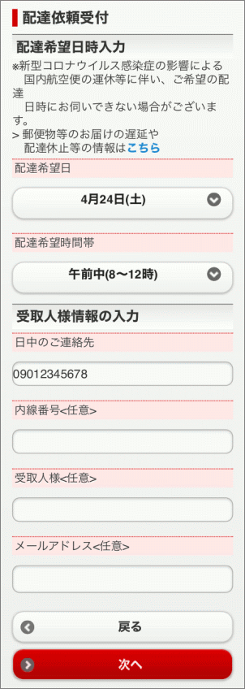
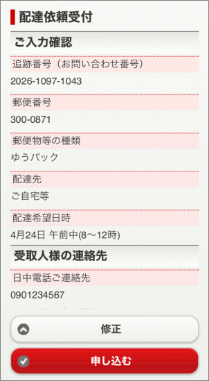
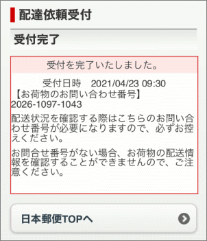
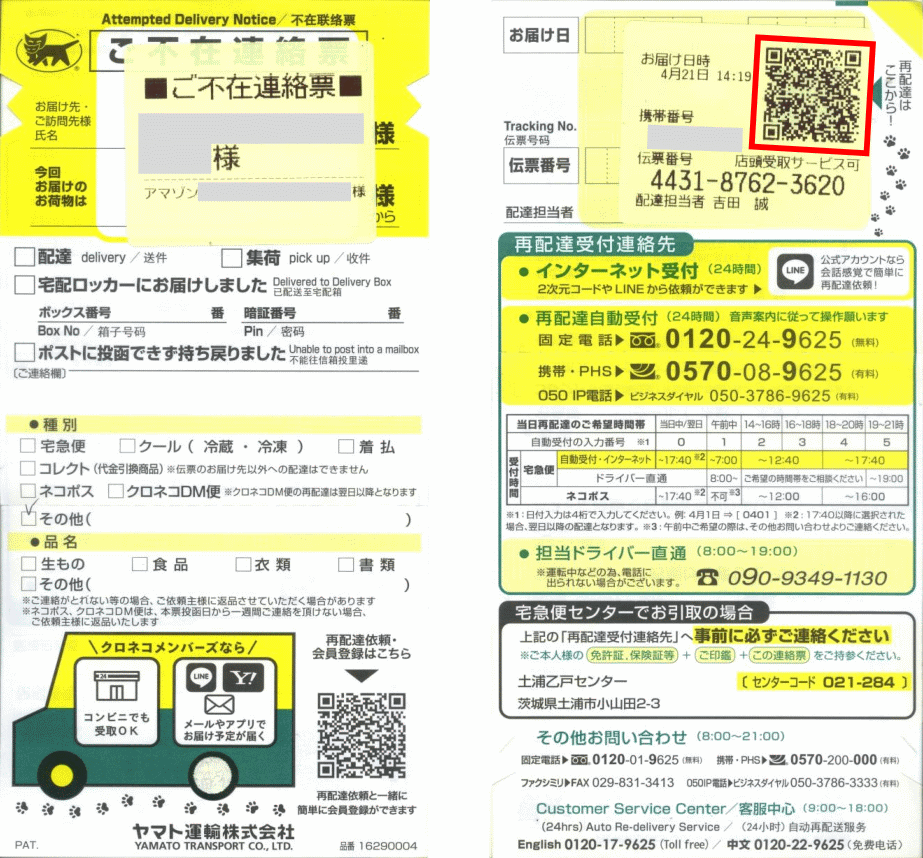

## Procedure para sa Japan Post

### Step 1: Scan QR Code of Undeliverable Item Notice

May tag na dinidikit ang delivery man sa Undeliverable Item Notice na may iba’t-ibang info. Sa example natin sa ibaba:

- Tracking No. (追跡番号 Tsuiseki Bango): 2026-1097-1043
- Delivery Date (配達日 Haitatsubi): 4/21
- Storage Limit (保管期限 Hokan Kigen): 4/28

I-scan ang **QR Code** sa ibaba nito (may pulang parisukat sa ating example) para pumunta sa re-delivery application page ng Japan Post.

### Step 2: Select delivery place

Sa re-delivery application page ng Japan Post ay i-select ang **lugar** (ご希望配達先) kung saan gustong ipa-deliver ang item. Karamihan ay nakalagay na sa **saraling tirahan** (ご自宅等) ito at hindi na kailangang baguhin.

I-click ang pulang **Next** (次へ) button.

### Step 3: Set date, time at contact number

I-set ang **araw** (配達希望日) at **oras** (配達希望時間帯) kung kailan gustong ipa-deliver ang item at i-type ang **contact number** (日中のご連絡先).

I-click ang pulang **Next** (次へ) button.

### Step 4: Confirm input information

Tsekin ang ipinasok na impormasyon.

Kung walang problema ay i-click ang pulang **Apply** (申し込み) button.

Kung may gustong baguhin ay i-click ang puting **Correction** (修正) button.

### Step 5: Finish

Natanggap na ang redelivery application. Nakalagay dito ang araw at oras na natanggap ang application, at ang tracking number.

Huwag itatapon ang Undeliverable Item Notice hanggang hindi natatanggap ang package.

## Procedure para sa Kuroneko Yamato

{}
Para sa Internet application ng re-delivery ng package na hawak ng Kuroneko Yamato ay kailangang:
- may email address
- alam ang pangalan sa *katakana*
- alam ang home address sa Nihongo
{}

### Step 1: Scan QR Code of Attempted Delivery Notice

May iba’t-ibang impormasyon ang nakalagay sa QR Code sa tag na dinikit ng delivery man sa Notice. Sa example natin sa ibaba:

- Tracking No. (追跡番号 Tsuiseki Bango): 4431-8762-3620
- Attempted Delivery Date and Time (お届け日時 Otodoke Nichiji): 4/21 14:19
- Cellphone ng Delivery Man (携帯番号 Keitai Bango): XXX-XXXX-XXXX

I-scan ang QR Code sa ibaba nito (may pulang parisukat sa ating example) para pumunta sa re-delivery application page ng Kuroneko Yamato.

### Step 2: Skip log-in for first-time user

