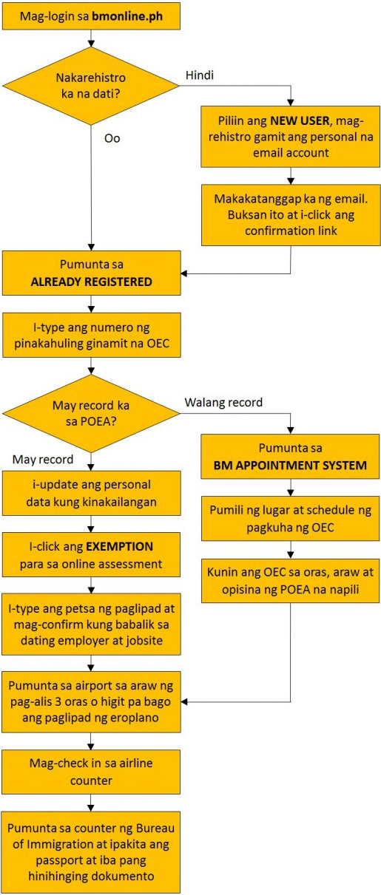

### Sino ang exempted?

Exempted sa OEC ang mga Balik-Manggagawa na babalik sa dating employer at jobsite, at may record na sa POEA database. Hindi kukuha ng OEC ang mga OFW na na-deploy ng POEA Government Placement Branch.

### Ano ang dapat gawin?

- Mag-login o mag-register sa **[bmonline.ph](http://www.bmonline.ph/)** bago pa man ang petsa ng pag-alis upang malaman kung may record o wala.

- Kung may record, i-update ito kung kinakailangan. Ito ang magiging basehan ng validation sa Bureau of Immigration sa airport sa araw ng iyong pag-alis.

### Paano ang buong proseso?

### May bayad ba ang registration?

Walang babayaran sa registration kapag exempted.

### Sino ang hindi exempted?

Kailangang kumuha at magbayad ng OEC ang mga sumusunod na Balik-Manggagawa.

- Iba na ang pupuntahang employer o jobsite
- Naka-watchlist o naka-watchlist ang employer
- Babalik sa bansang may restriction
- Undocumented workers (dating turista, dependents o students na nakakuha ng trabaho)
- Dating seaman na naging land-based workers

### Ano ang dapat gawin kung hindi exempted?

- Mag-login o mag-register sa **[bmonline.ph](http://www.bmonline.ph/)** bago pa man ang petsa ng pag-alis upang malaman kung may record o wala.

- Kung walang record ay pumunta sa BM appointment page para sa regular processing ng OEC sa napiling oras, petsa o opisina ng POEA.

### Magkano ang babayaran kung hindi exempted?

Php 100.00 ang babayaran para sa POEA processing fee.

###  Balik-Manggagawa Online Processing System website

