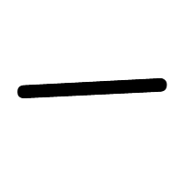

`ICHI, ITSU` `hito, hito(tsu)` [`JLPT:5`](../../jlpt/5/) [`Grade:1`](../../grade/1/) [`Strokes:1`](../../strokes/#1-stroke) `Freq:2`

{}
  Pinakasimpleng *kanji* sa lahat, isang pahalang na linya na ibig sabihin ay "isa". Ang 一 ay isa sa pinakamadalas na ginagamit na *kanji*, pangalawa lang sa [日](../日/) sa popularidad.

Ang pinagsamang 一 at 日 (一日) ay binabasa nang "ichinichi" kung ang ibig sabihin ay isang araw, pero "tsuitachi" kung ang ibig sabihin ay unang araw ng isang buwan.

Isa pang hindi pangkaraniwang reading na may 一 ay ang salitang "hitori" (一人).

Isulat ang 一 nang pataas nang kaunti at hindi tuwid na tuwid na parang dash.

{}

Paggamit


  
    1. 寿司を一口で食べます。
    2. 私はペンを一本買いました。
    3. 一番好きなバンドはスピッツです。
  
  
    1. すしを　ひとくちで　たべます。
    2. わたしは　ぺんを　いっぽん　かいました。
    3. いちばん　すきな　バンドは　スピッツです。
  
    
    1. Sushi wo hitokuchi de tabemasu.
    2. Watashi wa pen wo ippon kaimashita.
    3. Ichiban sukina bando wa Supittsu desu.
  
  
    1. Kainin nang isang subo ang sushi.
    2. Ako ay bumili ng isang ballpen.
    3. Ang pinakapaborito kong banda ay Spitz.
  


Gamit sa salita

|Nihongo|Furigana|Kahulugan|
|--------|---------|---------|
|一個|いっこ|isang bagay|
|一本|いっぽん|isang (mahabang) bagay|
|一枚|いちまい|isang (manipis na) bagay|
|一番|いちばん|una, pinaka-|
|一位|いちい|unang posisyon|
|日本一|にっぽんいち|una sa Japan|
|同一|どういち|pareho|

Paano isulat

