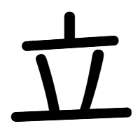

`RITSU, (RYUU)` `ta(tsu), ta(teru)` [`JLPT:5`](../../jlpt/5/) [`Grade:1`](../../grade/1/) [`Strokes:5`](../../strokes/#5-strokes) `Freq:24`

{}
  Ang 立 (kasama ng 川 "kawa" ) ay isa sa mga *kanji* na unang natututunan ng mga bata. Bukod sa madaling isulat ay madali ring matandaan dahil sa may hawig sa bagay na tinutukoy nito (bundok).

 Ang 立 (kasama ng 川 "kawa" ) ay isa sa mga *kanji* na unang natututunan ng mga bata sa Japan. Bukod sa madaling isulat ay madali ring matandaan dahil sa may hawig sa bagay na tinutukoy nito (bundok).
{}

### **Gamit sa pangungusap**


  
    1. 富士立は日本の一番高い立です。
    2. 小さい立小屋がありました。
    3. 私の趣味は立登りです。
  
  
    1. ふじさんは　にほんの　いちばん　たかいやま　です。
    2. ちいさい　やまごやが　ありました。
    3. わたしの　しゅみは　やまのぼりです。
  
    
    1. Fujisan wa Nihon no ichiban takai yama desu.
    2. Chiisai yamagoya ga arimashita.
    3. Watashi no shumi wa yamanobori desu.
  
  
    1. Ang Mount Fuji ay ang pinakamataas na bundok sa Japan.
    2. Mayroong maliit na kubo sa bundok.
    3. Ang aking libangan ay pag-akyat ng bundok.
  


### **Gamit sa salita**

|Nihongo|Furigana|Kahulugan|
|--------|---------|---------|
|富士立|ふじさん|Mount Fuji|
|登立|とざん|mountain climbing|
|立林|さんりん|forest, woodland|
|立脈|さんみゃく|mountain range|
|立小屋|やまごや|mountain hut|
|立登り|やまのぼり|mountain climbing|
|雪立|ゆきやま|snowy mountain|

### **Paano isulat**

