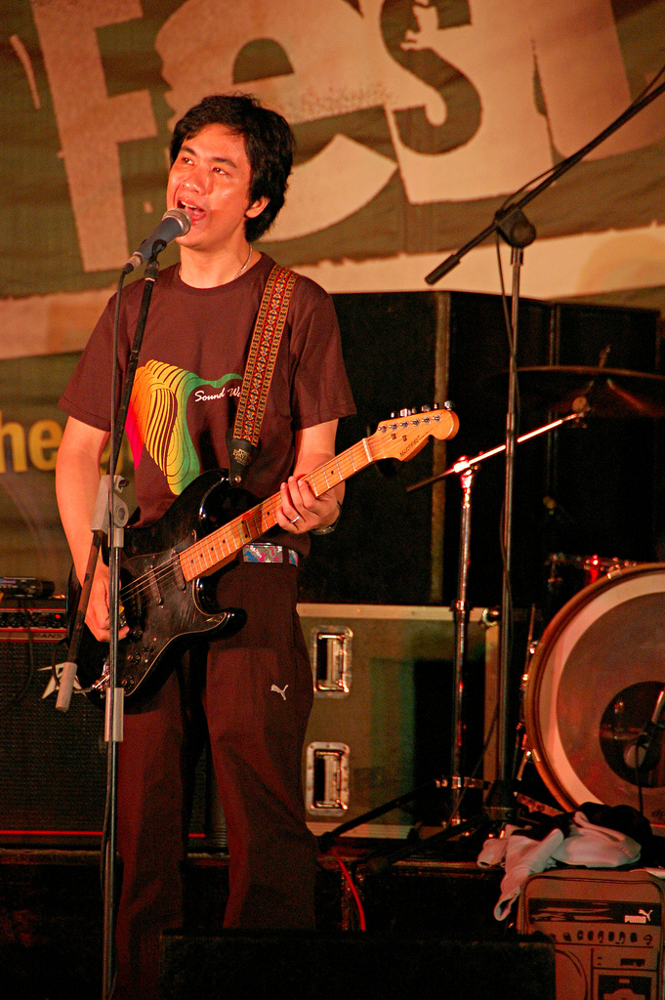

**Ely Eleandre Basiño Buendia** (born November 2, 1970), popularly known as Ely Buendia, is a Filipino musician, writer and director who gained fame as guitarist, songwriter and lead vocalist of the popular Filipino rock band [Eraserheads](../eraserheads). Widely regarded as one of the most respected music icons in the country, his compositions gained massive commercial success and universal critical acclaim, topping various music charts and leaving a legacy in Philippine popular culture. He currently performs as guitarist and lead vocalist for Apartel.

## Personal life

Buendia was born in his parents' home in Naga City at 6:20 am on November 2, 1970. He is the second child of Ely Revilla Buendia (born c. 1942 in Goa, Camarines Sur) and Lisetta Ruiz Basiño (March 22, 1942 in Caramoan, Camarines Sur – August 28, 2008 in Manila). His parents were married on October 30, 1964 in Ragay, Camarines Sur. He first learned Kundiman from his mother while he started playing the guitar at the age of 7 years old. Buendia graduated from Elementary in Pasig Catholic College in 1983 in Pasig City and High School in University of Perpetual Help Rizal. Buendia later enrolled to University of the Philippines Diliman where he formed his bands Bluidie Tryste, Sunday School and Eraserheads.

Buendia has two children, Una Aurea, with his first wife, Vicky Cayago, and Eon Drake, with Pupil co-manager Diane Ventura. He had a relationship with Andi Trinidad of Mega Magazine and reportedly also used to date TV5 news anchor and model Shawn Yao.

## Eraserheads (1989–2002)

In December 1989, Ely Buendia, [Raimund Marasigan](../raimund-marasigan), [Marcus Adoro](../marcus-adoro) and [Buddy Zabala](../buddy-zabala) formed Eraserheads in their collegiate school, the [University of the Philippines Diliman](../university-of-the-philippines-diliman), where Buendia was a Film major at the College of Mass Communications (he started his first year of college in 1987). The band found that they weren't good at covering other people's hits, so they concentrated on writing their own material instead. In 1991, Buendia explained, "After all, if we committed a mistake no one would recognize it since they don't know the song, right?" Performing their original songs live soon earned them a cult following in the University, which gradually spread outside the campus. One of the songs, a pop song entitled "Pare Ko", which Buendia wrote, became very popular, partly because of the lyrics which included a few swear words.

Eraserheads eventually signed a three-year deal with BMG Pilipinas. Their debut album *[Ultraelectromagneticpop!](../ultraelectromagneticpop)* featured Pare Ko and a host of other novelty pieces that had people listening and discovering more about the quartet. The album also brought the underground college rock scene into public awareness. 1993 saw the emergence of "Eraserheadsmania" because of successive hit singles, sold-out concerts and thousands of fans.

Buendia continued to write songs for the band, many of which became hit singles and classics. Eraserheads lasted for ten years before finally breaking up with Buendia and Adoro's departure. During those 10 years, the band produced eight studio albums along with other EPs and singles. Their gigs took them out of the country, with tours in the United States and other countries. One album, *Aloha Milkyway*, was released in the Asian region. Eraserheads were also the first ever Filipino artists to receive the "Moon Man" trophy for winning the 1997 MTV Asia Viewer's Choice Award for the video of their song, "Ang Huling El Bimbo". This hit was also written by Buendia, like many others that the band produced.

Eraserheads went onstage for their reunion concert on August 30, 2008 at the Fort Open Field, Taguig City, which was cut short unexpectedly. The continuation of the concert was held at the SM Mall of Asia Concert Grounds on March 7, 2009.

### Leaving Eraserheads

After weeks of speculation, it was confirmed that Buendia had left the band in mid-March 2002 for "reasons unknown". However, in subsequent interviews, Buendia referred to business matters as the cause of the band's break-up.

In an interview, Marasigan said he was eating in SM Megamall, a local shopping mall, when he heard of the news (how he heard of it, was not clear). He said he was "semi-surprised" and wondered if Zabala already knew about it. Adoro told of the story now famous among Eraserheads fans about Buendia's cryptic text message. He said Buendia stated in the text message that it's already time to graduate. Adoro quipped in the same interview that Buendia being the first to graduate was natural, since he was in batch 1987 in their school (UP, Diliman), while they were in batch 1988.

Zabala confesses in an interview that disbanding had not been that far away from the members' minds. He said that there were so many occasions where they could have disbanded but they did not. Adoro expressed the belief of some people that the band was getting too old and that it was "selfish" for the band to continue, likely referring to comments about how it's time for other bands besides Eraserheads to shine. The band made it clear, though, that Buendia's departure from the band wasn't in any way violent and there was no shouting (sigawan) or any confrontation.

Without giving up, the three remaining original Eraserheads decided to continue on. Within just a few weeks, the "new" Eheads debuted at Hard Rock Cafe in Makati City on April 19 featuring a female singer-guitarist, Kris Gorra-Dancel from the band, Fatal Posporos. However, after a few months, Adoro also quit the band. The remaining members of Eraserheads added Diego Mapa and Ebe Dancel to their lineup and renamed their band, "Cambio".

## 2003–present

### The Mongols

After Ely left Eraserheads, he would invite musicians and jam together. He had no definite line-up at that time, "I have, like, 10 members in the band right now. I have two drummers, two bass players..." according to Ely in an interview with Martin Nievera. This jamming together with friends would eventually evolve into The Mongols. It was composed of guitarist J. Astro (also known as Jerome Velasco) (of The Teeth), bassist Yan Yuzon, drummer Bogs "Boga Man" Jugo (of the indie pop band Daydream Cycle), and Buendia on guitars and vocals, under the stage name Jesus "Dizzy" Ventura. The band was managed by Day Cabuhat, one of Eraserheads' former managers. According to one of Eraserhead's event producers, Ely's "Jesus" stage name was from an inside joke during Eraserhead's US Tour. Ely and Marcus bought replica sheriff badges at the Universal Studios Hollywood and Ely got a badge with the name "Jesus" while Marcus' was "Cesar".

The Mongols released a self-produced underground EP in CD-R format with factory-printed sleeves in April 2003, "A Fraction of A Second". It contains five tracks, "Case Logic", "No", "Tomorrowland", "KSP" and "Abstraction of A Second". It was released under Redrum Records.

After a few months, the Mongols decided to have their self-produced album distributed by Neo Records Inc. under the major label VIVA Records. The result is a thirteen-track album called Buddha's Pest. Its tracks include "Keeper", "Bulakbol", "Bakit Nga Ba?", "Pony", "Teka Muna", "Candy Flip", "Heroine", "Wig Out", "It's Over", "Irish Spring", "Odd Even", "Your Bushido", plus an untitled instrumental track. It was produced by The Genghis Klan under Criminal Records.

### Pupil

Shortly after The Mongols' guitarist, J. Astro, left the band, the remaining members renamed their group Pupil. Buendia chanced upon the band name while reading a medical book. The band is enjoying more mainstream popularity, in contrast to the Mongols. Bogs left the band after their 1st album *Beautiful Machines*. Wendell is now the drummer of Pupil. Recently, Pupil's guitarist Yanny Yuzon also left the band in 2013. Day Cabuhat Pupil's Manager said that "Yanny is no longer. Transitions and changes are normal within any band structure and we all thank you for the understanding and continued support of all of our projects..."

### The Oktaves

The band consists of Ely Buendia as the frontman, Nitoy Adriano as the lead guitarist, Chris Padilla also in Guitars, Ivan Garcia on bass and Bobby Padilla on drums. "Nitoy Adriano is a former member of quintessential Filipino rock band The Jerks. They are the original alternative and blues band of the Philippines. Current and past members are considered icons in the local music scene," MCA Music, Inc. said. "Chris Padilla, Bobby Padilla and Ivan Garcia are actually a three piece rockabilly group called Hilera. They may be new players in the scene compared to the other two members but they have already made quite an impact by winning the Nescafe sound school competition in 2005 and by being nominated and winning various rock awards," MCA added.

How the band was formed, MCA Music, Inc. said, "The members have collaborated several times before most notably when Hilera took part in the production of Buendia's project with Francis Magalona entitled 'In Love and War'. However, the band was officially formed almost exactly a year ago when they first went onstage as "Oktaves" when they performed at the inaugural Esquire (magazine) ball." "The collaboration turned into a headlining band which now plays in the best rock venues in the country. They now have a repertoire of original songs and also perform a good number of classic rock anthems. Oktaves' brand of music is straight up rock n' roll. Their music is very relatable to various audiences of different generations. Whilst their sound is classy and sophisticated, they are also very appealing to the mainstream crowd," MCA Music Inc. said.

Their 1st album was the self-titled album The Oktaves it has 12 tracks including their 1st single "K.U.P.A.L (K.P.L)", their another single "Paakyat ka pa lang, Pababa na ako" and the song "Bungo Sa Bangin" by Ely Buendia feat. Turbogoth and Pepe Smith from the album Rock Rizal, an album tribute for José Rizal, it consist of Various Artists including Ely Buendia.

### Apartel

In 2016, Buendia launched a new band with Jay Ortega (of DRT, Gnash, Wally Gonzalez, and Tres), which is primarily focused on soul music, RnB, funk, and semblances of jazz. Buendia met Ortega during the latter's launch of his bar and cafe called Spin Cafe. The two later collaborated and started to form a group, with members and contributors Pat Sarabia (drums), Coco Coo (guitars), RJ Pineda (keyboards), Redge Concepcion (guitars), Louie Talan (bass), Carissa Ramos (bass), Deej Rodriguez (percussion), Roxy Modesto (saxophone), Wowie Ansano (trumpet), Pards Tupas (trombone), Joseph Cabañero (saxophone), Donna Sagun Señoran(harp and backup vocals), and Ramonne Rodriguez (backup vocals). Buddy Zabala (bass), Nitoy Adriano (guitars), Cooky Chua (backup vocals), Wendell Garcia (drums), and the group Bras Pas Pas Pas (horns), also shared their expertise to the band's album tracks. Entitled "Inner Play", the band's first album was released digitally on September 29, 2016. The double album 45RPM vinyl version was manufactured in Japan, and the band opted not to release in CD format due to piracy and decreasing number of CD users, which was released on November 12, 2016 at the HiFi Show, Dusit Thani Hotel. Inner Play will be released under Buendia and Ortega's own record label called Offshore Music. According to Buendia in an interview with Myx, their band name was inspired by the 1980s new wave band, The Motels. However, according to Buendia, Apartel's sound is a tribute to 1970s music, such as Stax Records, Motown, Manila Sound, APO Hiking Society, VST & Co., and Rico J. Puno. The band launched its first music video for their single "Is It Hip?" on September 17, 2016, in Victoria Court, Malate, and was directed by Marie Jamora and produced by Artikulo Uno Productions. The band also covers songs from its influences such as Sly & Family Stone's "Thank You For Talking To Me Africa". The band released Inner Play (Remixes) in 2017. Its latest album, "Full Flood", was released in 2018.

## Health

On January 7 2007, Ely Buendia suffered a heart attack or acute myocardial infarction secondary to arterial blockage. It began when Buendia complained about finding it a bit hard to breathe while they were on the way to a gig in Laguna. But he dismissed it as mere heartburn. After some time, Buendia was reportedly in the middle of a song during a gig in Calamba, Laguna when he felt a sudden pain in his chest and left arm. He was rushed to an intensive care unit at the Asian Hospital and Medical Center in Alabang, Muntinlupa. "It turns out that he'd been having a heart attack for the last twenty five hours." according to ex-eheads manager Jessica Zafra. Doctors performed an angiogram on the frontman and it confirmed the heart attack as two of his arteries were blocked. Buendia's condition was confirmed stable after an emergency angioplasty operation headed by Dr. Benjie Luna during the same night. According to Dok Sergio, "Ely is fine, successful yung surgery last night. (Last night's surgery was a success)."

The second angioplasty operation conducted on Ely Buendia on January 10, 2007 was successful and is secured from having heart attack recurrence. "The operation was a super success. He is totally out of danger and heart attack recurrence is not expected." according to Buendia's attending physician and cardiac surgeon, Dr. Wilfred Dee.

On behalf of Pupil, Ms. Day Cabuhat and Diane Ventura gave major thanks to everyone who called, visited and expressed their concerns to Buendia's condition such as fans, writers, editors, media, sponsors, networks, producers, and most especially to local musicians such as Yael Yuzon, Japs Sergio, Francis Magalona, Parokya ni Edgar, Kamikazee, Kiko Machine, Menaya, Rico Blanco, Urbandub, Buddy Zabala, Marcus Adoro and many others. Buendia was finally released from hospital and was allowed to stay home and rest by his doctors by the night of January 15, 2007. "I've got a bionic heart now," joked by Buendia.

This event prompted rap artist Francis Magalona, a longtime friend of Buendia and the other Eraserheads, to state the following in his personal blogsite: "Fast forward to right now, 9:58 am, Jan. 9, a lot of what ifs scenarios pop in my head. What if the E-heads members are back, like long-lost blood brothers? What if "the most significant OPM band of Pinoy Rock" would be in one room, what would happen?" And in postscript he adds, "Para sa akin panahon na para mag-reunite ang E-heads. Sugod na mga kapatid...rock & roll na hanggang umaga.", which roughly translates, "For me, it's time for E-Heads to reunite. Let's go brothers...rock & roll until the morning comes."

Ely's first on-stage public appearance after his heart attack was on Saturday 10 February 2007 as his band, Pupil, performed at The Music Hall in SM Mall of Asia, in an Animax event called "Love Is In The Air". The event featured a speed dating event as a welcome celebration for Valentine's Day and live performances from other local artists such as Callalily, and Amber. Pupil is also part of "Super Proxy Jam". It is an event that is hoping to spread awareness for the importance of Cardiovascular Health and for the benefit of The Heartist Foundation Inc. Francis Magalona & The Hardware Syndrome, Parokya Ni Edgar, Gloc-9, Dicta License, PiKaSO, and Dice & Mobbstar are also participants in the said event. Heartist Foundation Inc. is another collaborative effort between Ely Buendia and Francis Magalona that aims to help Filipino artists with health problems.

### Eraserheads reunion

Buendia joined Marasigan, Adoro, and Zabala for a one-night-only reunion show on August 30, 2008, at The Fort Open Grounds, In Bonifacio Global City, Taguig City. The concert, however, was cut short after Biendia collapsed due to emotional stress. They were already halfway of a planned 30-song setlist as Ely reportedly collapsed backstage during a break and was rushed to the Makati Medical Center. He was, however, reported to be in stable condition. Buddy had checked on Ely in his tent right after they went to their planned 20 minute break and saw that he already was on an oxygen mask with paramedics checking his blood pressure. As he left and came back, paramedics already took Ely on an ambulance. Bandmates Buddy, Raimund and Marcus further said that they had no idea that Ely was already having difficulty performing. Results showed that Buendia suffered from a slight attack and Hypokalemia. The doctors at Philippine Heart Center had found another blocked artery and performed angioplasty right away, which is Buendia's third since 2007. On September 5, 2008, Buendia was discharged from the hospital.

## Other works

### Literature

- Ely Buendia had a broadsheet column, entitled "CURSOR", published weekly (every Saturday) in the Entertainment Section of the *Manila Bulletin*. Some entries are "Cloning Music," "Crude Little Robots," "Biocast Entry No. 13," "A Dystopian Holiday," "Event Horizon," "The Answer," "Misguided Tours," "A Well-Documented Review," "Parking and Flying," "Soaking Up the Bar," "Mental Floss," and his final article, "A Cause for Elevation." Due to Buendia's busy musical career, CURSOR had ended and was last published during the first Saturday of September 2006.

- Ely's sci-fi short story "The Pillar" was published on the March 2009 issue of Rogue magazine, with illustrations by Arnold Arre. The Pillar will be released as a graphic novel in June 2011, with illustrations by Jason Moss, who is one of the pioneers of Adarna House.

### TV and films

- Aside from starring with Eraserheads in the movie *Run Barbi Run*, Ely played a cameo role in Rufa Mae Quinto's movie entitled *Masikip Sa Dibdib* where he was playing and singing "Keeper" by The Mongols in a live stage set with audiences going wild and enjoying the music.

- Buendia has once again showed his acting skills as he's part of Saab Magalona's short film *Spoonfeed*, it also stars Jaime Fabregas, Ccia Estocapio, and Saab Magalona herself. Ely graced the opening rites for Dekada Cinemanila on October 16, 2008. The event also marked Ely's comeback in the industry after his operation.

- A 13-minute indie film entitled *Waiting Shed* was produced by Cinemanila's Anima and Tikoy Aguiluz and was shown as part of Cinemanila's Sine Barangay. The film was directed by Ely Buendia, making it his first. *Waiting Shed* premiered with Marcus Adoro's indie film *The Artist Is In*.

- Ely Buendia was chosen by MTV Philippines as a voice actor in the Filipino version of MTV Asia's *Intersection* animated film. It is also a campaign of MTV Exit and USAID against exploitation and trafficking, which features soundtrack from Radiohead and Thievery Corporation. Other voice actors are Anne Curtis, Dingdong Dantes, Epi Quizon, and Dolly Anne Carvajal.

- He guested as "Dave", the older brother of Chris Brawner, in Manny Pacquiao's comedy sitcom, *Show Me Da Manny*. In the later part of the show, Buendia performed "Disconnection Notice" with his band Pupil. The episode was aired on September 13, 2009.

- He appeared in the Metro Manila Film Festival Best Picture *Manila Kingpin: The Asiong Salonga Story*, as well as the artist of the soundtrack. He won Best Theme Song in the recent MMFF Awards.

- He also appeared in the indie film *rakenrol* as himself.

- Ely Buendia directed the indie film entitled "Bang Bang Alley", starring Megan Young, Gabe Mercado, Jimmy Santos, Arthur Acuña, and Bela Padilla.

### Socio-Civic

- Ely also served as the Master Councilor of the Philippines branch of Order of DeMolay.[citation needed] He was initiated as one of the Charter Members of A. Mabini Chapter at Parañaque and has received the Degree of Chevalier, the highest Degree in DeMolay.[citation needed] DeMolay alumni members include Walt Disney, John Wayne, Mel Blanc, Bob Mathias, Bill Clinton, Menardo Jimenez, Neptali Gonzales II, Suharto T. Mangudadatu, Jejomar Binay, Ariel Magcalas, Rafael Salas, Joel Lamangan, Luke Mejares and Mike Orquillas. Each has spoken eloquently of the life-changing benefit gained from their involvement in DeMolay.
- Buendia is also a representative of Ako Mismo, a non-political and non-profit movement headed by KBP and PLDT which encourages self-awareness amongst citizens and the future of the Philippines. Other representatives include Edu Manzano, Luis Manzano, Maxene Magalona, Arnel Pineda, Chris Tiu, Charice Pempengco, Angel Locsin, Ramon Bautista, Efren Peñaflorida, Jr. and many others.
- Ely Buendia and Francis Magalona started the Heartist Foundation Inc., which aims to help Filipino artists with health problems and other concerns.

### Solo projects and collaborations

- Buendia had a solo project, even before leaving Eraserheads. He recorded ten tracks in his home studio, Suite 16 Studios." The album was called Wanted: Bedspacer, and it comprised the tracks "Wanted Bedspacer," "Monday Mundane," "Kakaiba," "Santo," "Over 18," "Tapos Na," "Acid Tongue," "Oras," "Shallow Breathing," and "Hotchik". The cassette version of the album has a bonus track titled "In the Midnight".
- In mid-2008, Buendia commenced a series of solo gigs. He mostly sang Eraserheads songs accompanied by indie bands or sessionists, without his band Pupil. First he had a local performance with the Oven Toaster band in the Mag:net Cafe, the Fort. Then he performed an all-Eraserheads number in Manning Bar, Sydney, Australia. Apparently, most fans have been intrigued by these events as there were no issued press releases or announcements regarding his recent solo performances. He also made a new version of "Ang Huling El Bimbo" with FILharmoniKa orchestra for Kumpas compilation, headed by Gerard Salonga, brother of Lea Salonga.
- Ely Buendia co-produced Sugar Hiccup's Oracle album with Raimund Marasigan.
- Ely Buendia and his sister, Lally Buendia wrote the songs "Black Whole", "Sucker" and "Marble" for Domino's Fair Tales album. His wife, Diane played Glockenspiel on "In Your Arms and Pedalpitch on "Provocatrice". Fair Tales was co-produced by Ely (together with his sister), and was mixed by him as well (together with Lazyboy). Domino was fronted by Lally Buendia and the album was released commercially under Viva Records in 2003.
- He composed True Faith's "Kung 'Di Rin Lang Ikaw" with lyrics by J. Bacasmas and arranged by Ron Soriano for PolyEast Records. Bacasmas is the vocals behind Ultraelectromagneticpop's "Ganjazz."
- "Magasin" which he wrote was sampled for the track "Girl On Da Magazin" by Flip-Hop group, Legit Misfitz.
- He wrote the songs "Mga Babae" and "Something Always Brings Me Back To You" sung by the female funk, R&B, rap, and soul music group, Novia under BMG Pilipinas.
- Buendia wrote a song called "Stone's Throw" for Sponge Cola's debut album Palabas.
- He also collaborated with Pinoy Rap artists in the song "Private Diane" with Francis Magalona and Death Threat. It was released under Sony Music. Buendia furthered the collaboration with rapper Beware (also of Death Threat) titled "Pag Puti ng Uwak", under the album Revenge of tha Undaground, which was released in 2007.
- He used the codename "MH Hesus" when he sang back-up vocals for Parokya Ni Edgar's "Hosanna Ngayong Pasko" Christmas song in the Jingle Balls Silent Night Holy Cow album. MH actually means Maalalahanin, it is the street somewhere in Teachers Village, Quezon City, where Ely Buendia used to live.
- Buendia also sang "Suntok Sa Buwan", an APO Hiking Society original. It was included in the OST of 2000 Viva Films movie Kailangan Ko'y Ikaw, starring Regine Velasquez and Robin Padilla.
- Buendia also collaborated with the late Francis Magalona for their new album, In Love & War, released in May 2010, with their hit single, "Higante".
- Buendia celebrated his 40th birthday with a one-off concert entitled "Ely Buendia XL (Xtra Live)" at Republiq Bar, Resorts World Manila. Aside from his main band, Pupil, guest artists performed with him, including Dope Militia, Raimund Marasigan, Hilera, Turbo Goth, Diego Mapa, Rommel Dela Cruz, Brigada and Francis Brew Reyes. "XL" is the Roman numeral of 40, as suggested by Buendia's father.
- Buendia was featured in Pete Best's Beatlefest 2010 concert held at the Aliw Theater on September 11, 2010. The concert was produced by Steve O'Neal Productions and featured Pete Best, Ramon Jacinto, Rene Garcia, Mcoy Fundales and the Glass Onion Band. Buendia sang Beatles songs such as I Feel Fine, She Said She Said, We Can Work It Out and Dear Prudence.
- In 2011, Ely Buendia contributed to Rock Ed Philippines and celebrated José Rizal's works using his song "Bungo Sa Bangin". It features Pepe Smith on drums, Kat Agarrado of Sinosikat? and Sarah Gaugler of Turbo Goth on backing vocals, Nitoy Adriano of The Jerks on lead guitar, Paolo Peralta of The Camerawalls on rhythm guitar and synths, and Niño Mesina of Afterimage on bass. Sandwich, The Dawn, Aiza Seguerra and many other OPM artists contributed to Rock Ed Philippines as well. Their works were released free and under Creative Commons license.
- Buendia collaborated with the independent band The Purplechickens for a Bob Dylan tribute night he set up. The band also appears in In Love And War where they covered the Dylan classic "It's Alright, Ma" (along with singer Radha).
- Elytistas was a short-lived endeavor band fronted by Ely Buendia with Diane Ventura on drums, Dok Sergio on bass and JP Cuison of Kiko Machine as lead guitarist. It performed mainly in saGuijo Cafe Makati and as a part of Livestock Productions. Buendia later formed another endeavor band, Ely Buendia and the Diamond Dogs, which covers David Bowie songs and other classics. It is fronted by Ely Buendia and composed of Nitoy Adriano of The Jerks and Jesse Grinter of Gaijin on guitars, Micaela Benedicto of Outerhope on keyboards, Mayo Baluyut of Revenge Avenger on bass and Wendell Garcia on drums.
- In 2011, Buendia revealed his new band called "Oktaves" under MCA Universal. Buendia's cover of La Paloma in the movie Manila Kingpin: The Asiong Salonga Story won the MMFF Award Best Original Theme Song, which later became an Oktaves song. Compared to Pupil and The Mongols, the Oktaves focuses on rock music from the 1950s to early 1970s. It is currently composed of Ely Buendia (frontman, guitars), Nitoy Adriano (lead guitars) Chris Padilla (vocals and guitars), Ivan Garcia (bass) and Bobby Padilla (drums).
- In early 2016, Buendia formed a new soul indie band called Apartel. He is the vocalist for the band alongside with Jay Ortega.
- For 2016, Buendia also had his "Greatest Hits" U.S. Tour with Nitoy Adriano, Wendell Garcia, and sessionist musicians, which was held in various venues such as Loew's Jersey Theatre, Aratani Theatre, Historic BAL Theatre, and many others.
- As part of Buendia's record label, Offshore Music, he launched a series of collaborations with the band, Itchyworms. It is under the name "Ely Buendia and the Itchyworms, and have already released two songs, "Lutang" and "Pariwara".

### Commercial projects

- As early as January 2006, there were reports that some of Pupil's fans have been hearing a new song called "Luk4 Jingle", as it was played on some radio stations and also during the ending credits video of the original episodes of Studio 23's Barkada Trip. Although due to lack of indications and confirmations from the band and related organizers that time, it was quite unclear if the song was actually from the band or was an old solo project of Ely or the vocals of the said song just sounded like Ely. Until recently, the song was finally confirmed, heard and witnessed when the band played it (titled "Text LUK4") live during the finale of DPC Yellow Pages' "Luk4 The Million – City Adventure Challenge" held on December 8, 2006 at the Metrowalk. Although Pupil plays it during live performances, the song itself was a side project of Ely's.
- Ely Buendia was included in a commercial project for San Miguel Beer's Red Horse product line, alongside various Filipino Rock icons: Basti Artadi from Wolfgang, Marc Abaya from Kjwan, Kevin Roy from Razorback, and Pepe Smith from Juan dela Cruz Band. He also became a top endorser of the Red Horse Muziklaban. During the 2007 Muziklaban, he performed "Nasaan Ka?" with Kjwan as his ad hoc band.
- Buendia is part of Coca-Cola Philippine's Coke Zero campaign with Billy Crawford and Gaby Dela Merced. The campaign was launched on SOP and is generally about the health awareness of the brand. He also participated in a similar but more formal campaign in 2008 with Quaker Oats.
- Ely Buendia was brought back together with Eraserheads bandmates Marcus Adoro, Raymund Marasigan, and Buddy Zabala to go all out for a new, complete prepaid offer of Smart Communications.

### Businesses

- Ely once co-owned 70's Bistro, Quezon City, where the famous Eraserheads piano--which was burned during their last concert The final set after the band's last song--was kept.

### On-stage equipment

- Fender Telecaster MIJ
- Fender American standard (Sunburst) Stratocaster
- Fender American Standard (Butterscotch) Telecaster
- Fender Jaguar || Dunlop M-101
- Fender Jazzmaster || Dunlop M-102
- Gibson Les Paul Custom || Dunlop M-103
- Gibson SG || Dunlop M-108
- Gretsch Electromagnetic || Dunlop M-109
- Gretsch Nashville Reissue
- Gretsch 6128
- Rickenbacker 360
- Yamaha Acoustic Guitars
- Taylor Acoustic Guitars
- Martin Acoustic Guitars
- Lumanog Guitar

## Philanthropy

Buendia is a supporter of PETA's campaign to free Mali from captivity in the Manila zoo and have her moved to Boon Lott's Elephant Sanctuary in Thailand."I am urging my fans to raise their voices to help free Mali,[She] has been lonely for more than 36 years," the 43-year-old musician thinks that "a sanctuary can give her (Mali) the kind of life that she needs and deserves." "If you can't imagine how that feels, just try to remember what you were doing in 1979. That's the last time Mali saw another elephant," Ely added. The frontman of "Pupil" and "Oktaves" hopes that "people will join me in calling for Mali's transfer to a sanctuary where she can finally be free to act like an elephant and engage in the behavior that comes naturally to her."

*Adapted from [Wikipedia](https://en.wikipedia.org), under [Creative Commons](https://en.wikipedia.org/wiki/Wikipedia:Text_of_Creative_Commons_Attribution-ShareAlike_3.0_Unported_License) license.*