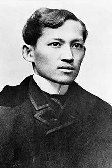

**José Protasio Rizal Mercado y Alonso Realonda** (*June 19, 1861 – December 30, 1896*) was a Filipino nationalist and polymath during the tail end of the Spanish colonial period of the Philippines. He is tagged as the national hero of the Filipino people. An ophthalmologist by profession, Rizal became a writer and a key member of the Filipino Propaganda Movement, which advocated political reforms for the colony under Spain.

He was executed by the Spanish colonial government for the crime of rebellion after the Philippine Revolution, inspired in part by his writings, broke out. Though he was not actively involved in its planning or conduct, he ultimately approved of its goals which eventually led to Philippine independence.

He is widely considered one of the greatest heroes of the Philippines and has been recommended to be so honored by an officially empaneled National Heroes Committee. However, no law, executive order or proclamation has been enacted or issued officially proclaiming any Filipino historical figure as a national hero. He was the author of the novels Noli Me Tángere and El filibusterismo, and a number of poems and essays.

## Early life

José Rizal was born in 1861 to Francisco Rizal Mercado y Alejandro and Teodora Alonso Realonda y Quintos in the town of Calamba in Laguna province. He had nine sisters and one brother. His parents were leaseholders of a hacienda and an accompanying rice farm by the Dominicans. Both their families had adopted the additional surnames of Rizal and Realonda in 1849, after Governor General Narciso Clavería y Zaldúa decreed the adoption of Spanish surnames among the Filipinos for census purposes (though they already had Spanish names).

Like many families in the Philippines, the Rizals were of mixed mestizo origin. José's patrilineal lineage could be traced back to Fujian in China through his father's ancestor Lam-Co, a Hokkien Chinese merchant who immigrated to the Philippines in the late 17th century. Lam-Co traveled to Manila from Xiamen, China, possibly to avoid the famine or plague in his home district, and more probably to escape the Manchu invasion during the Transition from Ming to Qing. He finally decided to stay in the islands as a farmer. In 1697, to escape the bitter anti-Chinese prejudice that existed in the Philippines, he converted to Catholicism, changed his name to Domingo Mercado and married the daughter of Chinese friend Augustin Chin-co. On his mother's side, Rizal's ancestry included Chinese, Japanese and Tagalog blood. His mother's lineage can be traced to the affluent Florentina family of Chinese mestizo families originating in Baliuag, Bulacan. He also had Spanish ancestry. Regina Ochoa, a grandmother of his mother, Teodora, had mixed Spanish, Chinese and Tagalog blood. His grandfather was a half Spaniard engineer named Lorenzo Alberto Alonzo.

From an early age, José showed a precocious intellect. He learned the alphabet from his mother at 3, and could read and write at age 5. Upon enrolling at the Ateneo Municipal de Manila, he dropped the last three names that made up his full name, on the advice of his brother, Paciano and the Mercado family, thus rendering his name as "José Protasio Rizal". Of this, he later wrote: "My family never paid much attention [to our second surname Rizal], but now I had to use it, thus giving me the appearance of an illegitimate child!" This was to enable him to travel freely and disassociate him from his brother, who had gained notoriety with his earlier links to Filipino priests Mariano Gomez, Jose Burgos and Jacinto Zamora (popularly known as Gomburza) who had been accused and executed for treason.

Despite the name change, José, as "Rizal", soon distinguished himself in poetry writing contests, impressing his professors with his facility with Castilian and other foreign languages, and later, in writing essays that were critical of the Spanish historical accounts of the pre-colonial Philippine societies. Indeed, by 1891, the year he finished his El filibusterismo, this second surname had become so well known that, as he writes to another friend, "All my family now carry the name Rizal instead of Mercado because the name Rizal means persecution! Good! I too want to join them and be worthy of this family name..."

## Education

Rizal first studied under Justiniano Aquino Cruz in Biñan, Laguna, before he was sent to Manila. As to his father's request, he took the entrance examination in Colegio de San Juan de Letran but he then enrolled at the Ateneo Municipal de Manila and graduated as one of the nine students in his class declared sobresaliente or outstanding. He continued his education at the Ateneo Municipal de Manila to obtain a land surveyor and assessor's degree, and at the same time at the University of Santo Tomas where he did take up a preparatory course in law and finished with a mark of excelente or excellent. He finished the course of Philosophy as a pre-law. Upon learning that his mother was going blind, he decided to switch to medicine at the medical school of Santo Tomas specializing later in ophthalmology. He received his four-year practical training in medicine at Ospital de San Juan de Dios in Intramuros. In his last year at medical school, he received a mark of sobresaliente in courses of Patologia Medica (Medical Pathology), Patología Quirúrgica (Surgical Pathology) and Obstretics.

Rizal, known for being an intelligent student, had some difficulty in some subjects in medical school such as Física (Physics) and Patología General (General Pathology). One of the causes is due to the evident discrimination of the Profesor to Filipino students.

Without his parents' knowledge and consent, but secretly supported by his brother Paciano, he traveled alone to Madrid in May 1882 and studied medicine at the Universidad Central de Madrid where he earned the degree, Licentiate in Medicine. He also attended medical lectures at the University of Paris and the University of Heidelberg. In Berlin, he was inducted as a member of the Berlin Ethnological Society and the Berlin Anthropological Society under the patronage of the famous pathologist Rudolf Virchow. Following custom, he delivered an address in German in April 1887 before the Anthropological Society on the orthography and structure of the Tagalog language. He left Heidelberg a poem, "A las flores del Heidelberg", which was both an evocation and a prayer for the welfare of his native land and the unification of common values between East and West.

At Heidelberg, the 25-year-old Rizal completed in 1887 his eye specialization under the renowned professor, Otto Becker. There he used the newly invented ophthalmoscope (invented by Hermann von Helmholtz) to later operate on his own mother's eye. From Heidelberg, Rizal wrote his parents: "I spend half of the day in the study of German and the other half, in the diseases of the eye. Twice a week, I go to the bierbrauerie, or beerhall, to speak German with my student friends." He lived in a Karlstraße boarding house then moved to Ludwigsplatz. There, he met Reverend Karl Ullmer and stayed with them in Wilhelmsfeld, where he wrote the last few chapters of Noli Me Tángere.

Rizal was a polymath, skilled in both science and the arts. He painted, sketched, and made sculptures and woodcarving. He was a prolific poet, essayist, and novelist whose most famous works were his two novels, Noli Me Tángere and its sequel, El filibusterismo. These social commentaries during the Spanish colonization of the country formed the nucleus of literature that inspired peaceful reformists and armed revolutionaries alike. Rizal was also a polyglot, conversant in twenty-two languages.

Rizal's multifacetedness was described by his German friend, Dr. Adolf Bernhard Meyer, as "stupendous." Documented studies show him to be a polymath with the ability to master various skills and subjects. He was an ophthalmologist, sculptor, painter, educator, farmer, historian, playwright and journalist. Besides poetry and creative writing, he dabbled, with varying degrees of expertise, in architecture, cartography, economics, ethnology, anthropology, sociology, dramatics, martial arts, fencing and pistol shooting. He was also a Freemason, joining Acacia Lodge No. 9 during his time in Spain and becoming a Master Mason in 1884.

## Personal life and relationships

José Rizal's life is one of the most documented of 19th century Filipinos due to the vast and extensive records written by and about him. Almost everything in his short life is recorded somewhere, being himself a regular diarist and prolific letter writer, much of the material having survived. His biographers, however, have faced difficulty in translating his writings because of Rizal's habit of switching from one language to another.

They drew largely from his travel diaries with their insights of a young Asian encountering the West for the first time. They included his later trips, home and back again to Europe through Japan and the United States, and, finally, through his self-imposed exile in Hong Kong.

Shortly after he graduated from the Ateneo Municipal de Manila (now Ateneo de Manila University), Rizal (who was then 16 years old) and a friend, Mariano Katigbak, came to visit Rizal's maternal grandmother in Tondo, Manila. Mariano brought along his sister, Segunda Katigbak, a 14-year-old Batangueña from Lipa, Batangas. It was the first time they met and Rizal described Segunda as "rather short, with eyes that were eloquent and ardent at times and languid at others, rosy–cheeked, with an enchanting and provocative smile that revealed very beautiful teeth, and the air of a sylph; her entire self diffused a mysterious charm." His grandmother's guests were mostly college students and they knew that Rizal had skills in painting. They suggested that Rizal should make a portrait of Segunda. He complied reluctantly and made a pencil sketch of her. Unfortunately for Rizal who had referred to her as his first love in his memoir Memorias de un Estudiante de Manila, Katigbak was already engaged to Manuel Luz.

From December 1891 to June 1892, Rizal lived with his family in Number 2 of Rednaxela Terrace, Mid-levels, Hong Kong Island. Rizal used 5 D'Aguilar Street, Central district, Hong Kong Island, as his ophthalmology clinic from 2 pm to 6 pm. This period of his life included his recorded affections of which nine were identified. They were Gertrude Beckett of Chalcot Crescent, Primrose Hill, Camden, London, wealthy and high-minded Nelly Boustead of the English and Iberian merchant family, last descendant of a noble Japanese family Seiko Usui (affectionately called O-Sei-san), his earlier friendship with Segunda Katigbak, Leonor Valenzuela, and eight-year romantic relationship with a distant cousin, Leonor Rivera (popularly thought to be the inspiration for the character of María Clara in Noli me tangere).

### Affair

In one recorded account detailing Rizal's 1887 visit to Prague, Maximo Viola wrote that Rizal succumbed to the temptation of a 'lady of the camellias'. Viola, a friend of Rizal's and an early financier of Noli Me Tangere, was alluding to Dumas's 1848 novel, La dame aux camelias, about a man who fell in love with a courtesan. While the affair was on record, there were no further details in Viola's letter concerning the duration and nature of the affair.

### Association with Leonor Rivera

Leonor Rivera is thought to be the inspiration for the character of María Clara in Noli Me Tángere and El Filibusterismo. Rivera and Rizal first met in Manila when Rivera was only 14 years old. When Rizal left for Europe on May 3, 1882, Rivera was 16 years of age. Their correspondence began when Rizal left a poem for Rivera saying farewell.

The correspondence between Rivera and Rizal kept him focused on his studies in Europe. They employed codes in their letters because Rivera's mother did not favor Rizal. A letter from Mariano Katigbak dated June 27, 1884, referred to Rivera as Rizal's "betrothed". Katigbak described Rivera as having been greatly affected by Rizal's departure, frequently sick because of insomnia.

When Rizal returned to the Philippines on August 5, 1887, Rivera and her family had moved back to Dagupan, Pangasinan. Rizal was forbidden by his father Francisco Mercado to see Rivera in order to avoid putting the Rivera family in danger because at the time Rizal was already labeled by the criollo elite as a filibustero or subversive because of his novel Noli Me Tángere. Rizal wanted to marry Rivera while he was still in the Philippines because of Rivera's uncomplaining fidelity. Rizal asked permission from his father one more time before his second departure from the Philippines. The meeting never happened. In 1888, Rizal stopped receiving letters from Rivera for a year, although Rizal kept sending letters to Rivera. The reason for Rivera's year of silence was the connivance between Rivera's mother and the Englishman named Henry Kipping, a railway engineer who fell in love with Rivera and was favored by Rivera's mother. The news of Leonor Rivera's marriage to Kipping devastated Rizal.

His European friends kept almost everything he gave them, including doodlings on pieces of paper. In the home of a Spanish liberal, Pedro Ortiga y Pérez, he left an impression that was to be remembered by his daughter, Consuelo. In her diary, she wrote of a day Rizal spent there and regaled them with his wit, social graces, and sleight-of-hand tricks. In London, during his research on Antonio de Morga's writings, he became a regular guest in the home of Reinhold Rost of the British Museum who referred to him as "a gem of a man." The family of Karl Ullmer, pastor of Wilhelmsfeld, and the Blumentritts saved even buttonholes and napkins with sketches and notes. They were ultimately bequeathed to the Rizal family to form a treasure trove of memorabilia.
Josephine Bracken was Rizal's common-law wife whom he reportedly married shortly before his execution.

### Relationship with Josephine Bracken

In February 1895, Rizal, 33, met Josephine Bracken, an Irish woman from Hong Kong, when she accompanied her blind adoptive father, George Taufer, to have his eyes checked by Rizal. After frequent visits, Rizal and Bracken fell in love with each other. They applied to marry but, because of Rizal's reputation from his writings and political stance, the local priest Father Obach would only hold the ceremony if Rizal could get permission from the Bishop of Cebu. He was unable to obtain an ecclesiastical marriage because he would not return to Catholicism.

After accompanying her father to Manila on her return to Hong Kong, and before heading back to Dapitan to live with Rizal, Josephine introduced herself to members of Rizal's family in Manila. His mother suggested a civil marriage, which she believed to be a lesser sacrament but less sinful to Rizal's conscience than making any sort of political retraction in order to gain permission from the Bishop. Rizal and Josephine lived as husband and wife in a common-law marriage in Talisay in Dapitan. The couple had a son who lived only for a few hours; Rizal named him after his father Francisco.

## In Brussels and Spain (1890–92)

In 1890, Rizal, 29, left Paris for Brussels as he was preparing for the publication of his annotations of Antonio de Morga's Sucesos de las Islas Filipinas (1609). He lived in the boarding house of the two Jacoby sisters, Catherina and Suzanna, who had a niece Suzanna ("Thil"), age 16. Historian Gregorio F. Zaide states that Rizal had "his romance with Suzanne Jacoby, 45, the petite niece of his landladies." Belgian Pros Slachmuylders, however, believed that Rizal had a romance with the 17-year-old niece, Suzanna Thil, as his other liaisons were all with young women. He found records clarifying their names and ages.

Rizal's Brussels stay was short-lived; he moved to Madrid, giving the young Suzanna a box of chocolates. She wrote to him in French: "After your departure, I did not take the chocolate. The box is still intact as on the day of your parting. Don’t delay too long writing us because I wear out the soles of my shoes for running to the mailbox to see if there is a letter from you. There will never be any home in which you are so loved as in that in Brussels, so, you little bad boy, hurry up and come back…" In 2007, Slachmuylders' group arranged for an historical marker honoring Rizal to be placed at the house.

He published Dimanche des Rameaux (Palm Sunday), a socio-political essay, in Berlin on 30 November 1886. He discussed the significance of Palm Sunday in socio-political terms: "This entry [of Jesus into Jerusalem] decided the fate of the jealous priests, the Pharisees, of all those who believed themselves the only ones who had the right to speak in the name of God, of those who would not admit the truths said by others because they have not been said by them. That triumph, those hosannas, all those flowers, those olive branches, were not for Jesus alone; they were the songs of the victory of the new law, they were the canticles celebrating the dignification of man, the liberty of man, the first mortal blow directed against despotism and slavery". Shortly its publication, Rizal was summoned by the German police who suspected him of being a French spy.

The content of Rizal's writings changed considerably in his two most famous novels, Noli Me Tángere, published in Berlin in 1887, and El Filibusterismo, published in Ghent in 1891. For the latter, he used funds borrowed from his friends. These writings angered both the Spanish colonial elite and many educated Filipinos due to their symbolism. They are critical of Spanish friars and the power of the Church. Rizal's friend Ferdinand Blumentritt, an Austria-Hungary-born professor and historian, wrote that the novel's characters were drawn from real life and that every episode can be repeated on any day in the Philippines.

Blumentritt was the grandson of the Imperial Treasurer at Vienna in the former Austro-Hungarian Empire and a staunch defender of the Catholic faith. This did not dissuade him from writing the preface of El filibusterismo after he had translated Noli Me Tángere into German. As Blumentritt had warned, these books resulted in Rizal's being prosecuted as the inciter of revolution. He was eventually tried by the military, convicted and executed. Teaching the natives where they stood brought about an adverse reaction, as the Philippine Revolution of 1896 took off virulently thereafter.
Leaders of the reform movement in Spain. Left to right: Rizal, del Pilar, and Ponce (c. 1890).

As leader of the reform movement of Filipino students in Spain, Rizal contributed essays, allegories, poems, and editorials to the Spanish newspaper La Solidaridad in Barcelona (in this case Rizal used a pen name, "Dimasalang", "Laong Laan" and "May Pagasa"). The core of his writings centers on liberal and progressive ideas of individual rights and freedom; specifically, rights for the Filipino people. He shared the same sentiments with members of the movement: that the Philippines is battling, in Rizal's own words, "a double-faced Goliath"—corrupt friars and bad government. His commentaries reiterate the following agenda:

- That the Philippines be made a province of Spain (The Philippines was a province of New Spain – now Mexico, administered from Mexico city from 1565 to 1821. From 1821 to 1898 it was administered directly from Spain.)
- Representation in the Cortes
- Filipino priests instead of Spanish friars – Augustinians, Dominicans, and Franciscans – in parishes and remote sitios
- Freedom of assembly and speech
- Equal rights before the law (for both Filipino and Spanish plaintiffs)

The colonial authorities in the Philippines did not favor these reforms. Such Spanish intellectuals as Morayta, Unamuno, Pi y Margall, and others did endorse them.

Wenceslao Retana, a political commentator in Spain, had slighted Rizal by writing an insulting article in La Epoca, a newspaper in Madrid. He implied that the family and friends of Rizal were evicted from their lands in Calamba for not having paid their due rents. The incident (when Rizal was ten) stemmed from an accusation that Rizal's mother, Teodora, tried to poison the wife of a cousin, but she said she was trying to help. With the approval of the Church prelates, and without a hearing, she was ordered to prison in Santa Cruz in 1871. She was made to walk the ten miles (16 km) from Calamba. She was released after two-and-a-half years of appeals to the highest court. In 1887, Rizal wrote a petition on behalf of the tenants of Calamba, and later that year led them to speak out against the friars' attempts to raise rent. They initiated a litigation which resulted in the Dominicans' evicting them from their homes, including the Rizal family. General Valeriano Weyler had the buildings on the farm torn down.

Upon reading the article, Rizal sent a representative to challenge Retana to a duel. Retana published a public apology and later became one of Rizal's biggest admirers, writing Rizal's most important biography, Vida y Escritos del José Rizal.

## Return to Philippines (1892–96)

### Exile in Dapitan

Upon his return to Manila in 1892, he formed a civic movement called La Liga Filipina. The league advocated these moderate social reforms through legal means, but was disbanded by the governor. At that time, he had already been declared an enemy of the state by the Spanish authorities because of the publication of his novel.

Rizal was implicated in the activities of the nascent rebellion and in July 1892, was deported to Dapitan in the province of Zamboanga, a peninsula of Mindanao. There he built a school, a hospital and a water supply system, and taught and engaged in farming and horticulture. Abaca, then the vital raw material for cordage and which Rizal and his students planted in the thousands, was a memorial.

The boys' school, which taught in Spanish, and included English as a foreign language (considered a prescient if unusual option then) was conceived by Rizal and antedated Gordonstoun with its aims of inculcating resourcefulness and self-sufficiency in young men. They would later enjoy successful lives as farmers and honest government officials. One, a Muslim, became a datu, and another, José Aseniero, who was with Rizal throughout the life of the school, became Governor of Zamboanga.

In Dapitan, the Jesuits mounted a great effort to secure his return to the fold led by Fray Francisco de Paula Sánchez, his former professor, who failed in his mission. The task was resumed by Fray Pastells, a prominent member of the Order. In a letter to Pastells, Rizal sails close to the deism familiar to us today.

> We are entirely in accord in admitting the existence of God. How can I doubt His when I am convinced of mine. Who so recognizes the effect recognizes the cause. To doubt God is to doubt one's own conscience, and in consequence, it would be to doubt everything; and then what is life for? Now then, my faith in God, if the result of a ratiocination may be called faith, is blind, blind in the sense of knowing nothing. I neither believe nor disbelieve the qualities which many attribute to Him; before theologians' and philosophers' definitions and lucubrations of this ineffable and inscrutable being I find myself smiling. Faced with the conviction of seeing myself confronting the supreme Problem, which confused voices seek to explain to me, I cannot but reply: ‘It could be’; but the God that I foreknow is far more grand, far more good: Plus Supra!...I believe in (revelation); but not in revelation or revelations which each religion or religions claim to possess. Examining them impartially, comparing them and scrutinizing them, one cannot avoid discerning the human 'fingernail' and the stamp of the time in which they were written... No, let us not make God in our image, poor inhabitants that we are of a distant planet lost in infinite space. However, brilliant and sublime our intelligence may be, it is scarcely more than a small spark which shines and in an instant is extinguished, and it alone can give us no idea of that blaze, that conflagration, that ocean of light. I believe in revelation, but in that living revelation which surrounds us on every side, in that voice, mighty, eternal, unceasing, incorruptible, clear, distinct, universal as is the being from whom it proceeds, in that revelation which speaks to us and penetrates us from the moment we are born until we die. What books can better reveal to us the goodness of God, His love, His providence, His eternity, His glory, His wisdom? ‘The heavens declare the glory of God, and the firmament showeth his handiwork.

His best friend, professor Ferdinand Blumentritt, kept him in touch with European friends and fellow-scientists who wrote a stream of letters which arrived in Dutch, French, German and English and which baffled the censors, delaying their transmittal. Those four years of his exile coincided with the development of the Philippine Revolution from inception and to its final breakout, which, from the viewpoint of the court which was to try him, suggested his complicity in it. He condemned the uprising, although all the members of the Katipunan had made him their honorary president and had used his name as a cry for war, unity, and liberty.

He is known to making the resolution of bearing personal sacrifice instead of the incoming revolution, believing that a peaceful stand is the best way to avoid further suffering in the country and loss of Filipino lives. In Rizal's own words, "I consider myself happy for being able to suffer a little for a cause which I believe to be sacred [...]. I believe further that in any undertaking, the more one suffers for it, the surer its success. If this be fanaticism may God pardon me, but my poor judgment does not see it as such."

In Dapitan, Rizal wrote "Haec Est Sibylla Cumana", a parlor-game for his students, with questions and answers for which a wooden top was used. In 2004, Jean Paul Verstraeten traced this book and the wooden top, as well as Rizal's personal watch, spoon and salter.

### Arrest and trial

By 1896, the rebellion fomented by the Katipunan, a militant secret society, had become a full-blown revolution, proving to be a nationwide uprising. Rizal had earlier volunteered his services as a doctor in Cuba and was given leave by Governor-General Ramón Blanco to serve in Cuba to minister to victims of yellow fever. Rizal and Josephine left Dapitan on August 1, 1896, with letter of recommendation from Blanco.

Rizal was arrested en route to Cuba via Spain and was imprisoned in Barcelona on October 6, 1896. He was sent back the same day to Manila to stand trial as he was implicated in the revolution through his association with members of the Katipunan. During the entire passage, he was unchained, no Spaniard laid a hand on him, and had many opportunities to escape but refused to do so.

While imprisoned in Fort Santiago, he issued a manifesto disavowing the current revolution in its present state and declaring that the education of Filipinos and their achievement of a national identity were prerequisites to freedom.

Rizal was tried before a court-martial for rebellion, sedition and conspiracy, and was convicted on all three charges and sentenced to death. Blanco, who was sympathetic to Rizal, had been forced out of office. The friars, led by then-Archbishop of Manila Bernardino Nozaleda had 'intercalated' Camilo de Polavieja in his stead as the new Spanish Governor-General of the Philippines after pressuring Queen-Regent Maria Cristina of Spain, thus sealing Rizal's fate.

## Execution

Moments before his execution on December 30, 1896 by a squad of Filipino soldiers of the Spanish Army, a backup force of regular Spanish Army troops stood ready to shoot the executioners should they fail to obey orders. The Spanish Army Surgeon General requested to take his pulse: it was normal. Aware of this the sergeant commanding the backup force hushed his men to silence when they began raising "vivas" with the highly partisan crowd of Peninsular and Mestizo Spaniards. His last words were those of Jesus Christ: "consummatum est" – "it is finished."

He was secretly buried in Pacò Cemetery in Manila with no identification on his grave. His sister Narcisa toured all possible gravesites and found freshly turned earth at the cemetery with guards posted at the gate. Assuming this could be the most likely spot, there never having been any ground burials, she made a gift to the caretaker to mark the site "RPJ", Rizal's initials in reverse.

His undated poem Mi último adiós, believed to have been written a few days before his execution, was hidden in an alcohol stove, which was later handed to his family with his few remaining possessions, including the final letters and his last bequests.[59]:91 During their visit, Rizal reminded his sisters in English, "There is something inside it", referring to the alcohol stove given by the Pardo de Taveras which was to be returned after his execution, thereby emphasizing the importance of the poem. This instruction was followed by another, "Look in my shoes", in which another item was secreted. Exhumation of his remains in August 1898, under American rule, revealed that he had been uncoffined, his burial was not on sanctified ground granted to the 'confessed' faithful, and whatever was in his shoes had disintegrated. He is now buried in the Rizal Monument in Manila.

In his letter to his family he wrote: "Treat our aged parents as you would wish to be treated...Love them greatly in memory of me...December 30, 1896." He gave his family instructions for his burial: "Bury me in the ground. Place a stone and a cross over it. My name, the date of my birth and of my death. Nothing more. If later you wish to surround my grave with a fence, you can do it. No anniversaries."

In his final letter, to Blumentritt – Tomorrow at 7, I shall be shot; but I am innocent of the crime of rebellion. I am going to die with a tranquil conscience. Rizal is believed to be the first Filipino revolutionary whose death is attributed entirely to his work as a writer; and through dissent and civil disobedience enabled him to successfully destroy Spain's moral primacy to rule. He also bequeathed a book personally bound by him in Dapitan to his 'best and dearest friend'. When Blumentritt received it in his hometown of Litoměřice (Leitmeritz), he broke down and wept.

Rizal's execution, as well as those of other political dissidents (mostly anarchist) in Barcelona was ultimately invoked by Michele Angiolillo, an Italian anarchist, when he assassinated Spanish Prime Minister Antonio Canovas del Castillo.

## Works and writings

Rizal wrote mostly in Spanish, the lingua franca of the Spanish East Indies, though some of his letters (for example Sa Mga Kababaihang Taga Malolos) were written in Tagalog. His works have since been translated into a number of languages including Tagalog and English.

### Novels and essays

- "El amor patrio", 1882 essay
- "Toast to Juan Luna and Felix Hidalgo", 1884 speech given at Restaurante Ingles, Madrid
- Noli Me Tángere, 1887 novel (literally Latin for 'touch me not', from John 20:17)
- Alin Mang Lahi ("Whate'er the Race"), a Kundiman attributed to Dr. José Rizal
- "Sa Mga Kababaihang Taga-Malolos" (To the Young Women of Malolos), 1889 letter
- Annotations to Antonio de Morga's Sucesos de las Islas Filipinas, 1889
- "Filipinas dentro de cien años" (The Philippines a Century Hence), 1889–90 essay
- "Sobre la indolencia de los filipinos" (The Indolence of Filipinos), 1890 essay
- "Como se gobiernan las Filipinas" (Governing the Philippine islands), 1890 essay
- El filibusterismo, 1891 novel; sequel to Noli Me Tángere
- Una visita del Señor a Filipinas, also known as Friars and Filipinos, 14-page unfinished novel written in 1889
- Memorias de un Gallo, 2-page unfinished satire
- Makamisa, unfinished Tagalog-language novel written in 1892

### Poetry

- "Felicitación" (1874/75)
- "El embarque" (The Embarkation, 1875)
- "Por la educación recibe lustre la patria" (1876)
- "Un recuerdo á mi pueblo" (1876)
- "Al niño Jesús" (c. 1876)
- "A la juventud filipina" (To the Philippine Youth, 1879)
- "¡Me piden versos!" (1882)
- "Canto de María Clara" (from Noli Me Tángere, 1887)
- "Himno al trabajo" (Dalit sa Paggawa, 1888)
- "Kundiman" (disputed, 1889) - also attributed to Pedro Paterno
- "A mi musa" (To My Muse, 1890)
- "El canto del viajero" (1892–96)
- "Mi retiro" (1895)
- "Mi último adiós" (1896)
- "Mi primera inspiracion" (disputed) - also attributed to Antonio Lopez, Rizal's nephew

### Plays

- El Consejo de los Dioses (The Council of Gods)
- Junto al Pasig (Along the Pasig)
- San Euistaquio, Mártyr (Saint Eustache, the martyr)

### Other works

Rizal also tried his hand at painting and sculpture. His most famous sculptural work was "The Triumph of Science over Death", a clay sculpture of a naked young woman with overflowing hair, standing on a skull while bearing a torch held high. The woman symbolized the ignorance of humankind during the Dark Ages, while the torch she bore symbolized the enlightenment science brings over the whole world. He sent the sculpture as a gift to his dear friend Ferdinand Blumentritt, together with another one named "The Triumph of Death over Life".

The woman is shown trampling the skull, a symbol of death, to signify the victory the humankind achieved by conquering the bane of death through their scientific advancements. The original sculpture is now displayed at the Rizal Shrine Museum at Fort Santiago in Intramuros, Manila. A large replica, made of concrete, stands in front of Fernando Calderón Hall, the building which houses the College of Medicine of the University of the Philippines Manila along Pedro Gil Street in Ermita, Manila.

## Reactions after death

### Retraction controversy

Several historians report that Rizal retracted his anti-Catholic ideas through a document which stated: "I retract with all my heart whatever in my words, writings, publications and conduct have been contrary to my character as a son of the Catholic Church." However, there are doubts of its authenticity given that there is no certificate of Rizal's Catholic marriage to Josephine Bracken. Also there is an allegation that the retraction document was a forgery.

After analyzing six major documents of Rizal, Ricardo Pascual concluded that the retraction document, said to have been discovered in 1935, was not in Rizal's handwriting. Senator Rafael Palma, a former President of the University of the Philippines and a prominent Mason, argued that a retraction is not in keeping with Rizal's character and mature beliefs. He called the retraction story a "pious fraud." Others who deny the retraction are Frank Laubach, a Protestant minister; Austin Coates, a British writer; and Ricardo Manapat, director of the National Archives.

Those who affirm the authenticity of Rizal's retraction are prominent Philippine historians such as Nick Joaquin, Nicolas Zafra of UP León María Guerrero III, Gregorio Zaide, Guillermo Gómez Rivera, Ambeth Ocampo, John Schumacher, Antonio Molina, Paul Dumol and Austin Craig. They take the retraction document as authentic, having been judged as such by a foremost expert on the writings of Rizal, Teodoro Kalaw (a 33rd degree Mason) and "handwriting experts...known and recognized in our courts of justice", H. Otley Beyer and Dr. José I. Del Rosario, both of UP.

Historians also refer to 11 eyewitnesses when Rizal wrote his retraction, signed a Catholic prayer book, and recited Catholic prayers, and the multitude who saw him kiss the crucifix before his execution. A great grand nephew of Rizal, Fr. Marciano Guzman, cites that Rizal's 4 confessions were certified by 5 eyewitnesses, 10 qualified witnesses, 7 newspapers, and 12 historians and writers including Aglipayan bishops, Masons and anti-clericals. One witness was the head of the Spanish Supreme Court at the time of his notarized declaration and was highly esteemed by Rizal for his integrity.

Because of what he sees as the strength these direct evidence have in the light of the historical method, in contrast with merely circumstantial evidence, UP professor emeritus of history Nicolas Zafra called the retraction "a plain unadorned fact of history." Guzmán attributes the denial of retraction to "the blatant disbelief and stubbornness" of some Masons. To explain the retraction Guzman said that the factors are the long discussion and debate which appealed to reason and logic that he had with Fr. Balaguer, the visits of his mentors and friends from the Ateneo, and the grace of God due the numerous prayers of religious communities.

Supporters see in the retraction Rizal's "moral courage...to recognize his mistakes," his reversion to the "true faith", and thus his "unfading glory," and a return to the "ideals of his fathers" which "did not diminish his stature as a great patriot; on the contrary, it increased that stature to greatness." On the other hand, senator Jose Diokno stated, "Surely whether Rizal died as a Catholic or an apostate adds or detracts nothing from his greatness as a Filipino... Catholic or Mason, Rizal is still Rizal – the hero who courted death 'to prove to those who deny our patriotism that we know how to die for our duty and our beliefs'."

## "Mi último adiós"

The poem is more aptly titled "Adiós, Patria Adorada" (literally "Farewell, Beloved Fatherland"), by virtue of logic and literary tradition, the words coming from the first line of the poem itself. It first appeared in print not in Manila but in Hong Kong in 1897, when a copy of the poem and an accompanying photograph came to J. P. Braga who decided to publish it in a monthly journal he edited. There was a delay when Braga, who greatly admired Rizal, wanted a good facsimile of the photograph and sent it to be engraved in London, a process taking well over two months. It finally appeared under "Mi último pensamiento," a title he supplied and by which it was known for a few years. Thus, the Jesuit Balaguer's anonymous account of the retraction and the marriage to Josephine was published in Barcelona before word of the poem's existence had reached him and he could revise what he had written. His account was too elaborate for Rizal to have had time to write "Adiós."

Six years after his death, when the Philippine Organic Act of 1902 was being debated in the United States Congress, Representative Henry Cooper of Wisconsin rendered an English translation of Rizal's valedictory poem capped by the peroration, "Under what clime or what skies has tyranny claimed a nobler victim?" Subsequently, the US Congress passed the bill into law, which is now known as the Philippine Organic Act of 1902.

This was a major breakthrough for a U.S. Congress that had yet to grant the equal rights to African Americans guaranteed to them in the U.S. Constitution and at a time the Chinese Exclusion Act was still in effect. It created the Philippine legislature, appointed two Filipino delegates to the U.S. Congress, extended the U.S. Bill of Rights to Filipinos and laid the foundation for an autonomous government. The colony was on its way to independence. The United States passed the Jones Law that made the legislature fully autonomous until 1916 but did not recognize Philippine independence until the Treaty of Manila in 1946—fifty years after Rizal's death. This same poem, which has inspired independence activists across the region and beyond, was recited (in its Indonesian translation by Rosihan Anwar) by Indonesian soldiers of independence before going into battle.

### Later life of Bracken

Josephine Bracken, whom Rizal addressed as his wife on his last day, promptly joined the revolutionary forces in Cavite province, making her way through thicket and mud across enemy lines, and helped reloading spent cartridges at the arsenal in Imus under the revolutionary General Pantaleón García. Imus came under threat of recapture that the operation was moved, with Bracken, to Maragondon, the mountain redoubt in Cavite.

She witnessed the Tejeros Convention prior to returning to Manila and was summoned by the Governor-General, but owing to her stepfather's American citizenship she could not be forcibly deported. She left voluntarily returning to Hong Kong. She later married another Filipino, Vicente Abad, a mestizo acting as agent for the Tabacalera firm in the Philippines. She died of tuberculosis in Hong Kong on March 15, 1902, and was buried at the Happy Valley Cemetery. She was immortalized by Rizal in the last stanza of Mi Ultimo Adios: "Farewell, sweet stranger, my friend, my joy...".

### Polavieja and Blanco

Polavieja faced condemnation by his countrymen after his return to Spain. While visiting Girona, in Catalonia, circulars were distributed among the crowd bearing Rizal's last verses, his portrait, and the charge that Polavieja was responsible for the loss of the Philippines to Spain. Ramon Blanco later presented his sash and sword to the Rizal family as an apology.

## Criticism and controversies

Attempts to debunk legends surrounding Rizal, and the tug of war between free thinker and Catholic, have kept his legacy controversial.

### National hero status

The confusion over Rizal's real stance on the Philippine Revolution leads to the sometimes bitter question of his ranking as the nation's premier hero. But then again, according to the National Historical Commission of the Philippines (NHCP) Section Chief Teodoro Atienza, and Filipino historian Ambeth Ocampo, there is no Filipino historical figure, including Rizal, that was officially declared as national hero through law or executive order. Although, there were laws and proclamations honoring Filipino heroes.

#### Made national hero by colonial Americans

Some suggest that Jose Rizal was made a legislated national hero by the American forces occupying the Philippines. In 1901, the American Governor General William Howard Taft suggested that the U.S. sponsored Philippine Commission name Rizal a national hero for Filipinos. Jose Rizal was an ideal candidate, favourable to the American occupiers since he was dead, and non-violent, a favourable quality which, if emulated by Filipinos, would not threaten the American rule or change the status quo of the occupiers of the Philippine islands. Rizal did not advocate independence for the Philippines either. Subsequently, the US-sponsored commission passed Act No. 346 which set the anniversary of Rizal's death as a “day of observance.”

Renato Constantino writes Rizal is a "United States-sponsored hero" who was promoted as the greatest Filipino hero during the American colonial period of the Philippines – after Aguinaldo lost the Philippine–American War. The United States promoted Rizal, who represented peaceful political advocacy (in fact, repudiation of violent means in general) instead of more radical figures whose ideas could inspire resistance against American rule. Rizal was selected over Andrés Bonifacio who was viewed "too radical" and Apolinario Mabini who was considered "unregenerate."

#### Made national hero by Emilio Aguinaldo

On the other hand, numerous sources quote that it was General Emilio Aguinaldo, and not the second Philippine Commission, who first recognized December 30 as "national day of mourning in memory of Rizal and other victims of Spanish tyranny. As per them, the first celebration of Rizal Day was held in Manila on December 30, 1898, under the sponsorship of the Club Filipino.

The veracity of both claims seems to be justified and hence difficult to ascertain. However, most historians agree that a majority of Filipinos were unaware of Rizal during his lifetime, as he was a member of the richer elite classes (he was born in an affluent family, had lived abroad for nearly as long as he had lived in the Philippines) and wrote primarily in an elite language (at that time, Tagalog and Cebuano were the languages of the masses) about ideals as lofty as freedom (the masses were more concerned about day to day issues like earning money and making a living, something which has not changed much today).

Teodoro Agoncillo opines that the Philippine national hero, unlike those of other countries, is not "the leader of its liberation forces". He gives the opinion that Andrés Bonifacio not replace Rizal as national hero, like some have suggested, but that be honored alongside him.

Constantino's analysis has been criticised for its polemicism and inaccuracies regarding Rizal. The historian Rafael Palma, contends that the revolution of Bonifacio is a consequence wrought by the writings of Rizal and that although the Bonifacio's revolver produced an immediate outcome, the pen of Rizal generated a more lasting achievement.

### Critiques of books

Others present him as a man of contradictions. Miguel de Unamuno in "Rizal: the Tagalog Hamlet", said of him, “a soul that dreads the revolution although deep down desires it. He pivots between fear and hope, between faith and despair.” His critics assert this character flaw is translated into his two novels where he opposes violence in Noli and appears to advocate it in Fili, contrasting Ibarra's idealism to Simoun's cynicism. His defenders insist this ambivalence is trounced when Simoun is struck down in the sequel's final chapters, reaffirming the author's resolute stance, Pure and spotless must the victim be if the sacrifice is to be acceptable.

Many thinkers tend to find the characters of María Clara and Ibarra (Noli Me Tángere) poor role models, María Clara being too frail, and young Ibarra being too accepting of circumstances, rather than being courageous and bold.

In El Filibusterismo, Rizal had Father Florentino say: “...our liberty will (not) be secured at the sword's point...we must secure it by making ourselves worthy of it. And when a people reaches that height God will provide a weapon, the idols will be shattered, tyranny will crumble like a house of cards and liberty will shine out like the first dawn.” Rizal's attitude to the Philippine Revolution is also debated, not only based on his own writings, but also due to the varying eyewitness accounts of Pío Valenzuela, a doctor who in 1895 had consulted Rizal in Dapitan on behalf of Bonifacio and the Katipunan.

### Role in the Philippine revolution

Upon the outbreak of the Philippine Revolution in 1896, Valenzuela surrendered to the Spanish authorities and testified in military court that Rizal had strongly condemned an armed struggle for independence when Valenzuela asked for his support. Rizal had even refused him entry to his house. Bonifacio, in turn, had openly denounced him as a coward for his refusal.

However, years later, Valenzuela testified that Rizal had been favorable to an uprising as long as the Filipinos were well-prepared, and well-supplied with arms. Rizal had suggested that the Katipunan get wealthy and influential Filipino members of society on their side, or at least ensure they would stay neutral. Rizal had even suggested his friend Antonio Luna to lead the revolutionary forces since he had studied military science. In the event that the Katipunan was discovered prematurely, they should fight rather than allow themselves to be killed. Valenzuela said to historian Teodoro Agoncillo that he had lied to the Spanish military authorities about Rizal's true stance toward a revolution in an attempt to exculpate him.

Before his execution, Rizal wrote a proclamation denouncing the revolution. But as noted by historian Floro Quibuyen, his final poem Mi ultimo adios contains a stanza which equates his coming execution and the rebels then dying in battle as fundamentally the same, as both are dying for their country.

## Legacy and remembrance

Rizal was a contemporary of Gandhi, Tagore and Sun Yat Sen who also advocated liberty through peaceful means rather than by violent revolution. Coinciding with the appearance of those other leaders, Rizal from an early age had been enunciating in poems, tracts and plays, ideas all his own of modern nationhood as a practical possibility in Asia. In the Noli he stated that if European civilization had nothing better to offer, colonialism in Asia was doomed.

Though popularly mentioned, especially on blogs, there is no evidence to suggest that Gandhi or Nehru may have corresponded with Rizal, neither have they mentioned him in any of their memoirs or letters. But it was documented by Rizal's biographer, Austin Coates who interviewed Jawaharlal Nehru and Gandhi that Rizal was mentioned, specifically in Nehru's prison letters to his daughter Indira.

As a political figure, José Rizal was the founder of La Liga Filipina, a civic organization that subsequently gave birth to the Katipunan led by Andrés Bonifacio, a secret society which would start the Philippine Revolution against Spain that eventually laid the foundation of the First Philippine Republic under Emilio Aguinaldo. He was a proponent of achieving Philippine self-government peacefully through institutional reform rather than through violent revolution, and would only support "violent means" as a last resort. Rizal believed that the only justification for national liberation and self-government was the restoration of the dignity of the people, saying "Why independence, if the slaves of today will be the tyrants of tomorrow?" However, through careful examination of his works and statements, including Mi Ultimo Adios, Rizal reveals himself as a revolutionary. His image as the Tagalog Christ also intensified early reverence to him.

Rizal, through his reading of Morga and other western historians, knew of the genial image of Spain's early relations with his people. In his writings, he showed the disparity between the early colonialists and those of his day, with the latter's injustices giving rise to Gomburza and the Philippine Revolution of 1896. The English biographer, Austin Coates, and writer, Benedict Anderson, believe that Rizal gave the Philippine revolution a genuinely national character; and that Rizal's patriotism and his standing as one of Asia's first intellectuals have inspired others of the importance of a national identity to nation-building.

The Belgian researcher Jean Paul "JP" Verstraeten authored several books about Jose Rizal: Rizal in Belgium and France, Jose Rizal's Europe, Growing up like Rizal (published by the National Historical Institute and in teacher's programs all over the Philippines), Reminiscences and Travels of Jose Rizal and Jose Rizal "Pearl of Unselfishness". He received an award from the president of the Philippines "in recognition of his unwavering support and commitment to promote the health and education of disadvantaged Filipinos, and his invaluable contribution to engender the teachings and ideals of Dr. Jose Rizal in the Philippines and in Europe". One of the greatest researchers about Rizal nowadays is Lucien Spittael.

Several titles were bestowed on him: "the First Filipino", "Greatest Man of the Brown Race", among others. The Order of the Knights of Rizal, a civic and patriotic organization, boasts of dozens of chapters all over the globe. There are some remote-area religious sects who venerate Rizal as a Folk saint collectively known as the Rizalista religious movements, who claim him as a sublimation of Christ. In September 1903, he was canonised as a saint in the Iglesia Filipina Independiente, however it was revoked in the 1950s.

### Species named after Rizal

José Rizal was imprisoned at Fort Santiago and soon after he was banished at Dapitan where he plunged himself into studying of nature. He then able to collect a number of species of various classes: insects, butterflies, amphibians, reptiles, shells, snakes and plants.

Rizal sent many specimens of animals, insects, and plants for identification to the (Anthropological and Ethnographical Museum of Dresden), Dresden Museum of Ethnology. It was not in his interest to receive any monetary payment; all he wanted were scientific books, magazines and surgical instruments which he needed and used in Dapitan.

During his exile, Rizal also secretly sent several specimens of flying dragons to Europe. He believed that they were a new species. The German zoologist Benno Wandolleck named them Draco rizali after Rizal. However, it has since been discovered that the species had already been described by the Belgian-British zoologist George Albert Boulenger in 1885 as Draco guentheri.

There are three species named after Rizal:

- Draco rizali – a small lizard, known as a flying dragon
- Apogania rizali – a very rare kind of beetle with five horns
- Rhacophorus rizali – a peculiar frog species. Rhacophorus rizali
	
### Historical commemoration

- Although his field of action lay in politics, Rizal's real interests lay in the arts and sciences, in literature and in his profession as an ophthalmologist. Shortly after his death, the Anthropological Society of Berlin met to honor him with a reading of a German translation of his farewell poem and Dr. Rudolf Virchow delivering the eulogy.
- The Rizal Monument now stands near the place where he fell at the Luneta in Bagumbayan, which is now called Rizal Park, a national park in Manila. The monument, which also contains his remains, was designed by the Swiss Richard Kissling of the William Tell sculpture in Altdorf, Uri. The monument carries the inscription: "I want to show to those who deprive people the right to love of country, that when we know how to sacrifice ourselves for our duties and convictions, death does not matter if one dies for those one loves – for his country and for others dear to him."
- The Taft Commission in June 1901 approved Act 137 renaming the District of Morong into the Province of Rizal. Today, the wide acceptance of Rizal is evidenced by the countless towns, streets, and numerous parks in the Philippines named in his honor.
- Republic Act 1425, known as the Rizal Law, was passed in 1956 by the Philippine legislature requiring all high school and colleges to offer courses about his life, works and writings.
- Monuments erected in his honor can be found in Madrid; Tokyo; Wilhelmsfeld, Germany; Jinjiang, Fujian, China; Chicago; Jersey City; Cherry Hill Township, New Jersey; Honolulu; San Diego; Los Angeles including the suburbs Carson and West Covina (both near Seafood City, Mexico City, Mexico; Lima, Peru; Litomerice, Czech Republic; Toronto; Markham; and Montreal, Quebec, Canada.
- A two-sided marker bearing a painting of Rizal by Fabián de la Rosa on one side and a bronze bust relief of him by Philippine artist Guillermo Tolentino stands at the Asian Civilisations Museum Green marking his visits to Singapore in 1882, 1887, 1891 and 1896.
- A Rizal bronze bust was erected at La Molina district, Lima, Peru, designed by Czech sculptor Hanstroff, mounted atop a pedestal base with four inaugural plaque markers with the following inscription on one: "Dr. José P. Rizal, Héroe Nacional de Filipinas, Nacionalista, Reformador Political, Escritor, Lingüistica y Poeta, 1861–1896."
- A Rizal bust sits in front of the Filipino American Council of Chicago, celebrating a one-day visit Dr. Rizal made to Chicago on May 11, 1888, as seen below.
- A plaque marks the Wilhelmsfeld building where he trained with Professor Becker. There is a small park in Wilhelmsfeld named after Rizal with a bronze statue of Rizal, and the street where he lived on was also renamed after him. Wilhelmsfeld's local government gifted the sandstone fountain in Pastor Ullmer's house garden where Rizal lived to the Philippine government and is now located at Rizal Park in Manila.
- In Heidelberg, a small stretch along the Neckar River is named after Rizal. In 2014, a commemorative sandstone plaque was placed there in Rizal's honor.
- Throughout 2011, the National Historical Institute and other institutions organized several activities commemorating the 150th birth anniversary of Rizal, which took place on June 19 of that year.
- The London Borough of Camden placed a Blue Plaque at 37 Chalcot Crescent, where Rizal lived for some time, with the words: "Dr. José Rizal, Writer and National Hero of the Philippines".
- A monument in honor of Rizal was planned, and built in Rome.
- In the City of Philadelphia, the 'City of Murals' first Filipino mural in the US east coast honoring José Rizal was to unveiled to the public in time for Rizal's Sesquicentennial year-long celebration.
- A street in Chanakyapuri, the Diplomatic Enclave of New Delhi, India, is named Dr. Jose P. Rizal Marg
- The Grand Oriental Hotel in Colombo, Sri Lanka has a suite named after Jose P. Rizal as he had stayed there in May 1882.
- Nearly every town and city in the Philippines contains a street named after Rizal (Rizal street and Rizal Avenue)
- At least ten towns / cities in the Philippines are named "Rizal" (for example: Rizal – Cagayan)
- A road in the Chanakyapuri area of New Delhi (India) is named Dr. Jose P Rizal Marg.
- A road in Medan, Indonesia is named Jalan Jose Rizal after him.
- The USS Rizal (DD-174) was a Wickes-class destroyer named after Rizal by the United States Navy and launched on September 21, 1918.
- The José Rizal Bridge and Rizal Park in the city of Seattle are dedicated to Rizal.
- On 19 June 2019, on Rizal's 158th birthday, he was honored with a Google Doodle.
- A bronze bust of Rizal by F.B. Case was gifted to the City of Toronto by the Government of the Philippines in 1998. It is located at Earl Bales Park in the neighbourhood of Lansing.
- A monument by Mogi Mogado was unveiled at Luneta Gardens (similar name as the park where Rizal is buried - Luneta Park or now as Rizal Park) in 2019 as a gift from the Filipino Canadian community of Markham to the City of Markham. It is located in the Box Grove area of Markham, Ontario near Rizal Avenue, which is also named for him.
- A Jose Rizal-class frigate of the Philippine Navy was built by Hyundai Heavy Industries. Two ships were ordered in 2016. They are the first guided missile frigate to enter service with the Philippine Navy. The lead ship, BRP Jose Rizal, arrived in the Philippines on May 22, 2020.

## Rizal in popular culture
### Adaptation of his works

The cinematic depiction of Rizal's literary works won two film industry awards more than a century after his birth. In the 10th FAMAS Awards, he was honored in the Best Story category for Gerardo de León's adaptation of his book Noli Me Tángere. The recognition was repeated the following year with his movie version of El Filibusterismo, making him the only person to win back-to-back FAMAS Awards posthumously.

Both novels were translated into opera by the composer-librettist Felipe Padilla de León: Noli me tangere in 1957 and El filibusterismo in 1970; and his 1939 overture, Mariang Makiling, was inspired by Rizal's tale of the same name.

Ang Luha at Lualhati ni Jeronima is a film inspired by the third chapter of Rizal's El filibusterismo.

### Biographical films/TV series

- Portrayed by Eddie del Mar in the 1956 film, Ang Buhay at Pag-ibig ni Dr. Jose Rizal
- Portrayed by Albert Martinez in the 1997 film, Rizal sa Dapitan
- Portrayed by Dominic Guinto and Cesar Montano in the 1998 biographical film, José Rizal
- Portrayed by Joel Torre in the 1999 mockumentary film, Bayaning 3rd World
- Portrayed by Nasser in the 2013 TV series, Katipunan
- Portrayed by Jhiz Deocareza and Alden Richards in the 2014 TV series, Ilustrado.
- Portrayed by Jericho Rosales in the 2014 film, Bonifacio: Ang Unang Pangulo
- Portrayed by Tony Labrusca in the 2019 iWant original series, Ang Babae sa Septic Tank 3: The Untold Story of Josephine Bracken

### Other

- Rizal appeared in the 1999 video game Medal of Honor as a secret character in multiplayer, alongside other historical figures such as William Shakespeare and Winston Churchill. He can be unlocked by completing the single-player mode, or through cheat codes.
- The Tekken series introduced a character by the name of Josie Rizal in acknowledgement of José Rizal.

*Adapted from [Wikipedia](https://en.wikipedia.org), under [Creative Commons](https://en.wikipedia.org/wiki/Wikipedia:Text_of_Creative_Commons_Attribution-ShareAlike_3.0_Unported_License) license.*