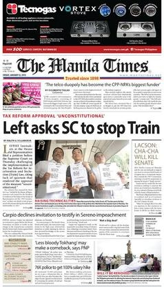

The **Manila Times** is the Philippines' largest English language broadsheet newspaper by circulation. It is published daily by The Manila Times Publishing Corp. with editorial and administrative offices at 2/F Sitio Grande Building, 409 A. Soriano Avenue, Intramuros, Manila.

It was founded on October 11, 1898, shortly after news that the Treaty of Paris would be signed, ending the Spanish–American War and transferring the Philippines from Spanish to American sovereignty. It presently bills itself as having the fourth-largest circulation of the newspapers in the Philippines, Manila Standard, along with the Philippine Daily Inquirer, the Manila Bulletin and The Philippine Star.

The current president and chief executive officer (CEO) and executive editor is Dante Francis "Klink" Ang II. On May 1, 2017, its chairman emeritus Dante Arevalo Ang was appointed by Philippine President Rodrigo Roa Duterte as special envoy of the President for international public relations.

|Type	|Daily newspaper|
| :------------- | :---------- | 
|Format	|Broadsheet|
|Owner	|Dante Ang|
|Founded	|October 11, 1898|
|Political alignment	|Centre-right, Pro-administration, Populist|
|Language	|English|
|Headquarters	|Intramuros, Manila|
|Country	|Philippines|
|Website	|www.manilatimes.net|

## History

The Manila Times was founded by Thomas Gowan, an Englishman who had been living in the Philippines. The paper was created to serve mainly the Americans who were sent to Manila to fight in the Spanish–American War. At the time, most of the newspapers in the Philippines were in Spanish and a few others were in the native languages. Shortly after the paper's founding, reports reached Manila about the Paris Conference that would lead to the treaty ceding the Philippines to the United States from Spain.

The first issue of The Manila Times on October 11, 1898 had a sheet of two leaves, or four pages, measuring about 12 by 8 inches, each page divided into two columns. The first page was taken up by announcements and advertisements. Page 2 was the editorial page. It contained the editorials and the more important news of the day. Page 3 was devoted to cable news from Europe and the United States all bearing on the Spanish–American War.

- In 1899, George Sellner acquired The Manila Times from Gowan, who joined the paper as business manager.

- In 1902, an American businessman acquired The Manila Times, reacquired by Sellner in 1905.

- In 1907, Thomas C. Kinney acquired The Manila Times from Sellner.

- On July 25, 1914, The Manila Times moved its headquarters from the Escolta Street to the Cosmopolitan Building.

- In 1919, future Philippine President during the Commonwealth period Manuel L. Quezon acquired The Manila Times and he owned until 1921, when sugar mmagnete George Fairchild acquired the paper.

- In 1926, Jacob Rosenthal acquired The Manila Times from Fairchild.

- On December 10, 1928, the Cosmopolitan Building was destroyed by a fire and The Manila Times headquarters were moved to Intramuros.[1]

- On March 15, 1930, The Manila Times was shut down for the first time until 1945, when the paper re-opened after World War II and was sold to Chino Roces.

- By 1950, The Manila Times becomes the largest newspaper in the Philippines.

- On September 23, 1972, President Ferdinand Marcos declared martial law with Proclamation No. 1081, forcing the closure of The Manila Times for the second time .

- On February 5, 1986, The Manila Times re-opened before the People Power Revolution that ousted Marcos and installed Corazon Aquino as president.

- Chino Roces died on September 30, 1988 and in 1989, the paper was acquired by businessman John Gokongwei

- In 1999, The Manila Times faced controversy when it published a story about President Joseph Estrada called a "unwitting godfather" in a deal between the National Power Corporation (NAPOCOR) and Argentine firm Industrias Metalurgicas Pescarmona Sociedad Anonima (IMPSA).

- On March 9, 1999, Estrada filled a libel suit against The Manila Times, but the libel case withdraw one month later in April, and the libel case withdrawal triggered the resignation of the paper's editors and writers.

- On July 20, 1999, The Manila Times was acquired by Katrina Legarda and Reghis Romero from Gokongwei and then shut down for the third time on July 23, 1999 and later re-opened on October 11, 1999. On May 14, 2001, Mark Jimenez acquired the paper, until he sold to Dante Ang, a publicist for President Gloria Macapagal Arroyo on August 8, 2001.

*Adapted from [Wikipedia](https://en.wikipedia.org), under [Creative Commons](https://en.wikipedia.org/wiki/Wikipedia:Text_of_Creative_Commons_Attribution-ShareAlike_3.0_Unported_License) license.*