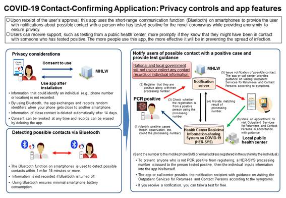
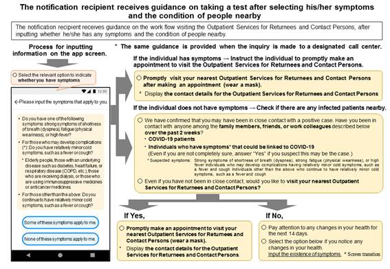

- The MHLW has collaborated with the COVID-19 Response Technology Team in the development of the COVID-19 Contact-Confirming Application (COCOA*) to help prevent the spread of COVID-19. Use this application after downloading it on your smartphone.

- This application enables users to receive notifications about possible contact with positive COVID-19 cases after approval from the individual user by utilizing the short-range communication function (Bluetooth) on smartphones. It ensures privacy by preventing users from identifying each other.

- Users can receive quick support from local public health centers, including test visits, if they know that they might have been in contact with positive cases. The more users use this app, the more effectively it will help prevent the spread of infection.

## Installing the app

**[Apple Store](https://apps.apple.com/jp/app/id1516764458)**

**[Google Play](https://play.google.com/store/apps/details?id=jp.go.mhlw.covid19radar)**

## Precautions

- An update for this application may be released. Please keep your app updated to the latest version.

- Important: To update the app, download it from the App Store or Google Play. Please be aware that if you delete the app and then reinstall it, your previous contact history will be deleted.

- The compatible OS version is iOS 13.5 or higher for iPhone and Android 6.0 or higher for Android. The app may not operate on some models, so make sure to check which models have been confirmed to be compatible. (The models that have been confirmed to be compatible with Android phones as of July 10 are listed below).

## Overview of COCOA

Click **[here](https://www.mhlw.go.jp/content/10900000/000679813.pdf)** to download the PDF version.

