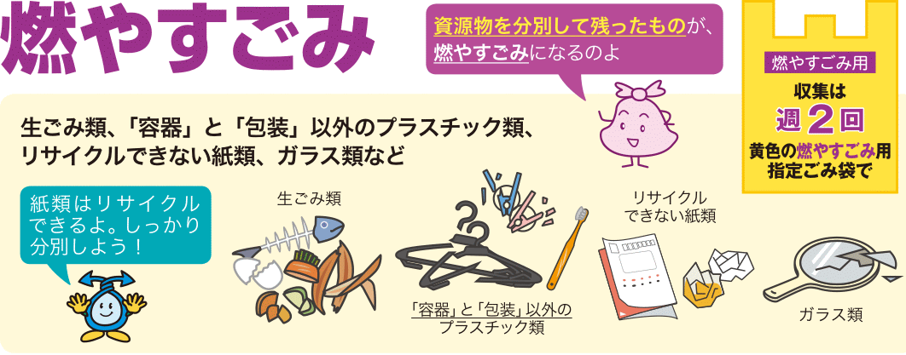
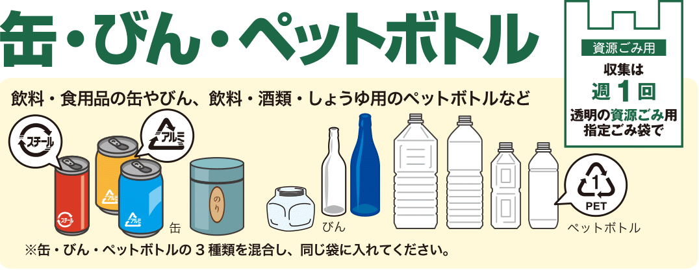
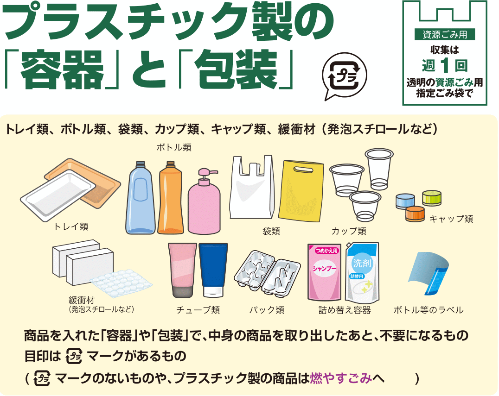
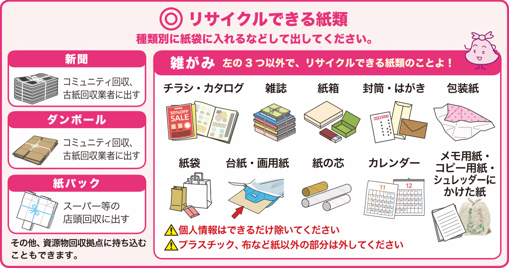
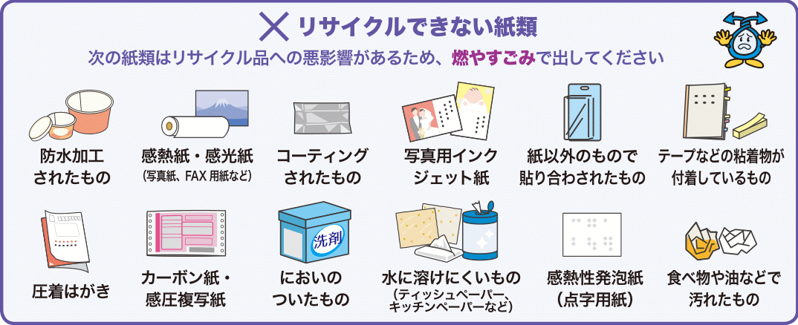


**NOTE:** ang ilustrasyon ng mga basura sa webpage na ito ay inangkop mula sa *Tamang Paghihiwalay at Pagtatapon ng Recyclable Items at Basura* (正しい資源物とごみの分け方・出し方 Tadashii Shigenbutsu to Gomi no Wakekata, Dashikata), na nilathala ng lungsod ng Kyoto. Maaaring i-download ang PDF ([Nihongo](https://www.city.kyoto.lg.jp/kankyo/cmsfiles/contents/0000250/250067/handbookjp.pdf) at [English](https://www.city.kyoto.lg.jp/kankyo/cmsfiles/contents/0000250/250067/handbookenglish.pdf)) mula sa kanilang [website](https://www.city.kyoto.lg.jp/kankyo/page/0000250067.html).


Iba't-ibang uri ng basura ang lumalabas sa bahay: mula sa pinakamaraming Burnable Garbage hanggang sa bihira lang na lumabas na kagaya ng battery, bumbilya o malalaking kasangkapan.

Sa page na ito ay makikita ang iba't-ibang uri ng basura at ang tamang pagtatapon ng mga ito.

## Burnable garbage

**燃やすごみ (Moyasu gomi)** Ang pinakamaraming lumalabas na basura sa isang bahay ay ang Burnable Garbage (sinusunog na basura). May iba't-ibang tawag sa basurang ito depende sa lugar, pero iisa lang ang ibig sabihin: basurang dinadala sa incinerator para sunugin.


**MGA KASAMA SA BURNABLE GARBAGE:**

- Nabubulok na basura (tinik ng isda, pinagputulan ng gulay, lumang pagkain, balat ng prutas, atbp) (Tignan ang **[Raw Waste](#raw-waste)** sa ibaba.)
- Plastik na gamit na hindi kasama sa **[Plastic Containers and Packaging](#plastic-containers-and-packaging)** (lumang hanger, plastik na sipit, lumang sipilyo, plastik na kutsara, straw, LEGO block, plastik na laruan, atbp)
- Hindi ma-recycle na papel (maduming papel, papel na may kahalong plastik, atbp)
- Lumang damit o tela na hindi na maaring gamitin, atbp.
- Balat na bag


**PAANO ITAPON:** Ilagay sa loob ng Burnable Garbage na plastik bag at itapon ayon sa kalendaryo.

### Raw Waste

**生ごみ なまごみ (Nama Gomi)** May mga lugar na itinatapon nang hiwalay ang nabubulok na basura at may **espesyal na plastik bag** para sa dito. 80% ng nabubulok na basura ay tubig. Tanggalin nang mabuti ang tubig bago ito itapon.


Ayon sa ilustrasyon sa itaas, ang **basag na salamin** ay kasama sa Burnable Garbage, pero sa maraming lugar at tinatapon ito sa Non-burnable Garbage. Balutin sa makapal na papel at ilagay sa gitna ng basura sa loob ng plastik para hindi makasugat.



Ang **malilinis na papel, mga karton ng gatas at cardboard at damit na maari pang gamitin** ay maaaring i-recycle at hindi tinatapon sa Burnable Garbage.



Basain ng tubig ang **posporo at upos ng sigarilyo** at gamitin hanggang maubos ang **gas ng lighter** bago itapon.


**IBA’T-IBANG TAWAG**

| Nihongo | Reading |
|---------|---------|
|燃えるごみ| Moeru gomi |
|燃やせるごみ| Moyaseru gomi |
|燃やすごみ| Moyasu gomi |
|可燃ごみ| Kanen gomi |

## Recyclables

**資源ごみ しげんごみ (Shigen Gomi)** Ang literal na ibig sabihin ng *shigen* ay *resource* (as in natural resources) at ang Shigen Gomi ay nire-recycle para magamit ulit bilang materyal sa paggawa ng ibang bagay.

### Cans

 **缶 カン (Kan)** Lata ng inumin o pagkain na may [Aluminum](https://ja.wikipedia.org/wiki/%E3%82%A2%E3%83%AB%E3%83%9F%E7%BC%B6) o [Steel](https://ja.wikipedia.org/wiki/%E3%82%B9%E3%83%81%E3%83%BC%E3%83%AB%E7%BC%B6) recycle mark, lata na pinaglagyan ng biskwit, tsaa, o *nori*.
 
 **PAANO ITAPON**: Hugasan ang dumi sa loob at patuyuin bago itapon. May mga lugar na mag espesyal na plastik na lalagyan para dito, sa ibang lugar naman ay maaaring itapon sa loob ng kahit na anong plastik (mas maganda kung malinaw) at mayroong lugar na kailangang ilagay ito sa tray o container sa nakatakdang tapunan para sa Recyclables.

### Bottles

**瓶 びん (Bin)** Mga bote ng beer, alak, toyo, at iba pa (hindi basag).

**PAANO ITAPON**: Hugasan ang dumi sa loob, patuyuin at tanggalin ang label at takip bago itapon. Ang plastik na label at takip ay maaaring itapon sa Burnable Garbage o Plastic Containers and Packaging. Ang tansan o metal na takip sa Non-burbable Garbage at ang cork ay Burnable Garbage.

May lugar na may espesyal na plastik na lalagyan para dito, sa ibang lugar naman ay maaaring itapon sa loob ng kahit na anong plastik (mas maganda kung malinaw) at mayroong lugar na kailangang ilagay ito sa tray o container sa nakatakdang tapunan para sa Recyclables. Mayroon ding mga supermarket at grocery shops na may tapunan para sa mga bote.

### PET bottles 

**ペットボトル (Pettobotoru)** Mga plastik na bote ng inumin at katulad na bagay na may PET mark.

**PAANO ITAPON**: Tanggalin ang takip at label at hugasan ang loob bago itapon. Ang plastik na takip ay itapon sa Plastic Containers and Packaging o Burnable Garbage.

Kagaya ng bote, may lugar na may espesyal na plastik na lalagyan para dito, sa ibang lugar naman ay maaaring itapon sa loob ng kahit na anong plastik (mas maganda kung malinaw) at mayroong lugar na kailangang ilagay ito sa tray o container sa nakatakdang tapunan para sa Recyclables. Mayroon ding mga supermarket at grocery shops na may tapunan para sa mga PET bottles.


**Huwag lalagyan ng kung ano-anong bagay** ang loob ng mga lata, bote o PET bottles, na kagaya ng upos ng sigarilyo o mga maliliit na bagay na kagaya ng pako o turnilyo. Kailangang malinis ang mga ito.


## Plastic Containers and Packaging

Isa sa pinakamaraming klase ng basura, bukod sa Burnable Garbage. Mga plastik na pinaglagyan o pinangbalot ng mga produkto at may Plastic Recycle mark. Ang walang Plastic Recycle mark at mga plastik na produkto ay itapon sa **[Burnable Garbage](#burnable-garbage)**.



**MGA KASAMA SA PLASTIC CONTAINER AND PACKAGING:**

- Plastik o styrofoam na tray na lalagyan ng isda, karne, gulay, atbp
- Lalagyan ng shampoo, conditioner, atbp
- Plastic bag mula sa grocery shop
- Cup na pinaglagyan ng yogurt at katulad na produkto
- Plastik na tray ng itlog
- Plastik na takip at label ng bote o PET bottles
- Styrofoam at mga katulad na bagay
- Plastik na pinangbalot


**PAANO ITAPON:** Linisan nang maigi bago itapon. Depende sa lugar, may espesyal na plastik na para dito o maaaring itapon gamit ang malinaw na plastik bag.


Ang **hindi malinisan nang maigi o sobrang dumi** ay itapon sa **[Burnable Garbage](#burnable-garbage)**. Huwag hahaluan ng ibang bagay.



Karamihan ng mga **tray na pinaglagyan ng isda, karne at gulay** ay maaaring itapon sa supermarket at grocery.


## Paper

Ang karamihan ng mga papel na basura ay maaring i-recycle, pero may iba na dahil madumi, may kahalong ibang bagay o mahirap matunaw sa tubig, na kailangang itapon sa Burnable Garbage.

### Recyclable Paper

Karamihan ng mga papel na maaring i-recycle ay dyaryo, karton, paper pack (ginagamit na lalagyan ng gatas), leaflet, catalog, magasin, papel na lalagyan, sobre at postcard, papel na balot, papel na bag, gitna ng toilet paper, kalendaryo (tinanggal ang metal na parte), memo pad, computer paper, atbp).

**PAANO ITAPON**: Ang mga dyaryo, magasin, karton, atbp. ay **talian** bago itapon para hindi maghiwa-hiwalay. Ang maliliit na papel ay maaaring ilagay sa **karton na kahon** o kaya ay **paper bag** bago itapon.

### Non-recyclable paper

Water-proof na papel, papel ng fax machine, larawan, papel na may coating, papel na ginagamit para mag-print ng picture sa inkjet printer, papel na may kahalong ibang bagay, papel na may tape o pandikit, crimped postcard (postcard na may magkadikit na page, karamihang galing sa city hall, banko, atbp), carbon paper, papel na may amoy, papel na mahirap matunaw sa tubig (tissue paper, kitchen paper, atbp), at maduduming papel.

**PAANO ITAPON**: Itapon ang mga ito sa **[Burnable Garbage](#burnable-garbage)**.

## Non-burnable garbage

Ang hindi nasusunog na basura at hindi kasama sa Recyclables ay karamihang inilalagay sa Non-burnable Garbage. Ang nasa baba ay example lang; kumunsulta sa rules ng pagtatapon ng sariling lungsod.

| Item | Remarks |
|---------|---------|
|Cellphone, camera, etc| Tsekin kung may designated na tapunan ang maliliit na electronics na kagaya ng mga ito sa community center. |
|Computer printer, scanner, etc| Tsekin kung maaring itapon ang mga ito sa non-burnable garbage. Taggalin ang ink cartridge o toner bago itapon. Ang ink cartridge at toner ay karamihang tinatapon sa mga electronics shop. |
|Microwave oven, rice cooker, oven toaster, etc| Tsekin ang kung gaano kalaki ang household appliance na maaring itapon sa non-burnable garbage at hindi sa oversized garbage. May mga lugar na maaring itapon sa non-burnable garbage ang appliance na hindi hahaba sa **50cm** ang isang side. |
|Bumbilya, flourescent bulbs, LED bulbs| Tsekin kung maaring itapon ang mga ito o kung may designated na tapunan sa mga electronics shop, community center, etc. May ibang lugar na maaring itapon ang ordinaryong bumbilya at hindi ang mga LED bulbs. Kung basag ay balutin ng makapal na papel at sulatan ng **"危険"** o kaya ay **"KIKEN"** ang plastic bago itapon. |
|Kutsilyo, gunting, cutter, etc| Balutin ng makapal na papel at sulatan ng **"危険"** o kaya ay **"KIKEN"** ang plastic bago itapon. |
|Baso, pinggan, kutsara, tinidor, etc| Ang basag na baso o matutulis na bagay ay balutin ng makapal na papel at sulatan ng **"危険"** o kaya ay **"KIKEN"** ang plastic bago itapon. |
|Bote na ginamit sa cosmetics, kemikal, pintura, etc| Karamihang hinihiwalay ito sa ordinaryong boteng ginamit sa pagkain na nire-recycle. Kung basag ay balutin ng makapal na papel at sulatan ng **"危険"** o kaya ay **"KIKEN"** ang plastic bago itapon. |
|Metal bat, golf club, payong, etc| Tsekin kung gaano kalaki ang mga ito para maitapon sa non-burnable garbage at hindi sa oversized garbage. May mga lugar na maaring itapon ang mga ito sa non-burnable garbage kung hindi hahaba sa **150cm** ang sukat.|
|Iba't-ibang tools (lagare, martilyo, liabe, etc)| Kung may matulis na parter ay balutin ng makapal na papel at sulatan ng **"危険"** o kaya ay **"KIKEN"** ang plastic bago itapon. |
|Lighter| Palabasin ang lahat ng gas bago itapon. |

| Nihongo | Reading |
|---------|---------|
|燃えないごみ| Moenai gomi |
|燃やせないごみ| Moyasenai gomi |
|燃やさないごみ| Moyasanai gomi |
|不可燃ごみ| Fukanen gomi |

## Oversized Garbage

**大型ごみ おおがたごみ (Ogata Gomi)** o **粗大ごみ そだいごみ (Sodai Gomi)** Ang malalaking basura na kagaya ng mga kasangkapan sa bahay na kagaya ng tokador, kama, bisikleta, *futon*, at malalaking container ay itinatapon bilang Oversized Garbage.

Ang normal na paraan ng pagtatapon ng mga ito ay tumawag muna sa garbage collection center para sabihin sa kanila na may lalabas na malaking basura, bumili ng disposal sticker na ididikit sa basura at itapon sa napagkasunduang araw.

Ang mga disposal sticker ay karamihang nabibili sa mga convenience store, city hall o grocery shop.

## Four kinds of electrical appliances

Ang tinatawag nilang "Apat na Klase ng Electrical Appliance" (TV, aircon (kasama ang makina sa labas), refrigerator, at washing machine/dryer) ay karamihang <strong> hindi kinukulekta ng lunsod o bayan</strong>.

Hindi rin ito maaring dalhin na direkta sa Clean Center para doon itapon.

**Tamang pagtatapon**: Kung papalitan ito ng bago, ipatapon sa tindahan kung saan bibilhin ang bagong kapalit (hindi ito puwede kung mag-o-order online).

Kung itatapon lang at alam kung saang tindahan ito binili, doon hilingin na itapon (maaaring walang bayad). Kung hindi na alam kung saan binili o kung malayo ang binilhang tindahan at hindi na madala doon, dalhin sa malapit na tindahan ng electrical appliance at doon ipatapon. Mainam na tawagan muna ang tindahan kung tumatanggap sila ng pagpapatapon (malamang ay may bayad ito).

## Computer

Ang iba't-ibang klase ng computer (kasama dito ang desktop computer, laptop, monitor, atbp) ay karamihang <strong> hindi kinukulekta ng lunsod o bayan</strong>.

Kailangang kontakin ang sari-sariling maker ng mga ito sa paraan ng pagtatapon. Maraming impormasyon ang [webpage ng PC3R](https://www.pc3r.jp/) sa ibaba tungkol dito.

