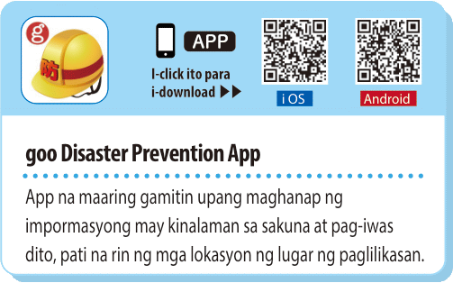

Maraming iba't-ibang natural disaster ang nangyayari sa Japan kagaya ng lindol, pagputok ng bulkan, *[tsunami](https://en.wikipedia.org/wiki/Tsunami)*, bagyo, baha at landslide.

Sa oras ng sakuna ay importanteng makakuha ng napapanahong impormasyon upang malaman ang sitwasyon at makapag-evacuate kung kailangan. Ang mga website at app sa ibaba ay maaaring makatulong tungkol dito.

### Japan Meteorological Agency website

Impormasyon tungkol sa sakuna ([Nihongo](https://www.data.jma.go.jp/multi/index.html?lang=jp), [English](https://www.data.jma.go.jp/multi/index.html?lang=en), [Tagalog](https://www.data.jma.go.jp/multi/index.html?lang=ph)) mula sa ahensya ng gobyerno na namamahala sa weather forecasting at disaster prevention.

### Stay Safe with NHK WORLD-JAPAN

Iba't-ibang serbisyo para sa kahandaan sa sakuna ([English](https://www3.nhk.or.jp/nhkworld/en/special/staysafe/)) mula sa public broadcaster ng Japan.

### Web apps

Maaring i-download ang sumusunod na app para sa smartphone.

