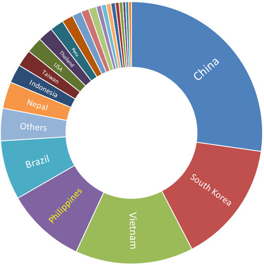
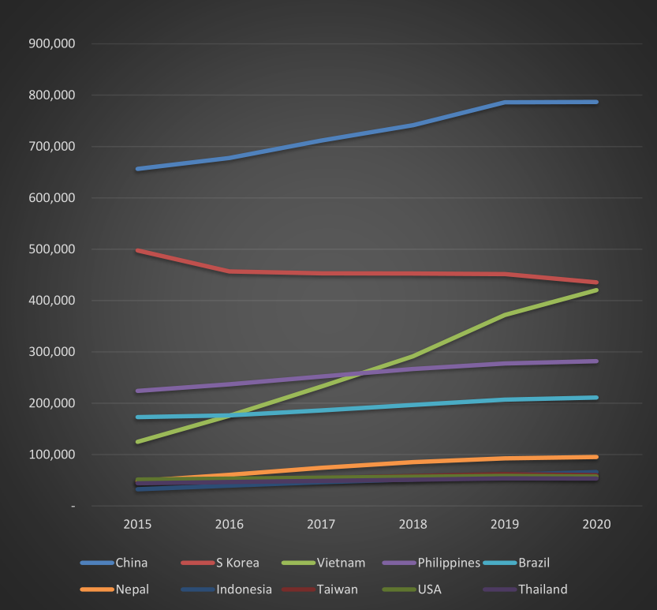
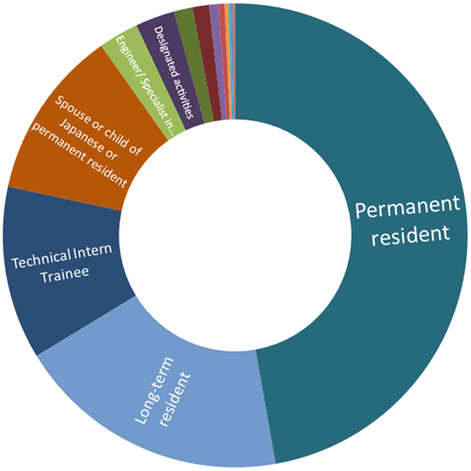
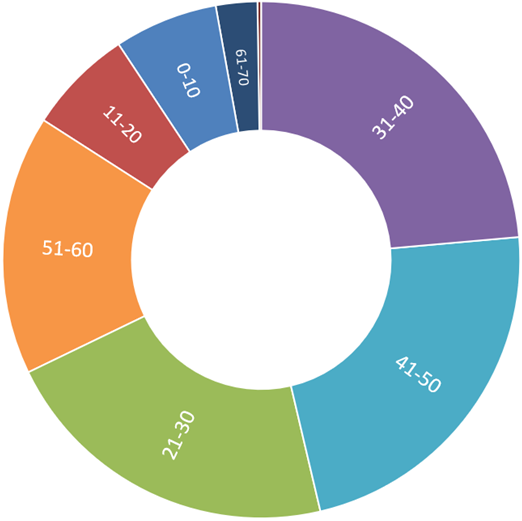
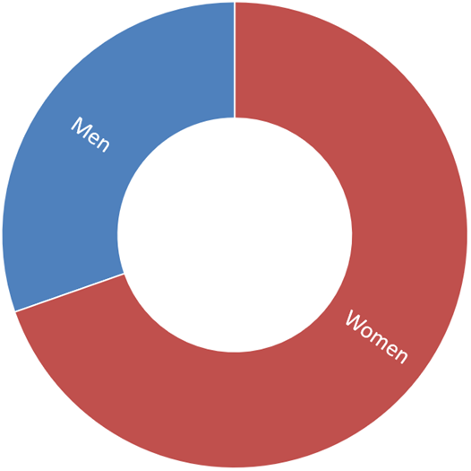
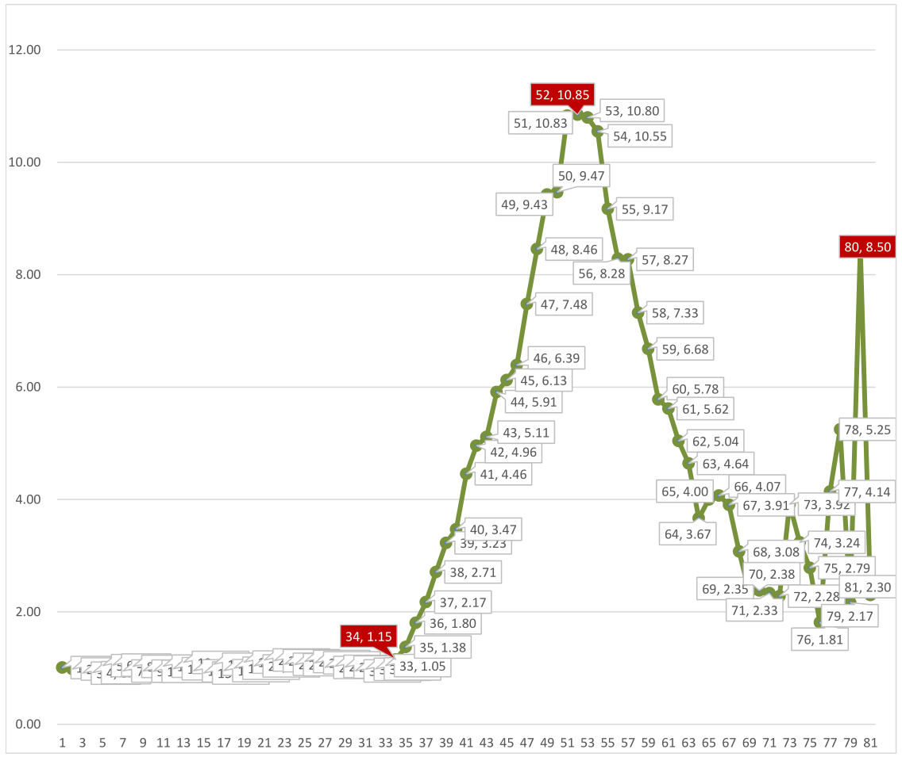

According to the [latest figures](http://www.moj.go.jp/isa/policies/statistics/toukei_ichiran_touroku.html) from the [Immigration Services Agency](http://www.moj.go.jp/isa/) of Japan, there are now **282,023 Filipino citizens** residing in the country. They comprise the fourth largest foreign group, behind China (786,830), South Korea (435,459) and Vietnam (420,415).

#### The largest groups of foreign residents in Japan

**China** and **South Korea**, partly due to their proximity and historical ties to Japan, have always been the largest groups of foreigners in the country.

**Vietnam**, on the other hand, has largely surpassed the Philippines because of the sheer numbers of technical intern trainees that they send to the country compared to the Philippines: Vietnam's 219,501 technical intern trainees is six times the Philippines' 35,032.

In fifth place is **Brazil**, home to the largest Japanese population outside Japan. Beginning around 1980s Japanese Brazilians started coming to Japan as contract workers and many have made Japan their permanent residence ever since. There were more Brazilians in Japan than Filipinos before technical intern trainees started arriving from the Philippines.

As can be seen on the graph below, China has a significant lead over other foreigners in Japan and is still growing. South Korea keeps second place ranking, although its numbers are slowing decreasing. 

#### Population of select groups of foreigners in Japan over time

Vietnam comes from out of nowhere in the middle of the last decade and overtakes Brazil (2016) and the Philippines (2017) and is on course to bump South Korea from second place if stays on its present trajectory.

Meanwhile, Philippines and Brazil keep their slow and steady increase in population to occupy fourth and fifth, respectively.

Lastly, **Nepal** conspicuously manages to leave the 50,000-something pack and increase its local population although it still has not managed to break the 100,000 mark.

## Filipinos in Japan by status of residence (visa)

Of the more than 280,000 Filipinos in Japan, almost half (131,000) are **permanent residents**. Spouses and children of Japanese or former long-term visa holders make up most of this group.

#### The largest groups of Filipinos in Japan

**Long-term residents** (53,000), the second group, are overwhelmingly made up of *Nikkeijin*, descendants of Japanese who immigrated to the Philippines during the first half of the last century. A sizable portion of this group have become permanent residents.

**Technical intern trainees** (33,500), at third, are a relatively recent arrival. Typically holding 3-year visas, they return to the Philippines after completing their "training" at Japanese companies. The recently enacted "Specified skilled worker" visa may enable former trainees to stay much longer and may even pave the way to a permanent residence.

**Spouses and children of Japanese and permanent residents**, at fourth, have their own group. Many members of this group eventually become permanent residents. Spouses of Japanese are overwhelmingly women, a product of the entertainer visa boom mentioned in the Q&A above.

Finally, at fifth are holders of **Engineer/Specialist in humanities/International services** visa. Filipinos with this visa work in white-collar jobs, in the fields of science, technology and humanities.

**Entertainers**, ubiquitous during the last century, have virtually disappeared (or have simply become spouses of Japanese and/or permanent residents). 

## Filipinos in Japan by age group

In 2020, almost 30 percent of Japanese are aged 65 and above, and the rapidly aging society puts a strain on the economy and exacerbates the already chronic labor shortage. Foreign contract workers, now mostly in the form of technical intern trainees from Southeast Asia and Nepal, fill the demand for blue-collar jobs.

Not surprisingly, of the 282,000 Filipinos in Japan, 237,000 or 84% are in prime working age from 21 to 60. The age groups of 21-30 (60,600), 31-40 (66,500), and 41-50 (64,100) share almost equal portions of the population pie, while the 51-60 bracket (45,800) is not so far behind.

## Filipinos in Japan by gender

196,400 of the 282,000 Filipinos in Japan are women, while 85,600 are men. The Filipino population in Japan is skewed in favor of women, 70% to 30%, perhaps a legacy of the visa boom of 1980s and 90s when young Filipino women came to Japan in search of work in the entertainment business, married Japanese men and eventually stayed.

#### Filipinos in Japan by gender

Looking at the graph below, female and male residents are both equal in numbers up to 33 years old (female:male ratio of 1.05). From 34 years of age, we notice a significant change (1.15).

By 37, there are more than 2 women for every 1 man; at 39 more than 3 women for every 1 man; at 41 more than 4 women for every 1 man, and so on, peaking at almost 11 women for every 1 man by the age of 52.

#### Female-to-Male ratio of Filipinos in Japan by age

From there, the ratio falls as steeply as it climbed, down to 3.67 at 64 years. From this point the graph goes through several ups and downs and reaches another peak at age 80, when there are 8.5 women for every 1 man.

Looking at this graph, if we assume that the average age of a Filipina *tarento* that came to Japan with an entertainer visa was 25, then it's probably reasonable to believe that the peak entertainer boom was reached in 1994 and started decreasing after.

