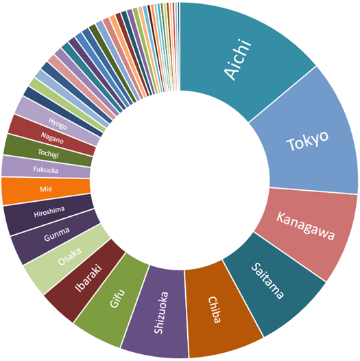

The population of Filipinos in Japan is concentrated in metropolitan areas like Tokyo and Osaka, and centers of industrial production like Nagoya in Aichi Prefecture and Hamamatsu in Shizuoka.

### Filipinos in Japan by prefecture

**Aichi** (capital Nagoya City) takes the number one spot for the prefecture with the largest population of Filipinos. This area in central Japan is a manufacturing powerhouse, number one in the country in shipment value of manufactured goods (2018).

Toyota, the largest listed company in Japan by market capitalization, is headquartered in Aichi (in Toyota City). Other companies like Brother Industries, Denso, and Makita also have headquarters in the prefecture, while others like Fuji Heavy Industries, Mitsubishi Motors, Sony, and Volkswagen have plants in the area.

All this manufacturing activity needs workers and Filipinos, long-term residents and technical intern trainees, readily fill the demand.

The next four prefectures with the most Filipino residents, **Tokyo**, **Kanagawa**, **Saitama** and **Chiba**, are part of the Greater Tokyo Area, the most populous metropolitan area in the world.

## Filipinos in Japan: the top 50 cities

**Tokyo** (the 23 wards that make up central Tokyo) takes the top spot, while the nearby cities of **Yokohama** and **Kawasaki**, both in Kanagawa Prefecture but part of the same metropolitan area, take third and fourth respectively.

At second spot is **Nagoya**, capital of Aichi Prefecture and Japan's fourth largest city. Having the largest concentration of Filipinos in Japan, Aichi has 11 cities in this list, more than any other prefecture.

**Osaka**, part of the second largest metropolitan area of Japan, comes in at number five.

**Hamamatsu** in Shizuoka Prefecture, at number 6, is famous for its production of musical instruments and motorcycles. Kawai, Roland, Yamaha and Suzuki Motors have headquarters here.

Seventh and eight is **Toyohashi**, Aichi and **Kani**, Gifu. Kani borders Aichi Prefecture and both cities' local economies are dominated by the production of automotive-related components for companies like Toyota, Mitsubishi, Suzuki, and Honda.

The cities of **Chiba** in Chiba Prefecture and **Kawaguchi** in Saitama Prefecture, at ninth and tenth, are part of the Tokyo metropolitan area.

### Table: the top 50 cities in Japan where Filipinos live

|Rank|City, Prefecture    |Population|
|----|--------------------|----------|
|1   |Tokyo, Tokyo        | 25,541   |
|2   |Nagoya, Aichi       | 9,539    |
|3   |Yokohama, Kanagawa  | 8,695    |
|4   |Kawasaki, Kanagawa  | 4,756    |
|5   |Osaka, Osaka        | 4,299    |
|6   |Hamamatsu, Shizuoka | 4,121    |
|7   |Toyohashi, Aichi    | 4,035    |
|8   |Kani, Gifu          | 3,705    |
|9   |Chiba, Chiba        | 2,785    |
|10  |Kawaguchi, Saitama  | 2,638    |
|11  |Matsusaka, Mie      | 2,481    |
|12  |Saitama, Saitama    | 2,305    |
|13  |Minokamo, Gifu      | 2,250    |
|14  |Hiroshima, Hiroshima| 2,180    |
|15  |Gifu, Gifu          | 2,083    |
|16  |Sagamihara, Kanagawa| 2,068    |
|17  |Toyota, Aichi       | 2,016    |
|18  |Anjo, Aichi         | 1,915    |
|19  |Okazaki, Aichi      | 1,850    |
|20  |Yaizu, Shizuoka     | 1,835    |
|21  |Ichihara, Chiba     | 1,830    |
|22  |Matsudo, Chiba      | 1,795    |
|23  |Isesaki, Gunma      | 1,746    |
|24  |Fukuyama, Hiroshima | 1,701    |
|25  |Ichinomiya, Aichi   | 1,682    |
|26  |Ota, Gunma          | 1,641    |
|27  |Yokosuka, Kanagawa  | 1,638    |
|28  |Ichikawa, Chiba     | 1,570    |
|29  |Kamagori, Aichi     | 1,500    |
|30  |Komaki, Aichi       | 1,470    |
|31  |Kobe, Hyogo         | 1,447    |
|32  |Tsu, Mie            | 1,432    |
|33  |Shizuoka, Shizuoka  | 1,410    |
|34  |Nishio, Aichi       | 1,402    |
|35  |Hachioji, Tokyo     | 1,349    |
|36  |Fukuoka, Fukuoka    | 1,323    |
|37  |Funabashi, Chiba    | 1,309    |
|38  |Kasugai, Aichi      | 1,294    |
|39  |Kariya, Aichi       | 1,260    |
|40  |Iwata, Shizuoka     | 1,244    |
|41  |Kyoto, Kyoto        | 1,232    |
|42  |Joso, Ibaraki       | 1,231    |
|43  |Soka, Saitama       | 1,231    |
|44  |Kurume, Fukuoka     | 1,183    |
|45  |Numazu, Shizuoka    | 1,164    |
|46  |Onomichi, Hiroshima | 1,110    |
|47  |Maebashi, Gunma     | 1,016    |
|48  |Fuji, Shizuoka      | 1,015    |
|49  |Koshigaya, Saitama  | 1,010    |
|50  |Kashiwa, Chiba      | 1,003    |

## Filipinos living at the extreme points of Japan

While Filipinos are most concentrated in the big metropolises, they can be found in almost any city, town and small village in Japan, with few exceptions. Here are a selection of Filipino groups living in the extreme north, south, east and west points of Japan.

#### Wakkanai City, Hokkaido (northernmost)



<iframe width="425" height="350" frameborder="0" scrolling="no" marginheight="0" marginwidth="0" src="https://www.openstreetmap.org/export/embed.html?bbox=141.5677642822266%2C45.319564529927746%2C141.8211364746094%2C45.473855048084765&amp;layer=transportmap" style="border: 0 solid black"></iframe> <small><a href="https://www.openstreetmap.org/#map=12/45.3968/141.6945&amp;layers=TN">View Larger Map</a></small>



The city of Wakkanai (which means "cold water river" in Ainu language) in Hokkaido is Japan's northernmost point and from where Russia's Sakhalin Island is visible. There are 6 Filipinos living in this cold city, where the lowest average winter temperature falls below -6°C.

(The northernmost point that Japan claims is the island of Iturup in the Northern Territories, but it is [controlled by Russia](https://en.wikipedia.org/wiki/Kuril_Islands_dispute).)

#### Nemuro City, Hokkaido (easternmost)



<iframe width="425" height="350" frameborder="0" scrolling="no" marginheight="0" marginwidth="0" src="https://www.openstreetmap.org/export/embed.html?bbox=145.32096862792972%2C43.162618434925875%2C145.82771301269534%2C43.482321075924304&amp;layer=transportmap" style="border: 0 solid black"></iframe> <small><a href="https://www.openstreetmap.org/#map=11/43.3227/145.5743&amp;layers=TN">View Larger Map</a></small>



Again, excluding the Northern Territories, the easternmost point of Japan where Filipinos live is Nemuro City in Hokkaido. There are 11 Filipino residents in this city, where, as in Wakkanai, the lowest average winter temperature falls below -6°C.

(Japan's easternmost point is actually Minamitorishima (Southern Bird Island), a small lonely atoll in the northwestern Pacific Ocean, some some 1,848 kilometers southeast of Tokyo and is administratively part of the capital city. It is off-limits to civilians.)

#### Taketomi Town, Okinawa Prefecture (southernmost)



<iframe width="425" height="350" frameborder="0" scrolling="no" marginheight="0" marginwidth="0" src="https://www.openstreetmap.org/export/embed.html?bbox=123.51516723632812%2C24.028905254133637%2C124.02191162109376%2C24.42964604483519&amp;layer=transportmap" style="border: 0 solid black"></iframe> <small><a href="https://www.openstreetmap.org/#map=11/24.2294/123.7685&amp;layers=T">View Larger Map</a></small>



Taketomi Town is a group of islands in the Yaeyama island chain located southwest of the main Okinawa island. It includes Hateruma, Japan's southernmost inhabited island, purportedly the site of Japan's best beach.

1 lucky Filipino lives in this town.

(Japan's southernmost uninhabited point is Okinotorishima (Remote Bird Island), a coral reef in the Philippine Sea.)

#### Yonaguni Town, Okinawa Prefecture (westernmost)



<iframe width="425" height="350" frameborder="0" scrolling="no" marginheight="0" marginwidth="0" src="https://www.openstreetmap.org/export/embed.html?bbox=122.94894218444826%2C24.429489752240542%2C123.01228523254396%2C24.479493493061938&amp;layer=transportmap" style="border: 0 solid black"></iframe> <small><a href="https://www.openstreetmap.org/#map=14/24.4545/122.9806&amp;layers=TN">View Larger Map</a></small>



West of Taketomi is Yonaguni Island, on which Yonaguni Town is located. It is the westernmost point of Japan, from where Taiwan is visible, and only 417 kilometers from the Batanes island of [Itbayat](https://en.wikipedia.org/wiki/Itbayat).

In this lonely tropical paradise live 2 Filipinos.