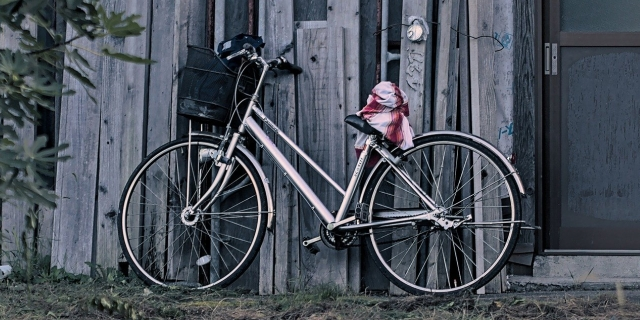
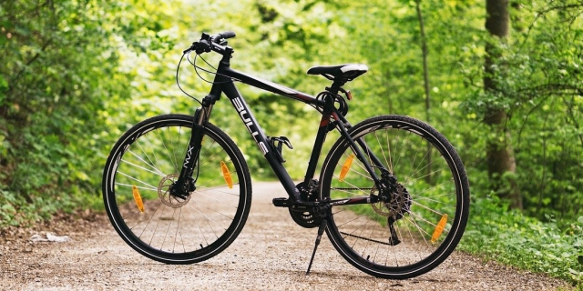
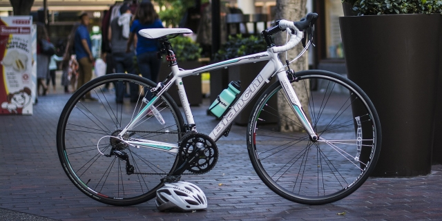

Ang mga bata sa Japan ay natututong sumakay ng bisikleta bago pa lang pumasok sa elementary school kaya ang bisikleta ang isa sa pinakapopular na sasakyan sa bansa. Walang kailangang lisensya, walang gastos para sa gasolina at kaunti lang ang kailangang maintenance.

Kung kailangan ng sasakyan para sa araw-araw na pagbili ng grocery, pagpunta sa malapit na park o community center, o pagbisita sa kaibigan na ilang kilometro lang ang layo mula sa apartment, ang bisikleta ang ideal na sasakyan.


🔖 Go to [Bicycle Traffic Rules](bicycle-traffic-rules/)


**Related blog posts:** [Bicycling in Tototo country](/bicycling-in-totoro-country/), [Weekend early-morning bicycling](/weekend-early-morning-bicycling/)

### Iba't-ibang klase ng bisikleta

Maraming klase ng bisikleta pero ang pinakapopular ay ang mga sumusunod.

#### CITY BIKE

O ang tinatawag nilang *mamachari* (parang sa itaas), popular sa mga high school students na pampasok sa school, mga *okaasan* (kung saan galing ang salitang *mamachari*) para mamalengke at maghatid-sundo ng mga bata (may angkasan) o mga *sarariman* na papunta sa *eki*.

>**PROS**
>: * Mura (mga 10,000 hanggang 30,000 yen)
>: * Madaling sakyan, lalo na ng mga babae
>: * Mayroon ng ilaw, lock at basket, may takip ang kadena

>**CONS**
>: * Mabigat, mahirap dalhin sa malayo o lugar na hindi maganda ang daan

#### MOUNTAIN BIKE/CROSS BIKE

Mas sporty ang style at mas pamilyar sa mga Pinoy kaya marami ang may gusto nito. 

>**PROS**
>: * Risonable ang presyo (mga 30,000 hanggang 80,000 yen)
>: * Mas magaang kaysa sa city bike at madaling sakyan
>: * Maaring sakyan sa mga lugar na hindi maganda ang daan

>**CONS**
>: * Kailangang bilhin pa ang ilaw at lock
>: * Walang basket kaya walang lalagyan ng grocery (puwedeng lagyan as option)
>: * Karamihan ay walang fender ang gulong

#### ROAD BIKE

Parang mountain bike ang hugis pero mas manipis ang gulong at magaang ang katawan para puwedeng sakyan nang mabilis sa mga daan. Hindi magandang sasakyan sa pang araw-araw na gawain.

>**PROS**
>: * Magaang ang katawan kaya mabilis sa daan kumpara sa mga naunang bisikleta

>**CONS**
>: * Mahal (mga 50,000 hanggang 120,000 yen)
>: * Kailangang bilhin pa ang ilaw at lock
>: * Walang basket kaya walang lalagyan ng grocery (puwedeng lagyan as option)
>: * Walang fender at manipis ang gulong kaya hindi magandang sakyan off-road

### Saan puwedeng bumili

Ang mga city bike ay mabibili sa kahit saang home center. Kung gusto mo ng disenteng seleksyon ng mountain bike at road bike ay magandang sa bicycle store na kagaya ng Asahi Bicycle ka pumunta. Ang mga high-end na road bike ay sa mga specialty bike store makikita.

***MAG-INGAT:** Maari ding mag-order online ng bisikleta pero mahirap kumuha ng support kapag nagkaroon ng problema. Kailangan ding ipa-register ang bisikleta pero hindi ito ginagawa ng mga online store kaya kailangang ikaw mismo ang magpa-register sa lugar sa malapit sa tirahan.*

