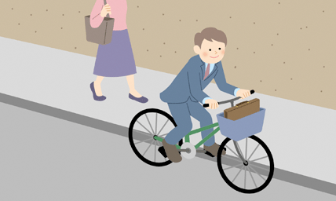
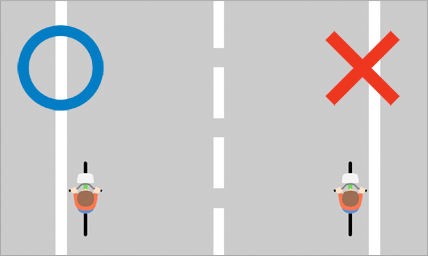
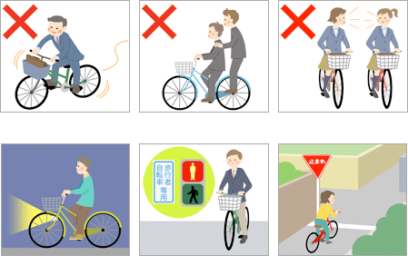
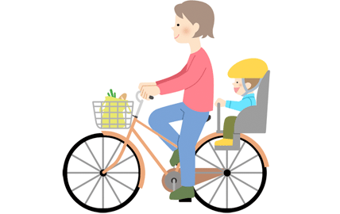


**Note:** Ang laman ng webpage na ito ay inangkop mula sa *[Bicycle Rules and Manners](http://www.j-bicycleinfo.jp/rule.html)* mula sa [自転車屋さんのサイト (Jitenshaya-san no Saito)](http://www.j-bicycleinfo.jp), ng Japan Bicycle Promotion Institute.


Kailangang maging pamilyar sa iba't-ibang panuntunan para maging ligtas at komportable ang pagbibisikleta sa daan.

#### 1. Ang daanan ng bisikleta ay sa kalsada, hindi sa sidewalk

Kagaya ng motorsiklo o kotse, ang bisikleta ay isang sasakyan, at ang tamang daanan nito ay sa kalsada. Ang sidewalk ay para sa mga naglalakad na tao.

#### 2. Dumaan sa kaliwang bahagi ng kalsada, hindi sa kanan

Kagaya ng kahit na anong sasakyan, ang tamang daanan ay sa kaliwang bahagi ng kalsada at hindi sa kanan.

#### 3. Bigyan ng priyoridad ang naglalakad sa sidewalk

Maaring dumaan sa sidewalk na may sign para dito, o kaya ay kung nakaramdam ng panganib sa kalsada, pero bigyan ng priyoridad ang mga naglalakad at bagalan ang takbo para hindi delikado para sa mga naglalakad.

#### 4. Sumunod sa safety rules ng pagbibisikleta

1. Bawal sumakay sa bisikleta nang nakainom ng alak.
2. Bawal mag-angkas (puwedeng iangkas ang batang 6 taon o pababa).
3. Bawal na magkatabi sa daan ang dalawang nagbibisikleta.
4. Gumamit ng ilaw sa gabi (bawal sumakay sa bisikletang walang ilaw sa gabi).
5. Sumunod sa traffic light.
6. Huminto sa intersection at tsekin na walang panganib.

#### 5. Pasuotin ng helmet ang bata

Ang batang nakasakay sa bisikleta (naka-angkas man o mag-isa) ay kailangang may helmet palagi.

#### 6. Iba pang panuntunan

- Bawal ang may hawak ng bagay sa kamay (kagaya ng cellphone o payong) habang nagbibisikleta.

