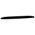
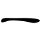

[//]: # (Don't edit the line below.)
}} kanji" src=".gif">

Ang pinakasimpleng kanji sa lahat, pumapangalawa lang ito sa [日](../日) sa pinakamadalas na gamiting kanji.

Huwag ito isusulat nang tuwid na tuwid na parang dash (―). Bigyan na kaunting angat habang sinusulat nang pahalang.

**Mnemonic:** "Isang guhit."

### ON-KUN READING

[//]: # (Don't edit the line below. ON-KUN READING code is automatically generated.)
- [ICHI](../../kanji-reading/ichi) [ITSU](../../kanji-reading/itsu) [hito](../../kanji-reading/hito) [hito(tsu)](../../kanji-reading/hito(tsu))

#### COMPOUNDS

#### ➊ **ARAW** (ng isang buwan)
  - [一](../一)[一](../一)　***ichinichi***　isang araw
  - [一](../一)[月](../月)[一](../一)[五](../五)[一](../一)　***ichigatsu jūgonichi***　Enero 15
  - [平](../平)[一](../一)　***heijitsu***　weekday
  - [本](../本)[一](../一)　***honjitsu***　ngayong araw 
  - [一](../一)[一](../一)　***hinichi***　petsa
  - [一](../一)[付](../付)　***hizuke***　petsa
  - [一](../一)[替わり](../替)　***higawari***　nagbabago araw-araw
  - [九](../九)[月](../月)[四](../四)[一](../一)　***kugatsu yokka***　Setyembre 4
  

#### ➋ **ARAW** (hindi gabi)
  - [一](../一)[夜](../夜)　***nichiya***　araw at gabi
  - [一](../一)[中](../中)　***nitchū***　sa araw
  
#### ➌ **ARAW** (bituin)
  - [一](../一)[食](../食)　***nisshoku***　solar eclipse
  - [一](../一)[光](../光)　***nikkō***　liwanag ng araw
  - [一](../一)[焼け](../焼)　***hiyake***　sunburn
  - [一](../一)の[丸](../丸)　***hinomaru***　Rising Sun flag
  - [一](../一)の[出](../出)　***hinode***　pagsikat ng araw
  - [朝](../朝)[一](../一)　***asahi***　umagang araw

#### ➍ **ARAW** ng Linggo
  - [一](../一)[曜](../曜)[一](../一)　***nichiyōbi***　Linggo
  - [土](../土)[一](../一)　***donichi***　Sabado at Linggo

#### ➎ **JAPAN**
  - [一](../一)[本](../本)　***nihon (nippon)***　Japan
  - [一](../一)[米](../米)　***nichibei***　Japan at Amerika
  - [一](../一)[露](../露)　***nichiro***　Japan at Rusya
  - [一](../一)[銀](../銀)　***nichigin***　Bank of Japan
  - [来](../来)[一](../一)　***rainichi***　pagdating sa Japan

### SPECIAL READING
  - [今](../今)[一](../一)　***kyō***　ngayong araw
  - [明](../明)[一](../一)　***asu***　bukas
  - [昨](../昨)[一](../一)　***kinō***　kahapon
  - [一](../一)[一](../一)　***tsuitachi***　unang araw ng buwan

### ORIGIN

Ang kanji ng 一 ay hindi masyadong nagbago mula sa mga sinaunang pagsulat:

<table class="kanji-table"><tr><td>

</td><td></td><td>

</td><td></td>
<td class="kanji-origin">一</td>
</tr></table>

### RELATED KANJI

- Mga bilang: [二](../二) [三](../三) [四](../五) [五](../五) [六](../七) [七](../七) [八](../八) [九](../九) [十](../十) [百](../百) [千](../千) [万](../万) [億](../億)
- Magkatulad ng ibig sabihin: [壱](../壱)