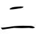
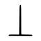

[//]: # (Don't edit the line below. Kanji animated GIF code is automatically generated.)


[//]: # (Edit below this line.)

**[Edit this at Github. Delete this link after editing.](https://github.com/tim0g/tim/tree/main/content/kanji/上/index.md)**

Magsulat dito ng introduction tungkol sa kanji. Mga opinions, impressions, suggestions, trivia, ang kung ano-ano pa.

Generate Lorem Ipsum placeholder text for use in your graphic, print and web layouts, and discover plugins for your favorite writing, design and blogging tools. Explore the origins, history and meaning of the famous passage, and learn how Lorem Ipsum went from scrambled Latin passage to ubiqitous dummy text.
 
**Mnemonic:** "Maikling sentence na makakatulong sa pagsaulo."

### ON-KUN READING

[//]: # (Don't edit the line below. ON-KUN READING code is automatically generated.)


### MEANING & WORDS

#### ➊ **TAAS**
  - [上](../上)[下](../下)　***jōge***　taas-baba
  - [頂](../頂)[上](../上)　***chōjō***　tuktok
  - [屋](../屋)[上](../上)　***okujō***　bubong
  - [以](../以)[上](../上)　***ijō***　o mas mataas
  - [上](../上)[級](../級)　***jōkyū***　mataas na klase
  - [上](../上)[手](../手)　***jōzu***　magaling
  - [母](../母)[上](../上)　***hahaue***　(mahal na) nanay
  - [上](../上)[の](../../nihongo/の)[子](../こ)　***ue no ko***　mas matandang anak
  - [上](../上)[を](../../nihongo/を)[向く](../向)　***ue wo muku***　tumingin sa itaas

#### ➋ **ITAAS, TUMAAS, UMAKYAT**
  - [上](../上)[昇](../昇)[する](../../nihongo/する)　***jōshō***　tumaas, umangat
  - [上](../上)[京](../京)[する](../../nihongo/する)　***jōkyō***　pumunta sa Tokyo
  - [持ち](../持)[上げる](../上)　***mochiageru***　itaas, iangat
  - [声](../声)[を](../../nihongo/を)[上げる](../上)　***koe wo ageru***　itaas ang boses
  - [血](../血)[圧](../圧)[が](../../nihongo/が)[上る](../上)　***ketsuatsu ga agaru***　tumaas ang presyon ng dugo
  - [上](../上)[回る](../回)　***uwamawaru***　malampasan, mas mataas
  - [階](../階)[段](../段)[を](../../nihongo/を)[上る](../上)　***kaidan wo noboru***　umakyat sa hagdan

#### ➌ **IBABAW**
  - [海](../海)[上](../上)　***kaijō***　ibabaw ng dagat, maritime
  - [陸](../陸)[上](../上)　***rikujō***　ibabaw ng lupa, land-based
  - [水](../水)[上](../上)　***suijō***　ibabaw ng tubig
  - [上](../上)[着](../着)　***uwagi***　panlabas na damit, jacket

#### ➍ **UNAHAN**
  - [上](../上)[旬](../旬)　***jōjun***　unang parte ng buwan
  - [上](../上)[巻](../巻)　***jōkan***　unang tomo
  - [川](../川)[上](../上)　***kawakami***　mataas na parte ng ilog

#### ➎ **BIGYAN**
  - プレゼント[を](../../nihongo/を)[上げる](../上)　***purezento wo ageru***　bigyan ng regalo
  - [お](../../nihongo/お)[金](../金)[を](../../nihongo/を)[貸して](../貸)[上げる](../上)　***okane wo kashite ageru***　pahiraman ng pera
  - [本](../本)[を](../../nihongo/を)[読んで](../読)[上げる](../上)　***hon wo yonde ageru***　basahan ng libro

### SPECIAL READING
  - [上](../上)[手](../手)い^　***umai***　magaling

### ORIGIN

<table class="kanji-table"><tr><td>

</td><td>▶</td><td>

</td><td>▶</td>
<td class="kanji-origin">上</td>
</tr></table>

### RELATED KANJI

- Magkatulad ng ibig sabihin: [登](../登)
- Kabaligtaran ng ibig sabihin: [下](../下)
