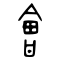
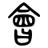

[//]: # (Don't edit the line below. Kanji animated GIF code is automatically generated.)


[//]: # (Edit below this line.)

**[Edit this at Github. Delete this link after editing.](https://github.com/tim0g/tim/tree/main/content/kanji/会/index.md)**

Magsulat dito ng introduction tungkol sa kanji. Mga opinions, impressions, suggestions, trivia, ang kung ano-ano pa.

Generate Lorem Ipsum placeholder text for use in your graphic, print and web layouts, and discover plugins for your favorite writing, design and blogging tools. Explore the origins, history and meaning of the famous passage, and learn how Lorem Ipsum went from scrambled Latin passage to ubiqitous dummy text.
 
**Mnemonic:** "Maikling sentence na makakatulong sa pagsaulo."

### ON-KUN READING

[//]: # (Don't edit the line below. ON-KUN READING code is automatically generated.)


### MEANING & WORDS

#### ➊ **Ibig sabihin**
  - [会](../会)[会](../会)　***reading***　meaning
  - [会](../会)[会](../会)　***reading***　meaning
  - [会](../会)[会](../会)　***reading***　meaning
  - [会](../会)[会](../会)　***reading***　meaning

### SPECIAL READING
  - [会](../会)[会](../会)　***reading***　meaning

### ORIGIN

Mula sa Chinese character na 會.

<table class="kanji-table"><tr><td>

</td><td>▶</td><td>

</td><td>▶</td>
<td class="kanji-origin">會</td><td>▶</td>
<td class="kanji-origin">会</td>
</tr></table>

### RELATED KANJI
- Magkatulad ng ibig sabihin: [合](../合) [遭](../遭) [遇](../遇) [併](../併)
