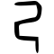
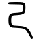

[//]: # (Don't edit the line below. Kanji animated GIF code is automatically generated.)


[//]: # (Edit below this line.)

Pamilyar sa nag-aaral ng Nihongo sa salitang [自](../自)[己](../己)[紹](../紹)[介](../介) (*jikoshōkai* self-introduction), pero hindi masyadong marami ang compound words.
 
**Mnemonic:** "Baku-bako at hindi tuwid ang aking daan."

### ON-KUN READING

[//]: # (Don't edit the line below. ON-KUN READING code is automatically generated.)


### MEANING & WORDS

#### ➊ **SARILI**
  - [自](../自)[己](../己)　***jiko***　sarili
  - [克](../克)[己](../己)　***kokki***　pagkakait sa sarili, abnegasyon
  - [利](../利)[己](../己)[主](../主)[義](../義)　***riko shugi***　egoismo
  - [己](../己)[を](../../nihongo/を)[知る](../知)　***onore wo shiru***　kilalanin ang sarili

### ORIGIN

<table class="kanji-table"><tr><td>

</td><td>▶</td><td>

</td><td>▶</td>
<td class="kanji-origin">己</td>
</tr></table>

### RELATED KANJI
- Magkatulad ng ibig sabihin: [自](../自) [我](../我) [身](../身) [私](../私) [僕](../僕) [俺](../俺) 
