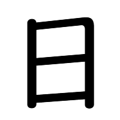

<table class="kanji-info"><tr>
    <td class="kanji-meaning">ARAW, JAPAN, LINGGO</td>
  </tr><tr>
    <td>FREQ1</td>
  </tr><tr>
    <td>Jōyō1</td>
  </tr><tr>
    <td>JLPT N4</td>
</tr></table> 

Ang pag-aaral ng kanji ay ginagawa simula sa Grade 1 sa mga paaralan sa Japan.

Ang tawag sa 1,026 na kanji na pinag-aaralan mula Grade 1 hanggange Grade 6 ay Kyōiku Kanji 教育漢字 (Education Kanji) at subset ito ng mas maraming (2,136) Joyo Kanji 常陽漢字 (Regular-use Kanji).

Kahit na ginawa ang Kyōiku Kanji para sa mag-aaral sa mababang paaralan sa Japan ay maari din nating gawing basehan ito sa ng pag-aaral ng kanji.

[Edit this page](https://github.com/tim0g/tim/blob/main/content/kanji/character/日/index.md)