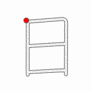

Ang pag-aaral ng kanji ay ginagawa simula sa Grade 1 sa mga paaralan sa Japan.

Ang tawag sa 1,026 na kanji na pinag-aaralan mula Grade 1 hanggange Grade 6 ay Kyōiku Kanji 教育漢字 (Education Kanji) at subset ito ng mas maraming (2,136) Joyo Kanji 常陽漢字 (Regular-use Kanji).

### COMPOUNDS

#### ❶ **ARAW**, mga **ARAW** ng buwan
  - [一](https://timog.org/kanji/一)[月](https://timog.org/kanji/月)[一](https://timog.org/kanji/一)[五](https://timog.org/kanji/五)[日](https://timog.org/kanji/日)　***ichigatsu jūgonichi***　Enero 15
  - [日](https://timog.org/kanji/日)[夜](https://timog.org/kanji/夜)　***nichiya***　araw at gabi
  - [日](https://timog.org/kanji/日)[中](https://timog.org/kanji/中)　***nitchū***　sa araw
  - [九](https://timog.org/kanji/九)[月](https://timog.org/kanji/月)[四](https://timog.org/kanji/四)[日](https://timog.org/kanji/日)　***kugatsu yokka***　Setyembre 4

#### ❷ **ARAW** (bituin)
  - [日](https://timog.org/kanji/日)[食](https://timog.org/kanji/食)　***nisshoku***　solar eclipse
  - [日](https://timog.org/kanji/日)[光](https://timog.org/kanji/光)　***nikkō***　liwanag ng araw

#### ❸ **ARAW** ng Linggo
  - [日](https://timog.org/kanji/日)[曜](https://timog.org/kanji/曜)[日](https://timog.org/kanji/日)　***nichiyōbi***　Linggo
  - [土](https://timog.org/kanji/土)[日](https://timog.org/kanji/日)　***donichi***　Sabado at Linggo

#### ❹ **JAPAN**
  - [日](https://timog.org/kanji/日)[本](https://timog.org/kanji/本)　***nihon (nippon)***　Japan
  - [日](https://timog.org/kanji/日)[米](https://timog.org/kanji/米)　***nichibei***　Japan at Amerika
  - [日](https://timog.org/kanji/日)[銀](https://timog.org/kanji/銀)　***nichigin***　Bank of Japan
  
### SPECIAL READINGS
  - [今](https://timog.org/kanji/今)[日](https://timog.org/kanji/日)　***kyō***　ngayong araw
  - [明](https://timog.org/kanji/明)[日](https://timog.org/kanji/日)　***ashita***　bukas
  - [昨](https://timog.org/kanji/昨)[日](https://timog.org/kanji/日)　***kinō***　kahapon
  - [一](https://timog.org/kanji/一)[日](https://timog.org/kanji/日)　***tsuitachi***　unang araw ng buwan
  
### MNEMONIC

Para sa maraming tao, ang kanji ng 日 ay mukhang bintana, kaya ang pangsaulo nito ay:

>Araw sa may bintana.

### ORIGIN

Sinaunang hugis ng 日:

Kanji GIF animations from [Kanji.gif](https://github.com/jcsirot/kanji.gif) by Jean-Christophe Sirot, originally from the [KanjiVG](https://kanjivg.tagaini.net/) project by Ulrich Apel. Kanji illustrations from [Wiktionary](https://en.wiktionary.org/wiki/%E6%97%A5). All under [CC BY-SA 3.0](https://creativecommons.org/licenses/by-sa/3.0/) license. Edit this page at [Github](https://github.com/tim0g/tim/blob/main/content/kanji/character/日/index.md).