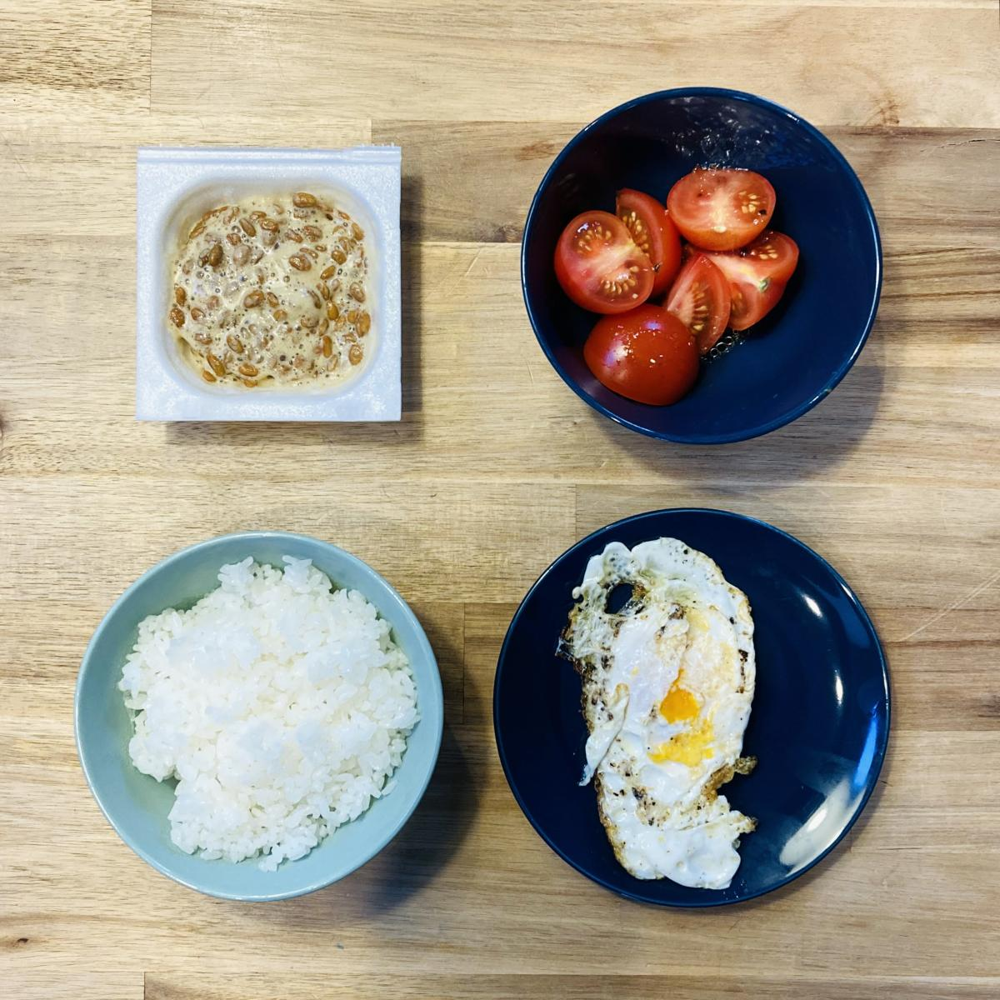

I don't know what's the equivalent of *[bangsilog](https://www.tagaloglang.com/bangsilog/)* or *[longsilog](https://www.angsarap.net/2015/07/20/longsilog/)* in Japan, but this is a fairly typical breafast in our house. We don't have *[bagoong](https://www.sarahlynnpablo.com/blog/2019/7/18/how-to-make-bagoong)* so the tomatoes are seasoned with regular Italian salad dressing. [Nattō](/how-to-make-natto-toast/) (fermented soy beans) is always a good (and protein-rich) addition to white rice.

Now, having seen photos of *bangsilog*, I suddenly got the urge to [marinate some milk fish](http://www.pinaycookingcorner.com/2012/02/daing-na-bangus-milkfish-marinated-in.html) in vinegar and garlic.
