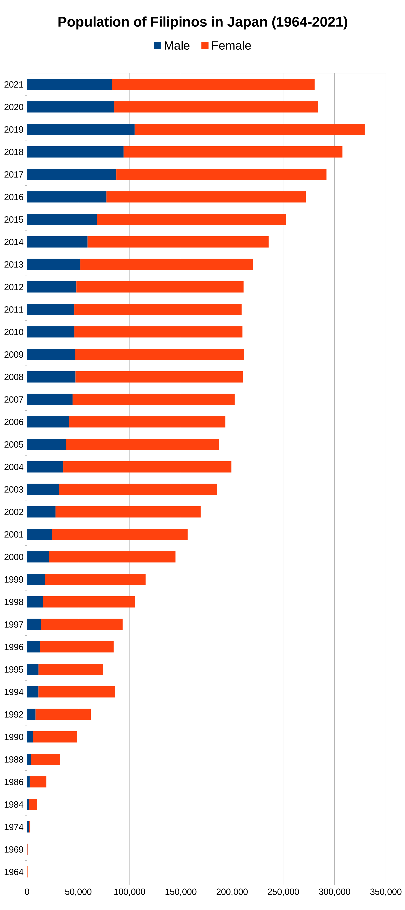

; photo info by [Paul Eric Darvin](https://www.flickr.com/photos/darvader78/).")

After digging through the [figures](https://www.moj.go.jp/isa/policies/statistics/toukei_ichiran_touroku.html) available from the [Immigration Services Agency](https://www.moj.go.jp/isa/), I made a chart of the rise of Filipino population in Japan.

In 1964, the earliest year of available data, the population of Filipinos in Japan was just 527 individuals, barely showing as a thin line in the chart below. Five years later, in 1964, it added just 150 Filipinos more, for a total of 677. 

Another five years later, in 1974, we see a significant change: there were now 3,129 Filipinos in Japan, men (1,970) outnumbering the women (1,159) almost 2 to 1. This would be the last year men would outnumber women.

1974 is just two years after kleptocrat Ferdinand Marcos [declared martial law](https://en.wikipedia.org/wiki/Martial_law_in_the_Philippines#Marcos_administration) in the Philippines. By this time the country was already struggling from high rates of unemployment, political instability and economic mismanagement, driving people to seek better opportunities abroad.

A decade later, in 1984, the Filipino population in Japan has tripled to 9,618 with the women outnumbering men almost 4 to 1. The Philippine economy has reached its lowest point by this time, due to the [endemic corruption](https://historycollection.com/the-conjugal-dictatorship-of-ferdinand-and-imelda-marcos-shook-the-phillippines/) of the Marcos presidency, producing the country's worst recession in 1984 and 1985.

The 80s is also the decade when female entertainers entered Japan in large numbers, skewing the female to male ratio.

From the 80s, the Filipino population would increase until it surpassed 300,000 in 2018 and reached its greatest extent (329,465) in 2019, the year coronavirus was first detected in China and spread around the globe producing the ongoing Covid pandemic. By this time, technical intern trainees have surpassed entertainers as the main group of Filipinos entering Japan.

In response to the pandemic, Japan closed its borders to most foreigners, including technical intern trainees. Most ttrainees return home after their contract expires in three years, which would explain the population decline in 2020 and 2021.

In the short term, Filipino (and overall foreigner) numbers in Japan would largely depend on when (or whether) the global pandemic would be controlled, and in the long term, how many workers Japan needs to support its graying population.

