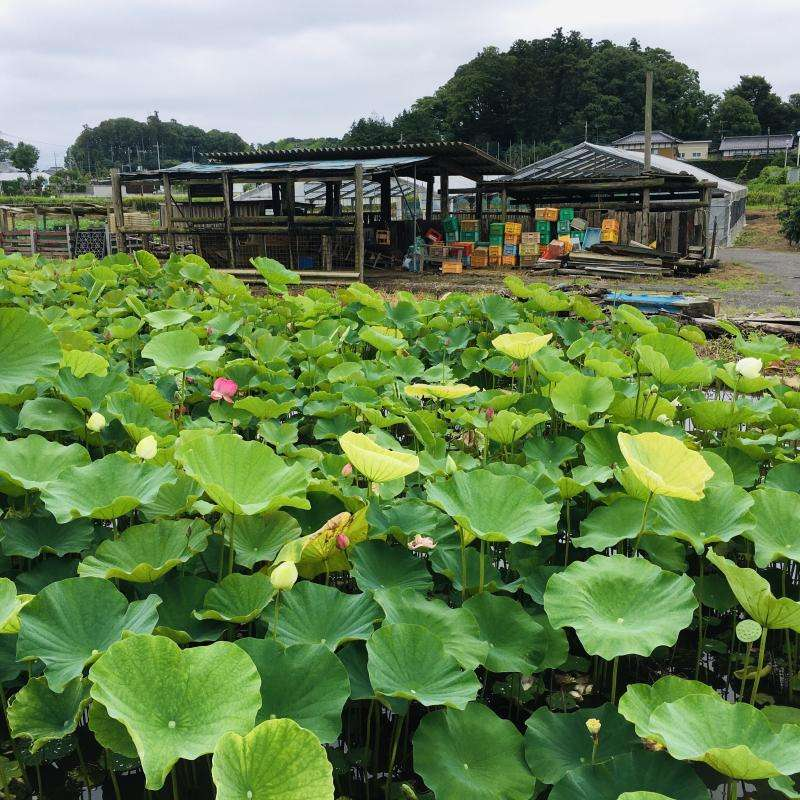
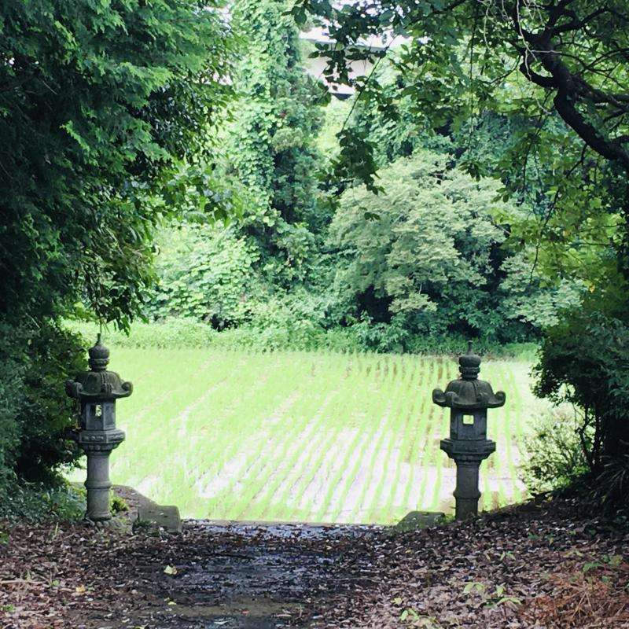

Puro ulan nitong mga nakaraang araw kaya nang nagkaroon ng kaunting oras sa weekend na tumila ang ulan ay nag-bisikleta ulit kami sa paligid. Ngayon ay medyo malayo ang nabisikleta namin, isang lugar na hindi pa namin napupuntahan, sa tabi ng mga palayan. Ito ang rainy season bago mag-summer sa Japan at saturated ang green sa buong paligid.

Parang hawig sa landscape ng [Tonari no Totoro](https://en.wikipedia.org/wiki/My_Neighbor_Totoro).

May sinabi si Phillip E. Wegner sa kanyang [review ng Tonari no Totoro](http://imagetext.english.ufl.edu/archives/v5_2/wegner/) tungkol sa *satoyama*, ang setting ng pelikula:

>According to another more recent definition, satoyama includes not only mixed community forests, but also the entire landscape necessary for agricultural activity. Thus, according to this definition, satoyama consists of a mosaic of mixed forests, rice paddy fields, dry rice fields, grasslands, streams, ponds, and reservoirs for irrigation. In this system, each habitat is considered essential for the agricultural economy. Grasslands were maintained to feed horses and cattle, which were then used as sources of power in agricultural activities. Streams, ponds, and reservoirs were managed to adjust water levels in the paddy fields and to supply fish to eat. (Kobori and Primack 308) 
>
>It is this sense of a total integration with the land, a blurring of the lines between nature and culture, and a collective stewardship of these commons that is a central aspect of the film's larger vision as well. Crucially, without landscape, there can be no possibility of an environmental politics isolated from other social and cultural concerns. (However, in our non-utopian world the film served as the inspiration for efforts to preserve satoyama in the Sayama Hills region, giving rise in April 1990 to the National Trust of Totoro no Furusato [homeland of Totoro].)

🌳🌳🌳

Isa sa mga magandang bagay sa pagbibisikleta ay madaling makadiskubre ng mga lugar na hindi napupuntahan o nahihintuan kapag nakakotse. Kagaya nitong tindahan ng mga locally made na gulay at pagkain at halaman.

May mga water lilies (*[renkon](https://en.wikipedia.org/wiki/Nelumbo_nucifera)*) sa tabi at mga cactus at iba't-ibang tropical plants na kagaya nitong pitcher plant sa loob.

Pag-uwi ay may nadaanan kaming Buddhist temple sa tabi ng isang sementeryo. Tahimik--at malamok ngayong summer, kaya umalis kaagad kami.

