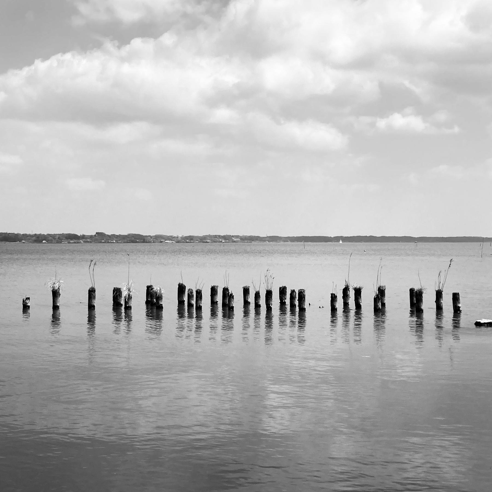

On an unusually hot spring day, we rode our bicycles to the Ground Self-Defense Force Camp on the shores of Lake Kasumigara hoping to see the *sakura* trees inside like we used to before the Coronavirus.

It was closed.

So we pedalled to the nearby Kasumigaura Park instead, ate Brazilian burger and "Okinawan" ice cream from the food trucks, before biking back home along the shores of Hanamuro River.

Before we got the the park, we took some pictures from the banks of the lake, in one of those semi-secluded areas between the fishing spots of the locals.

