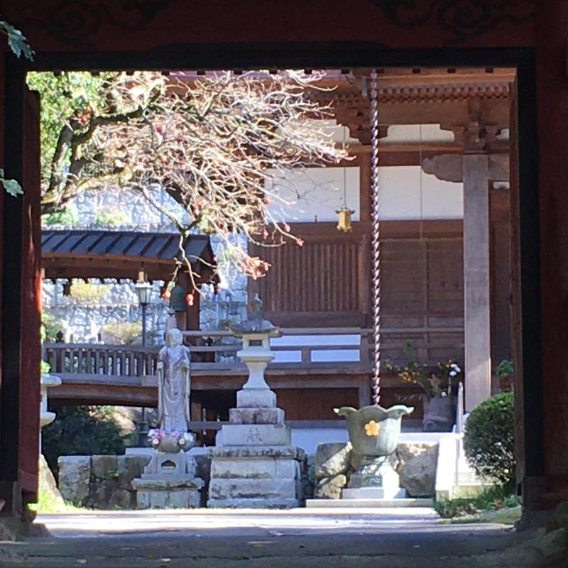
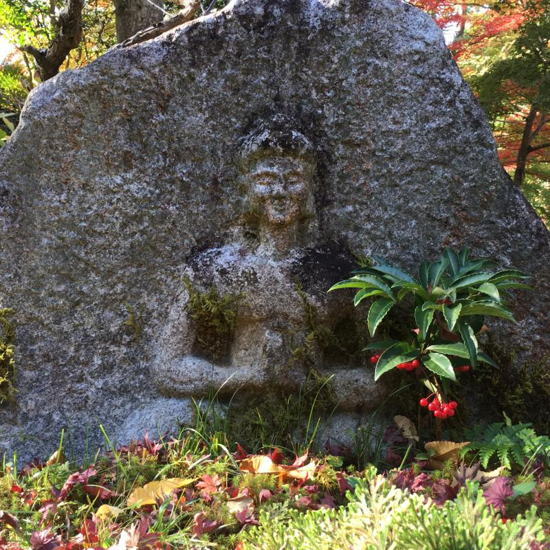
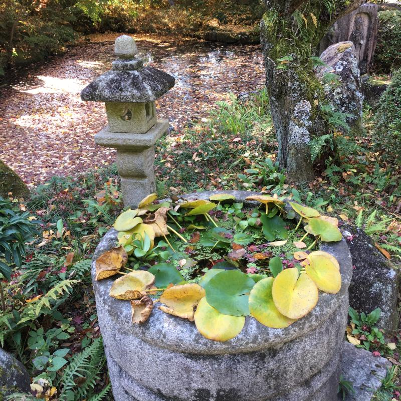
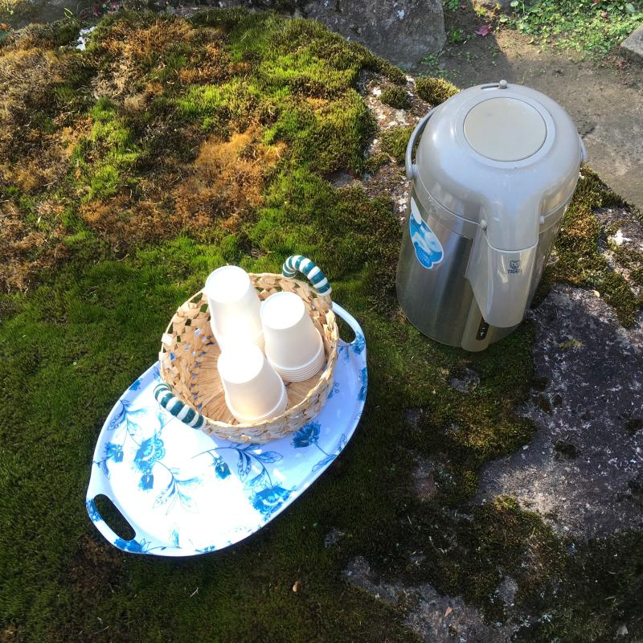
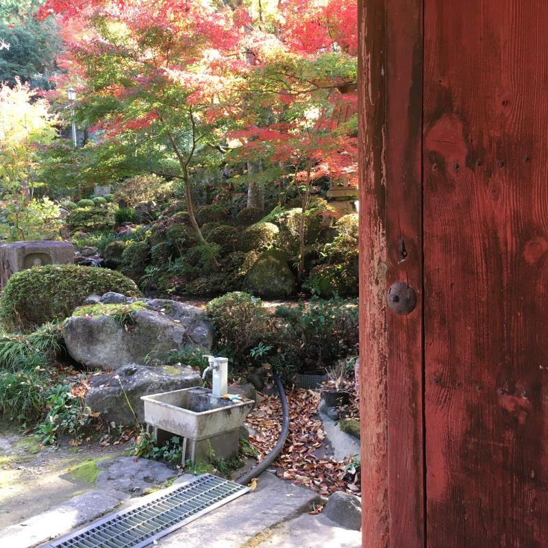

By accident, minsan may nadaanan kaming Buddhist temple sa baba ng Tsukuba-san kaya nang nagkaroon ng oras ay binalikan namin.

Gusto ko ang feel ng mga Buddhist temples at Shinto shrines sa Japan, tahimik, halos laging walang tao, malapit sa nature, at makakapag-isip ka ng mga spiritual na bagay.

Ang partikular na templong ito ay walang tao nang napadaan kami last autumn. Ang indication lang na may human presence ay ang dispenser ng ocha at paper cups na inihanda para sa mga bisita sa templo. Hindi namin ginalaw dahil: coronavirus.

