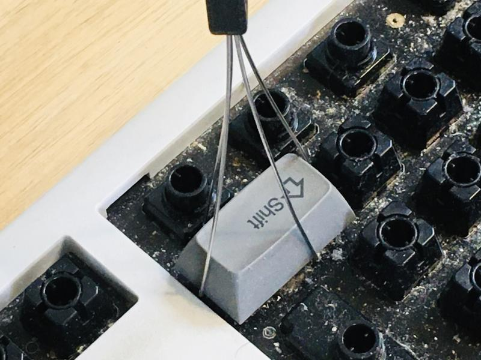

Isa sa mga kailangang gawin na hindi magawa-gawa ay ang paglilinis ng keyboard ko sa trabaho. Pero dahil sa corona, hindi makalabas masyado sa bahay kaya may oras sa mga ganitong gawain.

Ito ang paborito kong keyboard sa trabaho: **Topre Realforce Just Systems Japanese-layout keyboard**.

Hindi kami makapili ng computer na gagamitin pero pinalitan ko ang keyboard ng nabili ko ilang taon na ang nakakaraan mula sa [online store ng Just Systems](https://www.justmyshop.com/). Simpleng puti at grey, at may ilang extra na pulang keys.

Madumi. Sa ilang taon na gamit ay malagkit na ang mga keys at puno na ng alikabok, buhok, maliliit na piraso ng pagkain, balat, at kung ano-ano pang dumi ang ilalim ng mga keys. Kailangan ito ng vacuum cleaner, basahan, cotton buds, at air blower.

Puwede nang ibabad sa soap water at brashin ang dumi.

Light brushing sa tubig na may sabon. Dahan-dahan para hindi mabura ang print sa mga keys.

Malinis na! Kailangang patuyuin nang husto bago ikabit ulit sa keyboard. Kapansin-pansin ang maliit na Space key ng Japanese-layout keyboard kumpara sa English version.

Ibalik isa-isa. Pinalitan ko ang ilang keys ng pulang version na hindi ko pa nagagamit mula nang binili ko ang keyboard na ito. Ayan, puwede na ulit gamitin!

Isa pang pagkakaiba ng Japanese-layout keyboard sa English version, bukod sa maliit na Space key, ay ang oversized na Enter key. Pinalitan ko din ang Shift key ng pula.

Sa kaliwang side naman ay ang pulang Half/Full Character key at Tab key. Puwede na ulit gamitin.

