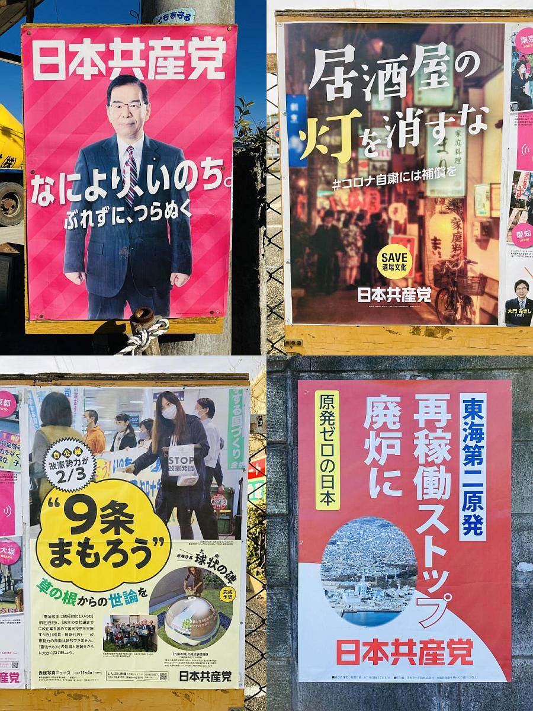

 exercising self-restraint regarding the Covid pandemic")

Nice logo *kanji*, too.

I'm no communist* --I prefer European socialism with Japanese characteristics--but I must admit the [Japanese Communist Party](http://jcp.or.jp/) (JCP) has some really cool posters, especially when compared with the bland ones put out by the ruling parties.

I've been wanting to take photos of these posters that I always see on the way to work but only recently have I been able to do so. Must of these posters can be [downloaded as PDFs](http://jcp.or.jp/web_download/cat/) from JCP's website, by the way.

Clockwise from upper-left: 1. Kazuo Shii, the face of the JCP; 2. “Don't turn off the lights of *izakaya*”; 3. “Scrap the Tōkai No.2 Power Station” (JCP is anti-nuclear energy); 4. “Let's protect Article 9” (JCP advocates pacifism)

The famous Article 9 of the Japanese Constitution states:

>(1) Aspiring sincerely to an international peace based on justice and order, the Japanese people forever renounce war as a sovereign right of the nation and the threat or use of force as means of settling international disputes.

>(2) In order to accomplish the aim of the preceding paragraph, land, sea, and air forces, as well as other war potential, will never be maintained. The right of belligerency of the state will not be recognized.

Despite this, however, Japan actually maintains the world's 5th [most powerful military](https://www.newsweek.com/most-powerful-military-forces-world-america-china-russia-1621130).

**But what does that even mean, actually? [Labeling people as communist](https://sandratrappen.com/2013/10/09/fascism-communism-or-socialism/), socialist or capitalist is as superficial as saying someone is "racist" or "anti-Semite." Most of the time, it serves no purpose than to denigrate without understanding others’ beliefs or shut down civil discourse by resorting to name-calling.*