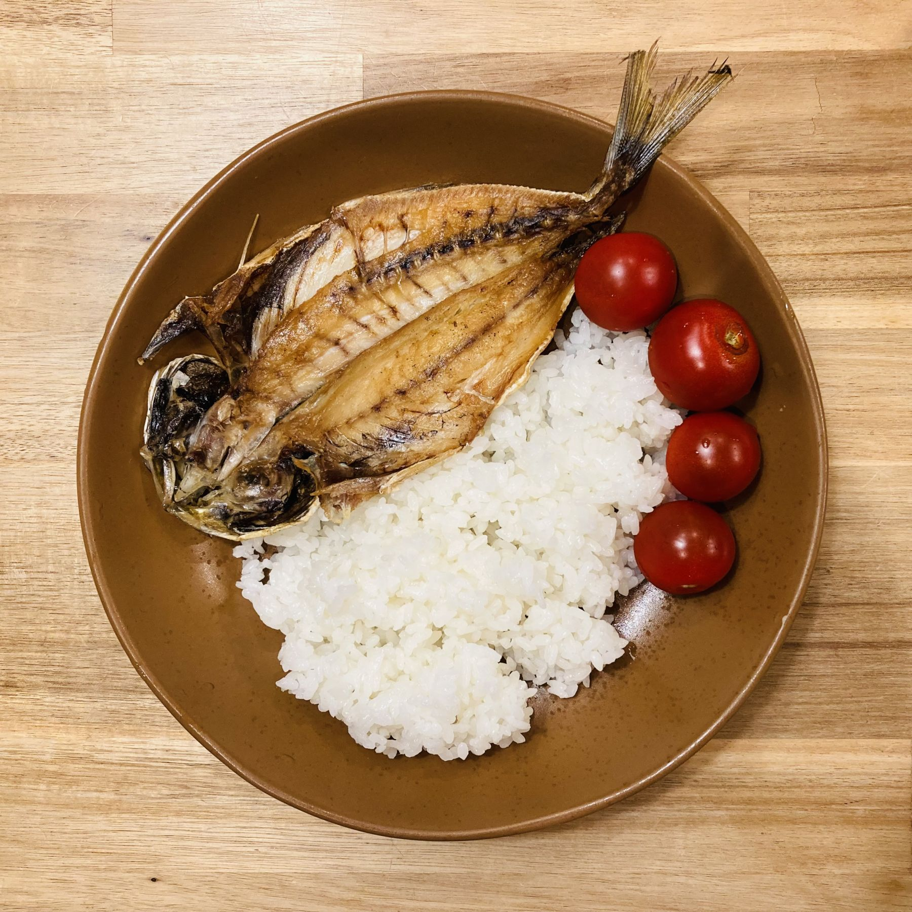

Rooting around in the kitchen for left-overs to make a quick meal, this is what I came up. Carbohydrates, protein, vegetable/fruit: it doesn't really get much simpler than this.

Is tomato a vegetable or fruit? It's both. Which sort of makes it a superfood. Or something.

