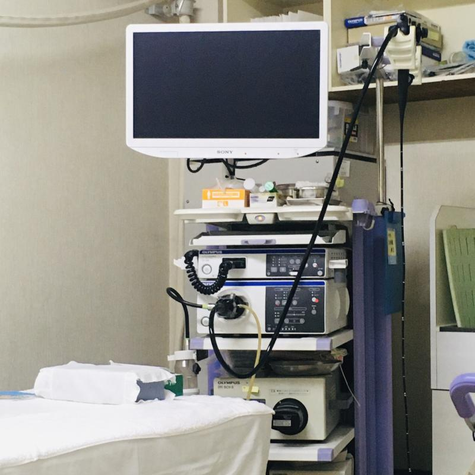

Unang araw ng mahabang *obon yasumi* at nasa clinic ako para sa isang endoscopy. Endo+scopy, mula sa dalawang Greek word na ang ibig sabihin ay "loob" at "tignan". Sa tunog pa lang ay hindi na kaaya-ayang procedure itong endoscopy na ito, bukod pa sa masyadong kumplikado ang pangalan.

Mas gusto ko ang mas simpleng *ikamera*: 胃カメラ (camera sa tiyan).

Mas gusto ko pang pumunta sa dentista kaysa gawin ang procedure na ito. Papainumin ka ng nakakasukang mala-sopas na likido, iisprayhan ang ilong at lalamunan mo ng pangpamanhid, at ipapasok sa ilong mo (o bibig depende sa hilig mo) hanggang sa tiyan ang isang maliit na camera sa dulo ng mahabang cable.

Ang tawag nila dito ay *upper* endoscopy.

Habang naghihintay ako sa harap ng information counter pagkatapos (kailangan maghintay ng 40 minutes pagkatapos) ay nabasa ako na gumagawa din sila ng *lower* endoscopy, kung saan sa puwit naman pinapasok ang camera para siyasatin ang bituka (colon). Tapos naisip ko, teka, may iba naman sigurong camera na ginagamit para...?

Pero ang mga tanong na alam mo na ang sagot ay hindi mo na dapat pinag-iisipan ng husto.

 `Makikita ang mahabang parang latigong camera sa tiyan (at bituka) sa kanang bahagi.`