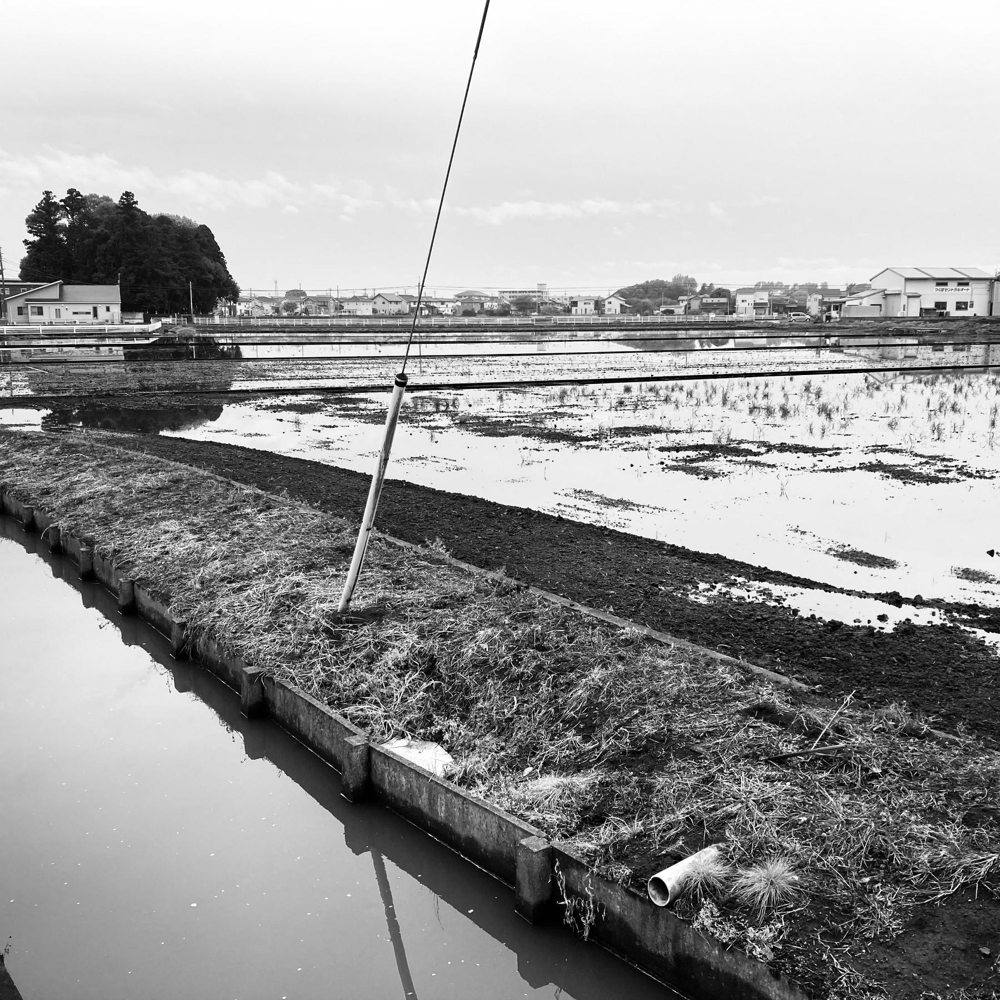
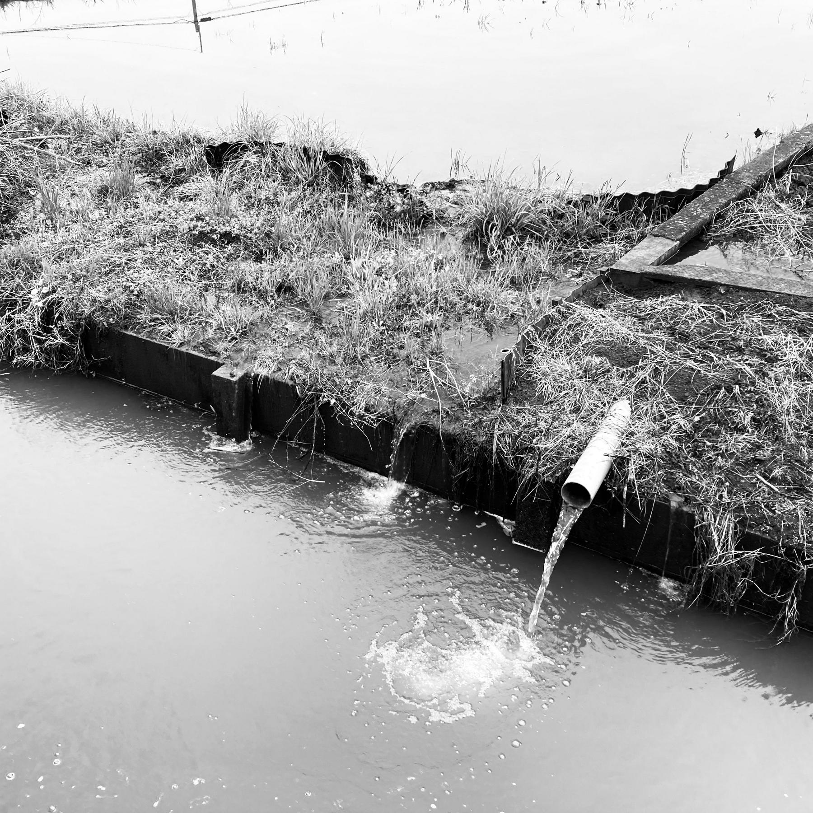
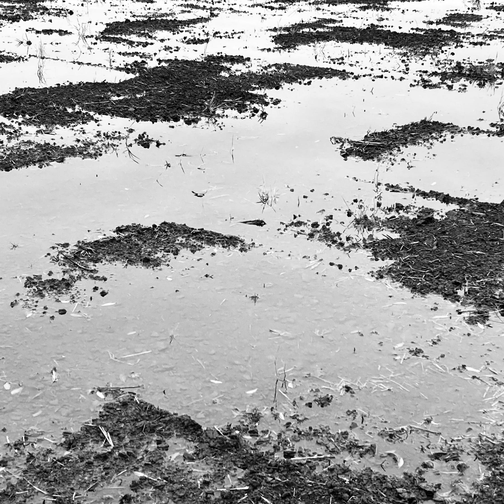
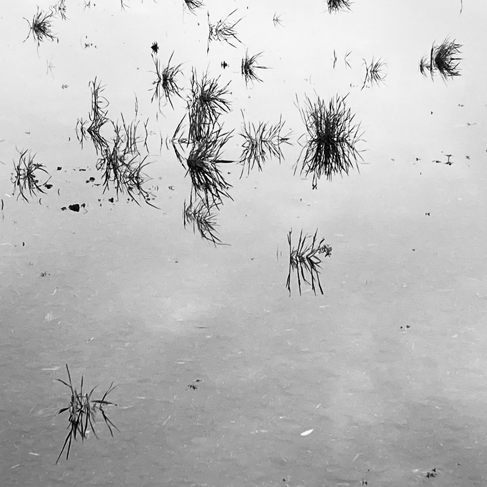
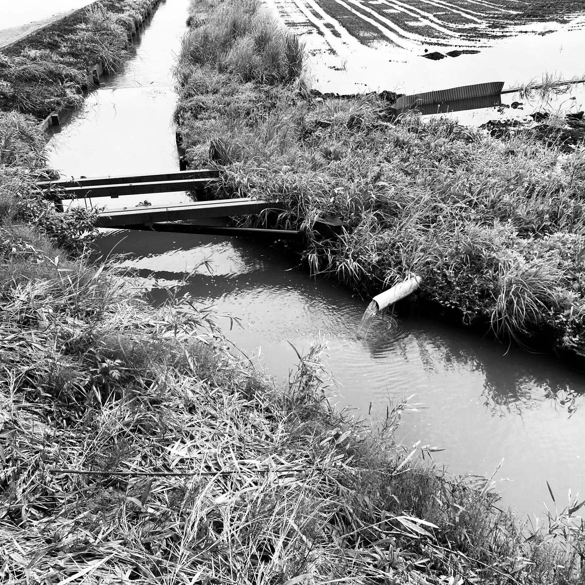
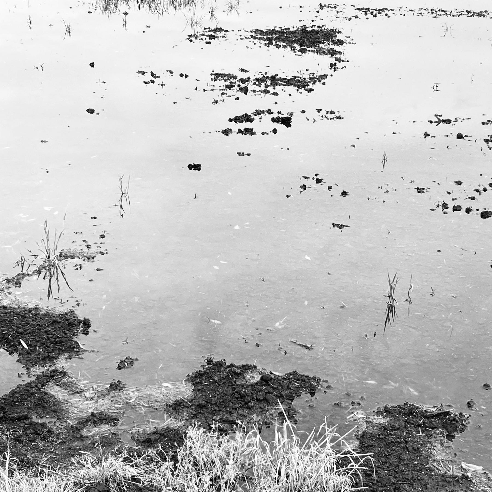
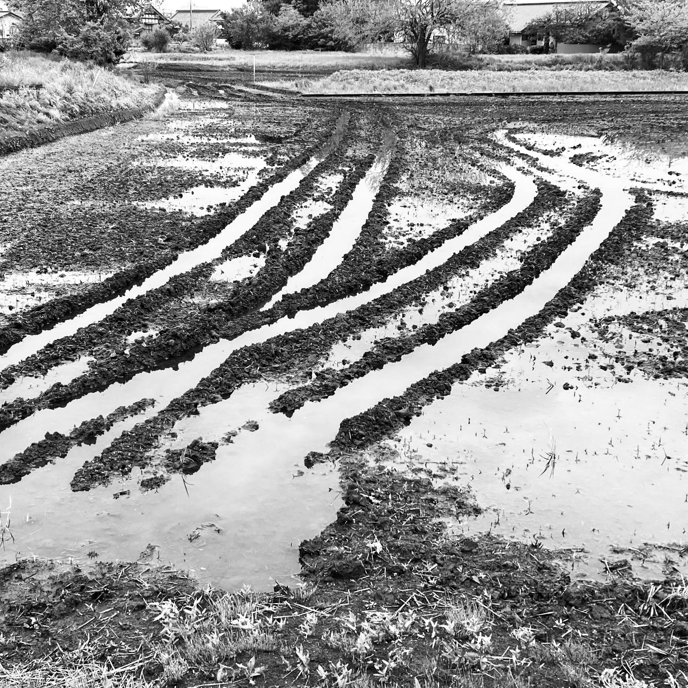
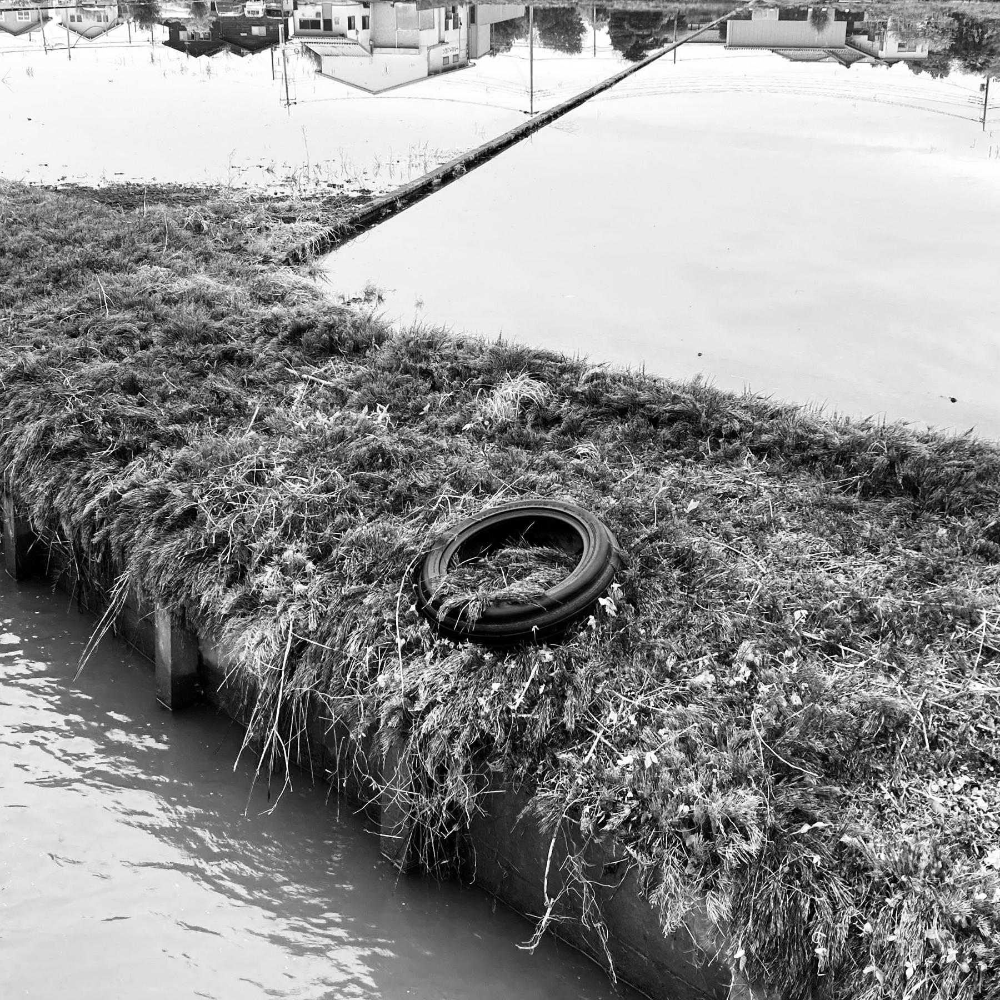

Last night when I came home from work, for the first time this year the sound of croaking frogs could be heard from the nearby freshly drenched rice fields.

Rains brought by the start of the rainy season in eastern Japan has flooded the fields, rousing the frogs and summoning the herons and egrets that always come at this time of the year.

I've always loved the sound of cloaking frogs at night. On some evenings the sound can be almost deafening when you're standing outside, and that's when you realise you're surrounded by living nature. In the morning, wading birds get their bellies full of these local delicacies.

The sound of frogs reminds me of my little hometown in the northwest Luzon in the Philippines where, the last time I visited, they served us *adobo* frogs for lunch.

