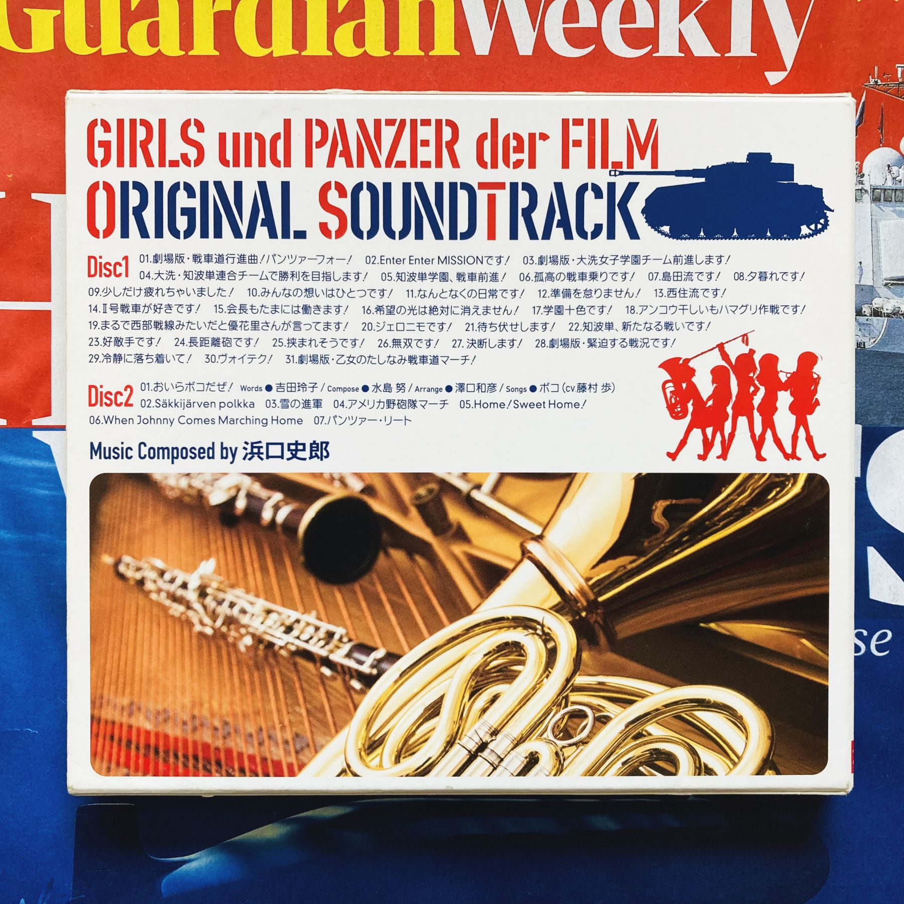
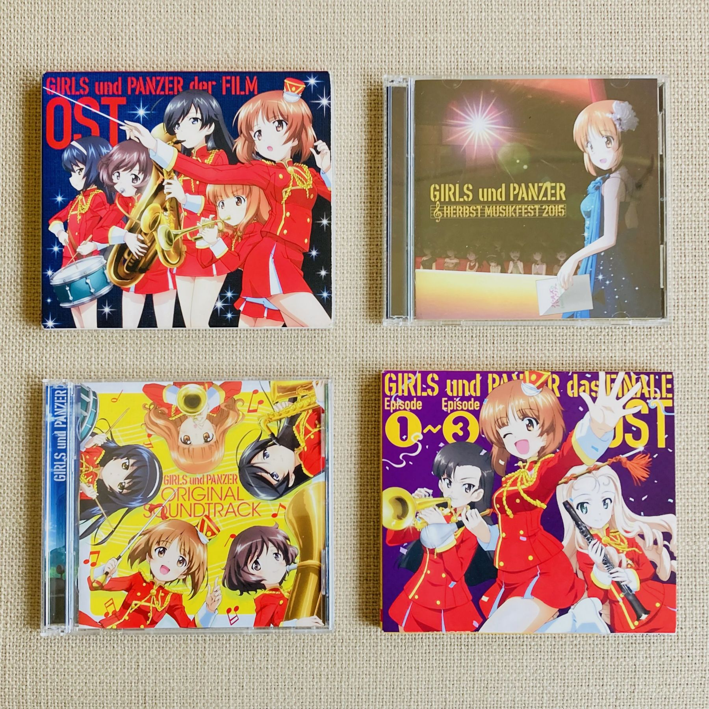

I'm not a Girls und Panzer expert: my whole knowledge of this anime comes from being forcibly dragged to the Girls und Panzer der Film movie a few years back, a movie that I unexpectedly enjoyed even after being audibly assaulted nonstop by tank warfare for the last half-hour of the movie.

Seriously, *kawaii* high school girls practicing *senshadō*, the way of the tank. What's not to like? (Not to worry, although they use live rounds in their matches, special emphasis--I learned--is made for the participants’ safety.)

In our house, we have no less than four 2-CD albums of the original soundtrack of Girls und Panzer and although I haven't heard all 8 CDs, I very much enjoy the Girls und Panzer der Film soundtrack, playing it almost nonstop lately (it's Golden Week and I'm holed up inside the house with Covid), marching music interspersed with quiet melodies, much like in the film.

What I like is the unbridled energy and enthusiasm of these battle-hardened girls, as these song titles show, all punctuated by exclamation marks:

1. 劇場版・戦車道行進曲！パンツァーフォー！ Way of the Tank Marching Song! Panzer vor!
2. Enter Enter MISSIONです！
3. 劇場版・大洗女子学園チーム前進します！ Ōarai Girls Academy Team forward!
4. 大洗・知波単連合チームで勝利を目指します！ Ōarai/Chibatan Combined Team aims for victory!
5. 知波単学園、戦車前進！ Chibatan Academy, tanks forward!
6. 孤高の戦車乗りです！ That's some unusual tank-riding shit!
7. 島田流です！ Shimada Style!
8. 夕暮れです！ What a day!
9. 少しだけ疲れちゃいました！ We're a little bit tired!
10. みんなの想いはひとつです！ Our hearts are one!
11. なんとなくの日常です！ Somewhat routine!
12. 準備は怠りません！ We don't neglect our preparations!
13. 西住流です！ Nishizumi Style!
14. Ⅱ号戦車が好きです！ We like the Panzerkampfwagen II!
15. 会長もたまには働きます！ Even the director has to work too sometimes!
16. 希望の光は絶対に消えません！ The light of hope will never be extinguished!
17. 学園十色です！ Gakuen Toiro!
18. アンコウ干しいもハマグリ作戦です！ Anglerfish-Dried Sweet Potato-Clam strategy!
19. まるで西部戦線みたいだと優花里さんが言ってます！ Yukari-san says it looks just like the northern front!
20. ジェロニモです！ Geronimo desu!
21. 待ち伏せします！ We lie in ambush!
22. 知波単、新たなる戦いです！ Chibatan, this is a new fight!
23. 好敵手です！ A worthy opponent!
24. 長距離砲です！ Long-range gun!
25. 挟まりそうです！ We're gonna get crushed!
26. 無双です！ Peerless!
27. 決断します！ Decision time!
28. 劇場版・緊迫する戦況です！ It's a tense battle situation!
29. 冷静に落ち着いて！ Calm down!
30. ヴォイテク！ Wojtek!
31. 劇場版・乙女のたしなみ戦車道マーチ！ Maiden's Taste Way of the Tank March!

Photos of other CDs here: [Girls und Panzer OST](/girls-und-panzer-original-soundtrack/girls-und-panzer-ost-cd.jpg), [Girls und Panzer das Finale OST](/girls-und-panzer-original-soundtrack/girls-und-panzer-das-finale-ost-cd.jpg), and [Girls und Panzer Herbst Musikfest 2015](/girls-und-panzer-original-soundtrack/girls-und-panzer-ost-herbst-musikfest-2015-cd.jpg).

## Girls und Panzer songs you can march to!

Fortunately, you needn't buy the Girls und Panzer CDs: here's a nice Youtube collection of marches from the Girls und Panzer soundtrack that will fill you with energy for marching--or driving a tank.



## Ohayō gozaimasu! Girls und Panzer style!

Finally, here's a short clip that shows how disarmingly cute and ridiculously insane this whole series is.

