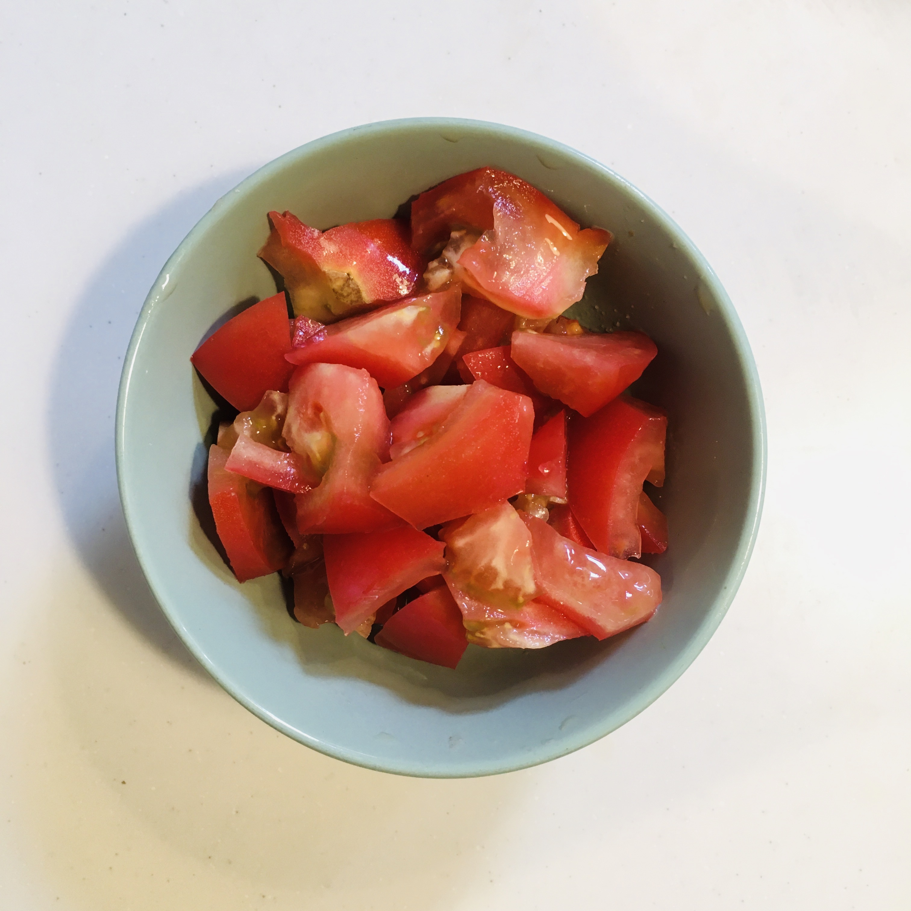
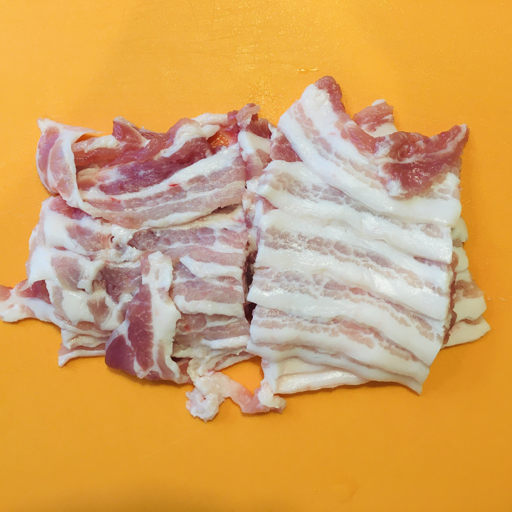
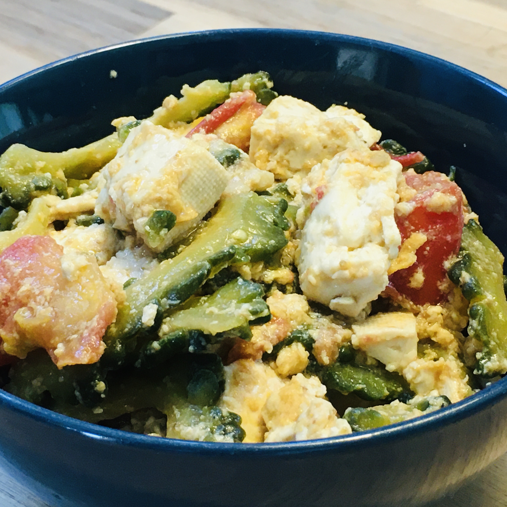

Summer na naman, kaya mura ang ampalaya, kaya mapapaluto ka ng *gōya chanpuru*. Okinawan version ito ng ating ginisang ampalaya: may *tofu* bukod sa usual na itlog na hinahalo natin.

Ang ampalaya na pamilyar sa mga Southeast Asians ay maaring dumating sa sinaunang Ryukyu Kingdom (ang Okinawa sa kasalukuyang panahon) noong 14th hanggang 16th century mula sa Malay archipelago. Ang *chanpuru* na ang ibig sabihin ay "something mixed" ay mula daw sa "campur" na salitang Malay na magkatulad ang ibig sabihin.

Kapag summer ay madaling magtanim ng amplaya at karaniwang pinapatubo ito sa mga school at bahay para pangtabing ng mga bintana mula sa mainit na araw. Kaya kapag summer sa Japan ay madaling humanap ng ampalaya, bigay man o bili.

Itong ginawa kong *gōya chanpuru* ay may oyster sauce.

(Ang pormal na pagsulat ay gōyā chanpurū (mahabang o, a, at u) pero karaniwang sinusulat din nang gōya chanpuru. Ang ampalaya sa Nihongo ay *tsurureishi*, pero karaniwang *nigauri* (bitter gourd) o *gōyā*.)

