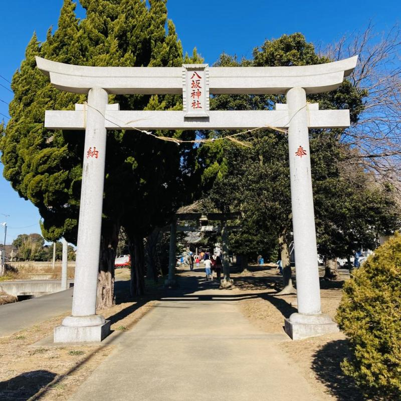

Hatsumōde (初詣) is the year's first visit to a shrine (jinja) or temple (otera) in Japan, traditionally done on New Year's Day.

Today we did ours just now at our local Yasaka Jinja.

Despite the sunny weather, it was freezing cold outside and the wind was literally howling between the houses, but we put on at least three layers of clothing, mufflers and headgears, walked about 500 meters to the shrine and took our place in the line.

At the shrine, we respectfully summoned the deities and prayed for a good year.

Before we left, someone who looked like he is connected with the local residents' association offered us one *mikan* each, after we disinfect our hands with alcohol of course. And then we headed back home before we freeze to death.

Let's hope 2022 will be a good year.

