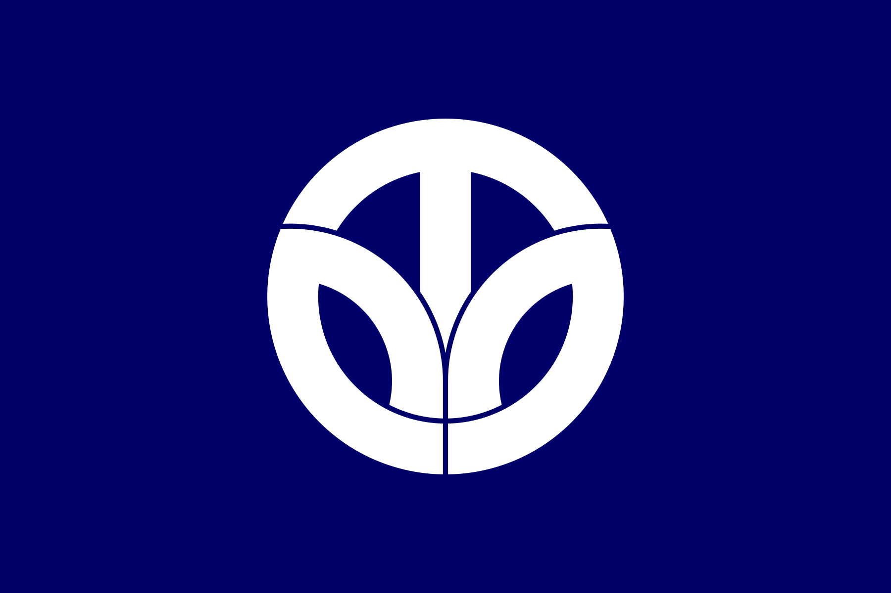

.")

I recently collected all the prefectural flags of Japan for a project, and here they are below in rasterized form, alphabetically arranged.

Most are formed by stylized hiragana and katakana (and even kanji) and shapes of prominent geographical features and symbols, which may not be obvious on first observation. 

Embarrassingly, I didn't even realise until recently that the emblem of [Ibaraki](#ibaraki-茨城) (where I live) is a stylized rose bud.

I like simple, uncluttered design. Besides Ibaraki, my other favorites are [Fukuoka](#fukuoka-福岡), [Hokkaidō](#hokkaidō-北海道), [Kyōto](#kyōto-京都), [Nagasaki](#nagasaki-長崎), [Saga](#saga-佐賀), and [Shizuoka](#shizuoka-静岡).

## Aichi 愛知
Aichi's flag combines あ (a), い (i), and　ち (chi) to form a design representing the overseas development of the prefecture facing the Pacific Ocean and the hopeful Rising Sun Wave Crest.

## Akita 秋田
The Akita flag features a dynamically stylized katakana ア (a) from its name, representing the progress and development of the prefecture. A striking design by an anonymous creator, it vaguely resembles the Nike logo, which it precedes by more than ten years.

## Aomori 青森

Akita's flag shows the topographic contour of the prefecture--the green color representing hope and future, and the white color representing the infinitely expanding space.

## Chiba 千葉
Chiba's emblem, the oldest of all prefectural emblems, is a combination of katakana チ and ハ to form the shape of nanohana, the prefectural flower. The blue backgruond represents hope and development.

## Ehime 愛媛
Ehime's design features a *[Mikan](https://en.wikipedia.org/wiki/Citrus_unshiu)* blossom, the prefectural flower, shifted slightly to the left. The white of the petals represents modesty and vitue; the green represents peace and hope; and the yellow represents happiness. It's a simple construction that contains no characters.

## Fukui 福井

Fukui's flag shows the prefecture name in katakana (フクイ) arranged in a circular design. The design where a young leaf grows between two leaves symbolizes the wish for the development of the prefecture.

## Fukuoka 福岡

Fukuoka's flag design incorporates stylized rendetion of ふく (fuku) to represent the plum blossom, the prefectural flower. The emblem represents peace and development, and harmony and progress of the prefecture's citizens.

## Fukushima 福島

Fukushima's flag features a highly stylized rendering of hiragana ふ (fu) in circular shape, symbolizing harmony and solidarity of its people, and the steady development of the prefecture. 

## Gifu 岐阜

The emblem on the flag is stylized first kanji of Gifu's name (岐). The green color scheme represents the beauty of nature in the prefecture.

## Gunma 群馬
In the middle of Gunma's flag are the characters 君 and 羊 arranged horizontally to form 羣 (the old form of 群) surrounded by the prefecture's three prominent mountains ([Akagi](https://en.wikipedia.org/wiki/Mount_Akagi), [Haruna](https://en.wikipedia.org/wiki/Mount_Haruna) and [Myōgi](https://en.wikipedia.org/wiki/Mount_My%C5%8Dgi))  stylized into crescent shapes to reprsent "growing Gunma". The purple color of the flag represents the cultural prosperity of Kōzuke Province (Gunma in ancient times).

## Hiroshima 広島
Hiroshima's flag features a stylized katakana ヒ(hi) to form a circle, representing the harmony and unity of the citizens of the prefecture, while the overlap of the circles represents progress and development.

## Hokkaidō 北海道
The seven-pointed star of the prefectural flag symbolizes the pioneering spirit of the ancestors who endured the harsh wind and snow and also represents the future of Hokkaidō.

The red of the star symbolizes the indomitable spirit of the people, the white represents brilliance and wind and snow, and the dark blue the sky and sea of the North.

## Hyōgo 兵庫
Hyōgo's prefectural flag features a stylized 兵 in the shape of a wave, symbolizing the prefecture's position between the Sea of Japan in the north and the Seto Inland Sea in the south. The cerulean blue represents youth while the white expresses brightness and honesty.

## Ibaraki 茨城

Ibaraki's flag, created by famed illustrator Kazumasa Nagai, shows a stylized rose bud, the prefectural flower. The swirls of the rose suggest advancement, creativity, dynamics and development.

## Ishikawa 石川

Ishikawa literally means "stone" and "river". The flag design shows the shape of the Noto Peninsula (where prefecture is located) jutting out to the Sea of Japan, and vaguely resembling an oblique *石川*. The blue background represents the Sea of Japan and the prefecture's land blessed by rich greenery, clean water and clear air.

## Iwate 岩手
The prefectural flag features a highly stylized, vertically symmetrical kanji of 岩, representing its progress to a prosperous and highly livable prefecture.

## Kagawa 香川

Stylized katakana カ (ka) from the prefecture's name, based on the image of an olive leaf, symbol of peace since ancient times. It also represents blessed climate and development. The background color is olive green.

Olive is the prefectural tree and has been cultivated in the prefecture for over 100 years.

## Kagoshima 鹿児島

The design is a highly stylized rendition of the prefecture's Satsuma and Ōsumi Peninsula and the part where Shibushi Bay is located is dented. The active volcano Sakurajima, symbol of the prefecture, is represented by the red circle in the middle.

## Kanagawa 神奈川
Kanagawa's flag features an almost abstract interpretation of the kanji 神 ("kami" or spirits venerated in the Shinto religion) from the prefecture's name.

## Kōchi 高知
Hiragana と (to) from Kōchi's old name Tosa and katakana コ (ko) from Kōchi are combined to create a circular design: the sword edge pointed upward symbolizes progress and the circle symbolizes peace and cooperation.

## Kumamoto 熊本
Katakana ク (ku) from the prefecture's name is transformed into the shape of Kyūshū, one of Japan's four main islands. The circle in the middle symbolizes Kumamoto's position in the middle of the island.

## Kyōto 京都

This design takes the first kanji (京) of the prefecture's name and stylized it into a six-pointed leaf, symbolizing the magnificence of the ancient city, and the over-all design represents the citizens’ unity and cooperation.

## Mie 三重
Like Miyagi Prefecture's emblem, Mie's flag features a stylized み (mi) designed to look like an upward arrow to create an image of the prefecture's progress, and the circle represents the world-famous pearl farming in Ago Bay.

## Miyagi 宮城

The flag shows a stylized み (mi) to represent the leaves of the [miyaginohagi](https://en.wikipedia.org/wiki/Lespedeza_thunbergii), the prefectural flower. The center leaf represents the prefecture's eternal development, the left leaf the harmony and cooperation of the citizens, and the right leaf the love of hometown.

## Miyazaki 宮崎
Miyazaki's flag features its symbols: nature (green) and the sun (yellow). At the center is the stylized katakana ミ (mi) arranged to look like steps upwards, and represents the progress of the prefecture.

## Nagano 長野
The katakana ナ (na) is stylized into a bird in flight inside a circle, where the shape of a mountain is reflected like on a lake. The design imagines the progress and development of the prefecture through its nature, and the citizen’ friendship and unity.

## Nagasaki 長崎
One of the only two prefectures to feature an alphabet on its flag, Nagasaki's international outlook is represented by a stylized N transformed into a dove, symbol of peace, the light blue color suggesting the bright sea and sky.

## Nara 奈良
Featuring a stylized katakana ナ (na), the outer cycle represents the nature of the great Yamato Province (Nara's old name) , the inncer circle represents the spirit of harmony, and the horizontal axis represents the continuous progress of the prefecture.

## Niigata 新潟
Niigata's emblem in its flag is formed by a stylized kanji 新 at its upper-middle part and the ガ (ga) on the left and タ (ta) on the right, in the shape of a collar representing harmony, hope and development of the prefecture.

## Ōita 大分
Ōita Prefecture's emblem is formed by three kanji 大大大 arranged in a circle, symbolizing trust, work and fraternity. The image of three people holding hands also represents peace and cooperation and the rising sun image the figures form represents the development of the prefecture.

## Okayama 岡山

The kanji 岡 is transformed into a circle design, representing the unity of its citizens and the progress and development of the prefecture.

## Ōsaka 大阪
Ōsaka's emblem is said to have its roots in Toyotomi Hideyoshi's battle standard, the Sennari gourd. The three branched O's (from Ōsaka) represent hope, prosperity and harmony.

## Saga 佐賀
Stylized petals of camphor, the prefectural tree, form the design of the emblem, with the white petals symbolizing fairness and cleanliness, and the red stamens and pistils symbolizing honesty and passion. The flower-shape represents harmony and powerful development.

## Saitama 埼玉
Saitama prefecture's emblem is formed by 16 [magatama](https://en.wikipedia.org/wiki/Magatama) beads of Sakimitama arranged in circle, symnbolizing the sun, development, passion and strength.

## Shiga 滋賀
In Shiga's flag, the katakana シ (shi) and ガ (ga) are imaginatively combined to form a circular design to express harmony, the inner circle representing Lake Biwa and the wings representing progress. The light blue background is the imagined color surface of Lake Biwa.

## Shimane 島根
Four (read as "shi") stylized katakana マ (ma) are arranged in a cloud-shaped circle to represent the citizens’ unity and the prefecture's harmonious development and progress.

## Shizuoka 静岡

Shizuoka's emblem combines the topographical features of the prefecture (the Izu peninsula, Suruga Bay, and Omaezaki peninsula) to form the shape of Mount Fuji, which lies at its border with Yamanashi.

The blue represents the endless sky and the Pacific Ocean, and the orange Mount Fuji and prefectural land represents the bright sunlight and passion and unity of its people.

## Tochigi 栃木

Tochigi’s flag features a highly abstracted kanji 栃 from the prefecture's name to express dynamism, and the ancient character for "tree" expresses energetic progress.

## Tokushima 徳島
The hiragana と and く (toku) combine to form Tokushima's emblem, in the image of a flying bird, symbolizing the prefecture's harmony, unity, venture and development.

## Tokyo 東京

Sometimes colloquially referred to as "baby turtle mark", Tokyo's flag combines the kanji for Japan (日本) and Tokyo 日, 本, 東 and 京 in a highly stylized emblem to represent its role as the capital and center of the country.

## Tottori 鳥取

The first kanji of Tottori's name means "bird" and the flag is styled to show the hiragana と in the shape of a bird, symbolizing freedom, peace and future development of the prefecture.

## Toyama 富山
Toyama's prefectural flag combines the shape of Mount Tateyama (one of Japan's holy mountains) and the hiragana と (to), imagining a prefecture that is making a leap towards the sky.

## Wakayama 和歌山
Wakayama's flag features a stylized katakana ワ (wa) in the shape of an opened fan, representing endless development of Kii Province (Wakayama's old name) and the enterprising and rich character of the prefecture's people.

## Yamagata 山形
The ∧∧∧ at the center of Yamagata's flag represents the mountain 山 from its name and the Mogami River that runs through the prefecture. The white scheme is associated with the color of snow on Mount Zaō.

## Yamaguchi 山口
Yamaguchi prefecure's 山 (mountain) and 口 (mouth) are designed into a cycle that represents the unity and progress of its citizens, and to symbolize the Asuka bird that flies toward the sun. 

## Yamanashi 山梨

Yamanashi's flag combines three kanji 人 (meaning "person") to form a 山 (meaning "mountain"), expressing harmony and cooperation of its citizens, enclosed by the image of Mount Fuji, which lies on Yamanashi's border with Shizuoka.

The design is based on the familiy crest of the Takeda clan, who ruled the Kii Province (the old Yamanashi). 

