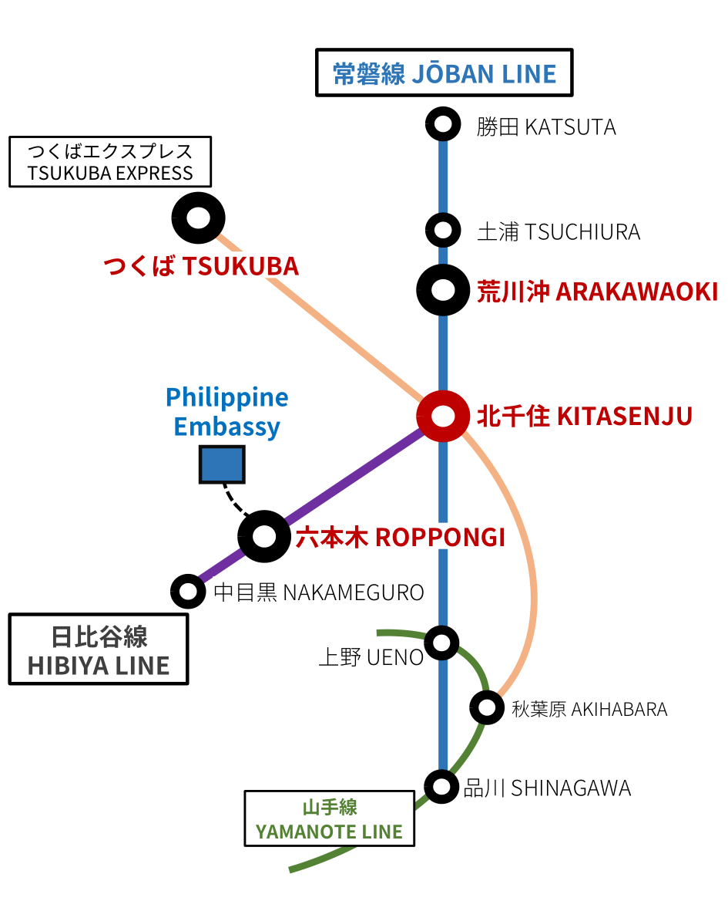

Related: [How to renew your Philippine passport in Japan (Tokyo)](https://timog.org/how-to-renew-philippine-passport-in-japan-tokyo/)

1. Get on the train at Tsuchiura or Arakawaoki Station (Jōban Line) going to Ueno or Shinagawa; or Tsukuba Station (Tsukuba Express Line) going to Akihabara.
2. Get off at Kitasenjū Station.
3. Ride the train on the Hibiya Line going to Nakameguro Station.
4. Get off at Roppongi Station and out through the No.3 exit.
5. Walk to the Philippine Embassy (Consular Section).

1. Sumakay sa tren sa Tsuchiura o Arakawaoki Station (Jōban Line) papuntang Ueno o Shinagawa; o sa Tsukuba Station (Tsukuba Express Line) papuntang Akihabara.
2. Bumaba sa Kitasenjū Station.
3. Sumakay sa tren sa Hibiya Line papuntang Nakameguro Station.
4. Bumaba sa Roppongi Station at lumabas mula sa No.3 exit.
5. Maglakad papunta sa Philippine Embassy (Consular Section).

### Walk from Roppongi Station's No.3 Exit to the Philippine Embassy



<iframe src="https://www.google.com/maps/embed?pb=!1m25!1m12!1m3!1d2805.748592312223!2d139.73469905975915!3d35.66150402285431!2m3!1f0!2f0!3f0!3m2!1i1024!2i768!4f13.1!4m10!3e2!4m3!3m2!1d35.662945199999996!2d139.7319952!4m4!1s0x60188b9e9de55555%3A0xd5260d0a2dd31685!3m2!1d35.6597949!2d139.73543379999998!5e0!3m2!1sen!2sjp!4v1649394294457!5m2!1sen!2sjp" width="600" height="450" style="border:0;" allowfullscreen="" loading="lazy" referrerpolicy="no-referrer-when-downgrade"></iframe>



