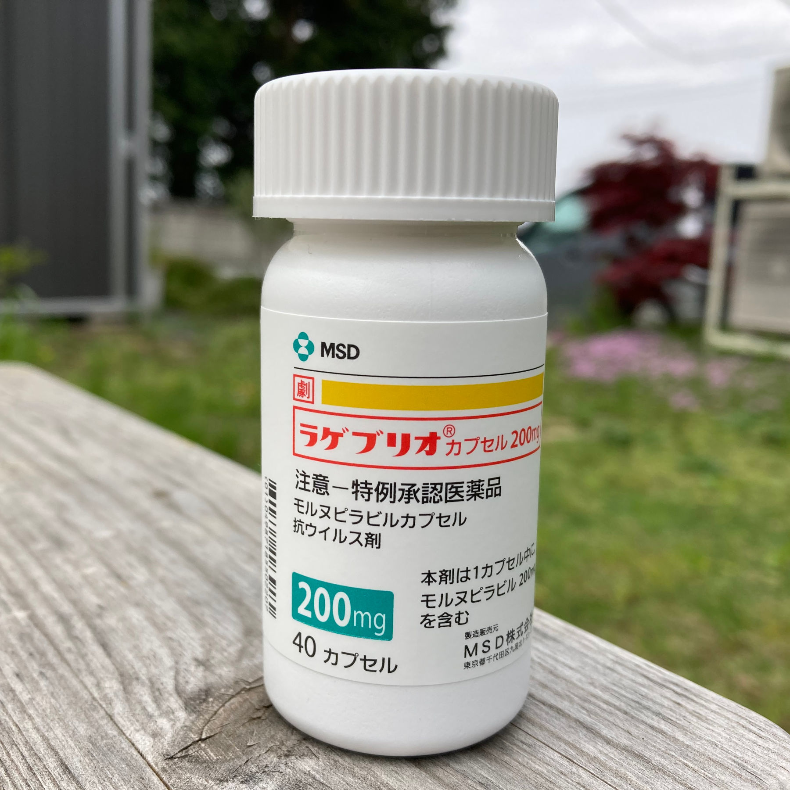

So my luck ran out, and even our [coronavirus omamori](https://timog.org/our-home-coronavirus-omamori-protecting-us-from-covid/) and usual prevention measures couldn't stop the inevitable and I came down with Covid-19, with mild symptoms.

Besides the usual medicines for cough and fever, I got this bottle of Lagevrio ラゲブリオ (generic name: molnupiravir), an experimental treatment of mild to moderate Covid for adults (18 years and older). Apparently, Lagevrio is the first oral antiviral drug against Covid-19, first approved in the UK.

One bottle contains forty 200mg-capsules of molnopiravir that should be taken for 5 days, 4 capsules per doze, twice a day, separated by more than 8 (although most websites say "12") hours of interval.

On its label is a notice that Lagevrio is a *specially approved medicine* (特例承認医薬品), which was approved by the relevant government ministry by relaxing the usual requirements for drug approval.

According to [Kotobank](https://kotobank.jp/word/%E7%89%B9%E4%BE%8B%E6%89%BF%E8%AA%8D-583042):

>If urgent measures are required to prevent the spread of health hazards such as the spread of diseases and there is no other appropriate method, based on Article 14-3 of the Pharmaceutical Affairs Law, the Minister of Health, Labor and Welfare may approve drugs and medical devices that have been approved for sale in countries that have the same level of approval system as Japan, by using a simple procedure than usual.

>In January 2010, the regulation was applied for the first time, for the special approval of imported vaccine for novel influenza.

Apparently, Lagevrio may induce a number of uncommon side effects like diarrhea, dizziness, headache, skin rash, nausea, redness of skin and vomiting.