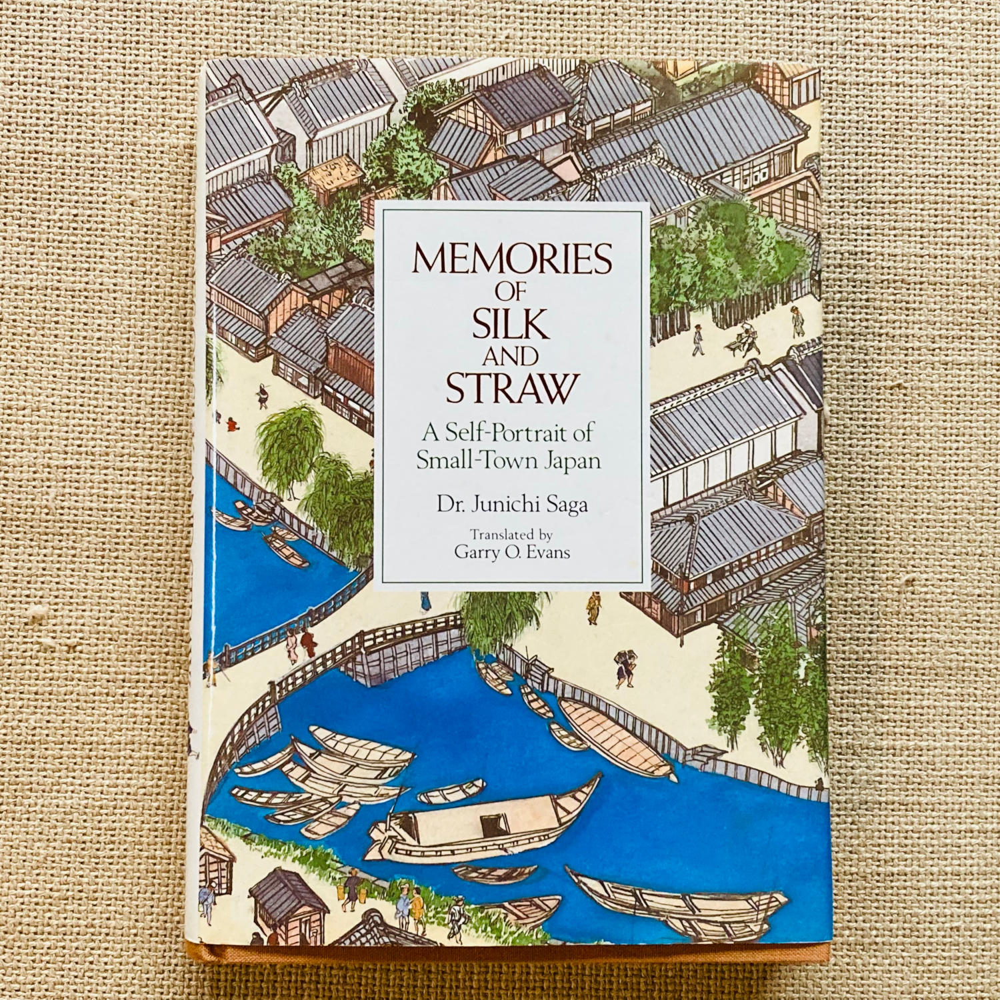

>I've done some pretty bad things in my life: I've been in dozens of fights, I was picked up by the police for gambling a few times, and I even committed murder. I've seen the inside of a good many jails, too, I can tell you. As I've got older, I've begun to realize how lousy and pointless my life's been, and every day now I pray to the statue of Buddha I've got set up at home. But when I die, there's no doubt I'll go straight to hell.

So opens *The Gangster*, one of the many fascinating stories of ordinary people in a small town in Japan, chronicled by Junichi Saga in his book Memories of Silk and Straw.

During one of the most exhausting period at my job a few weeks ago, I managed take a small break to stop by a nearby Book-Off and went home with this little gem of a book. And what do you know--it's about the stories of residents of Tsuchiura, Ibaraki Prefecture, next-door neighbor of Tsukuba where I live and just five minutes away by car.

I have never read a more engrossing book about Japan.

The book's author, Junichi Saga, is a doctor who shares his father's passion of recreating how Tsuchiura, his birthplace, looked and how its residents lived during the early decades of the 20th century. But while the older Saga did it with his paintings, the doctor did so through his countless interviews with people who actually lived in the area during those times.

Saga writes in the Introduction:

>Every day, after finishing work in my clinic, I would go out on foot around town visiting one elderly person after another, a portable tape recorder in my medical bag. The people I talked to came from all walks of life: day laborers, tradesmen, farmers, fishermen, *yakuza* (gansters), and geisha. Both in their attitudes and in the experiences they had undergone, they provided the sole surviving links with the feudal period which ended with the overthrow of the last shogun in 1868.

>Only forty or fifty years ago, poverty was a real and widespread fact of life here. In the memories of the old people in this book lies the story of the hardships Japan had to go through to reach its present position as an economic superpower. But amid all the poverty and unhappiness of those days, there also existed a strange kind of serenity which today seems to have been lost entirely.

Indeed, besides the fact that the stories happened not far from where I am living now, the thing that fascinates me about this book is that I have also experienced living in a small town (in the Philippines) when I was young. So the stories these elderly people narrate are both familiar and easily relatable, although separated from my own experiences by spans of time and culture.

The stories in the book can sometimes be brutally shocking, like this passage from *The Village Blacksmith*:

>Because everyone was so hard up around here, "thinning out" the newborn was quite widely practiced. The number of children killed just depended, I'm told, on how strict the local policeman was. The situation was so bad that the number of kids in each grade of the primary school varied a good deal, depending on who'd been the local constable at the time they were born.

... immediately followed by this charming anecdote:

>My family sometimes couldn't even afford the kerosene for a wick; so to provide the light to do my homework by, I often had to go out into the fields and collect fireflies, which I put in a paperbag. I'd hold the bag near my exercise book, and it would give off just about enough light for me to practice writing my Chinese characters.

There are many stories of grinding poverty, like one related in *The Midwife*:

>I remember one house I went to in Tsuchiura to deliver a baby where they had no *tatami* at all and the woman was lying on an old straw mat spread out on the bare wood floor. They didn't even have a bucket or washtub I could use. "What to you normally do your washing in?" I asked, and the husband told me they used an old fish tub they'd been given. "Well, I suppose we'll just have to make do with that. Wash the tub out thoroughly with hot water. Then boil up fresh water and pour it in." While they were doing this, the baby was born and the poor thing had to have its first bath in a fish tub; we then had to wrap it up in rags because that was all they could find for it to wear.

But through adversities big and small, the narrators themselves are the living proof of their endless will to survive and even thrive.

Saga writes that "Tsuchiura is a small, very unremarkable town" and indeed those same words aptly describe the present-day city I'm more acquainted with. But through these remarkable stories of hardship and resilience by its residents, this small, very unremarkable town in the northern outskirts of Tokyo has been vividly and memorably brought to life.

*Incidentally, while searching for information about this book, I found out that you could actually [borrow it](https://archive.org/details/memoriesofsilkst0000saga/) from Archive.org's virtual library. How cool is that?*