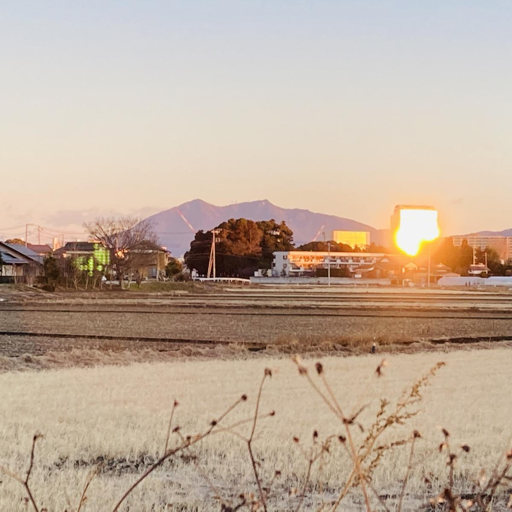

Lately, because of a Covid outbreak in the workplace, I've been trying to quasi-quarantine, coming home late and only to shower and sleep and leaving before most people are awake.

I've also been eating breakfast in the car in front of the local Seven Eleven which happens to have a nice view of Mount Tsukuba in the morning. Here's early-morning *Tsukuba-san* with a blazing building reflecting the first rays of the sunrise.

It's remarkable how grasses and weeds turn the lightest brown--almost white--during the winter and turn green back when the spring comes.