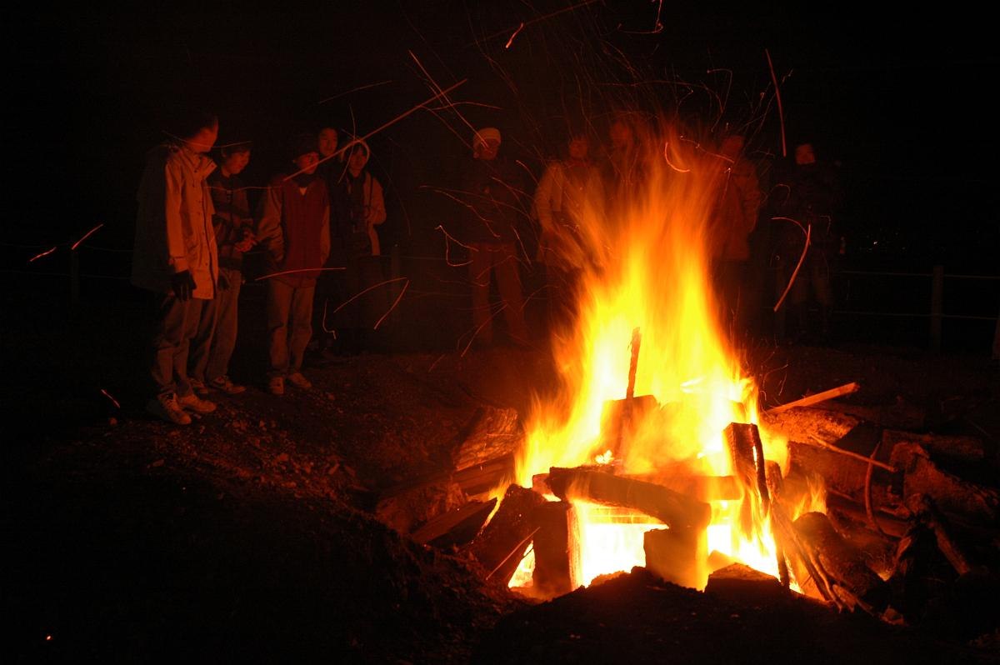

Today being New Year's day, I thought I might post another memorable climb of Mount Tsukuba that I did with my friend Chelo some years back.

I had done the same night-climb "solo" a few years before this. One New Year's day around 2AM, I drove to the parking lot of Mount Tsukuba halfway to the top thinking what a lonely thing it would be climbing a mountain at that ungodly hour. I shouldn't have worried, because there were so many people there was a 30-minute wait just to get inside the parking lot.

That day I went with Chelo was no different. There were lots of people everywhere: around Tsukuba Shrine, on the cable cars, even on the hiking trail itself.

.")

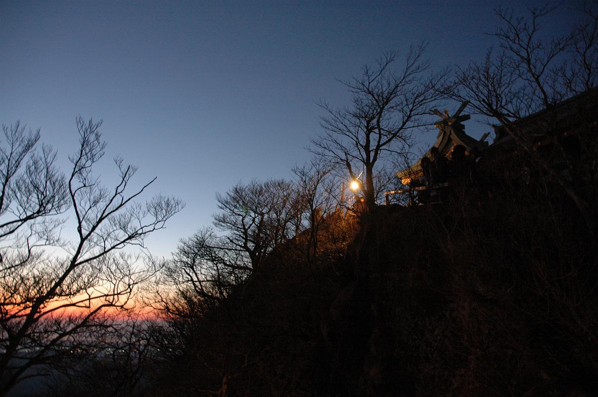

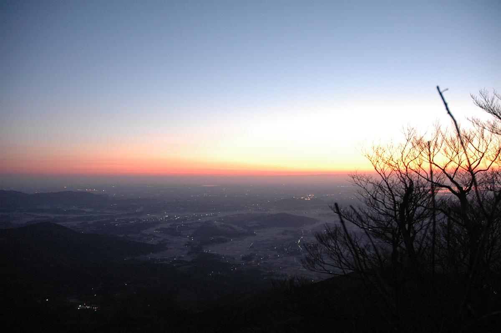

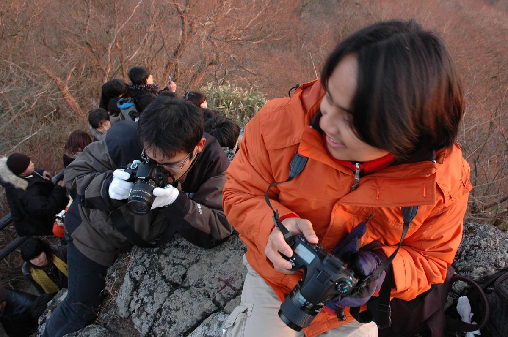

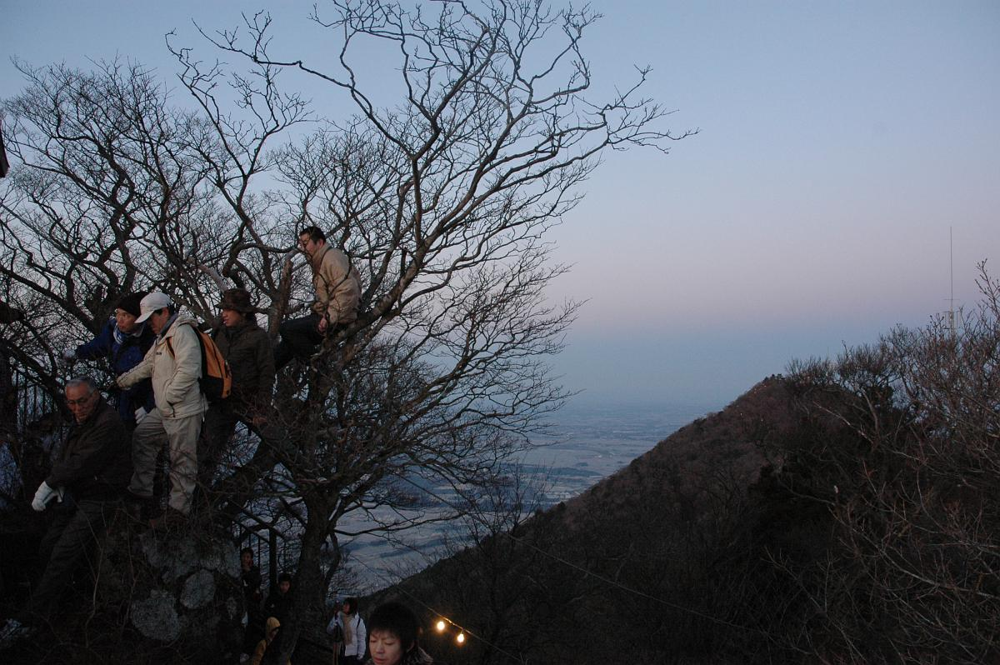

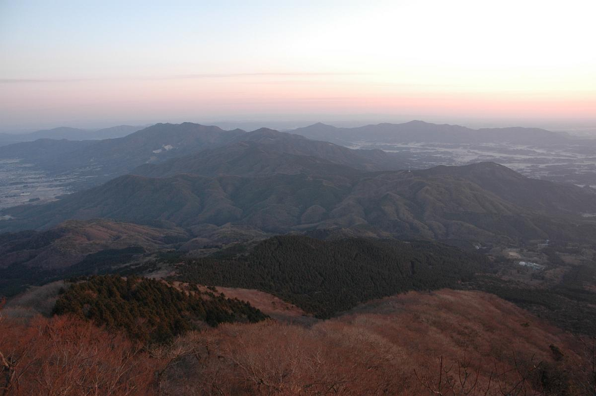

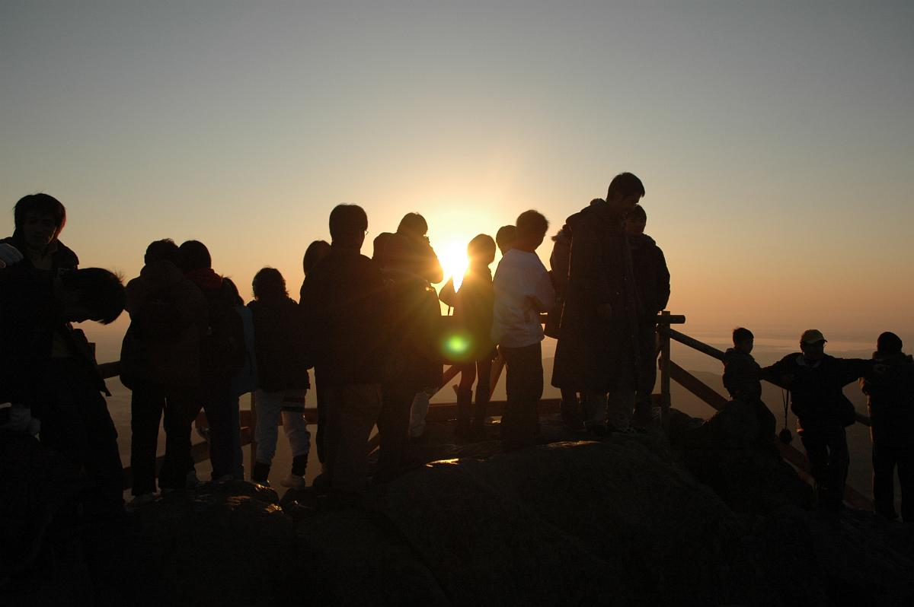

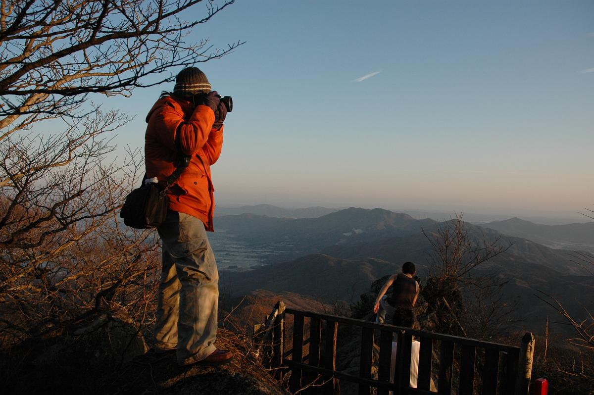

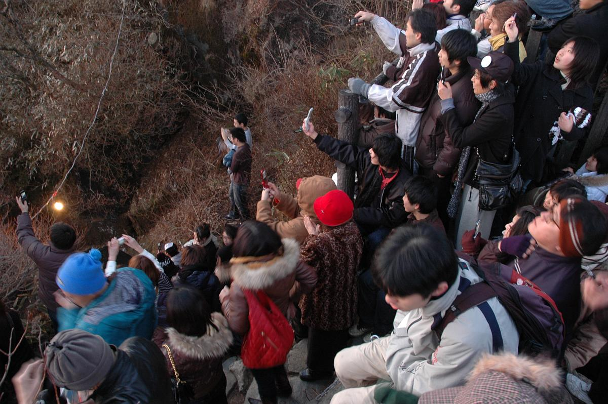

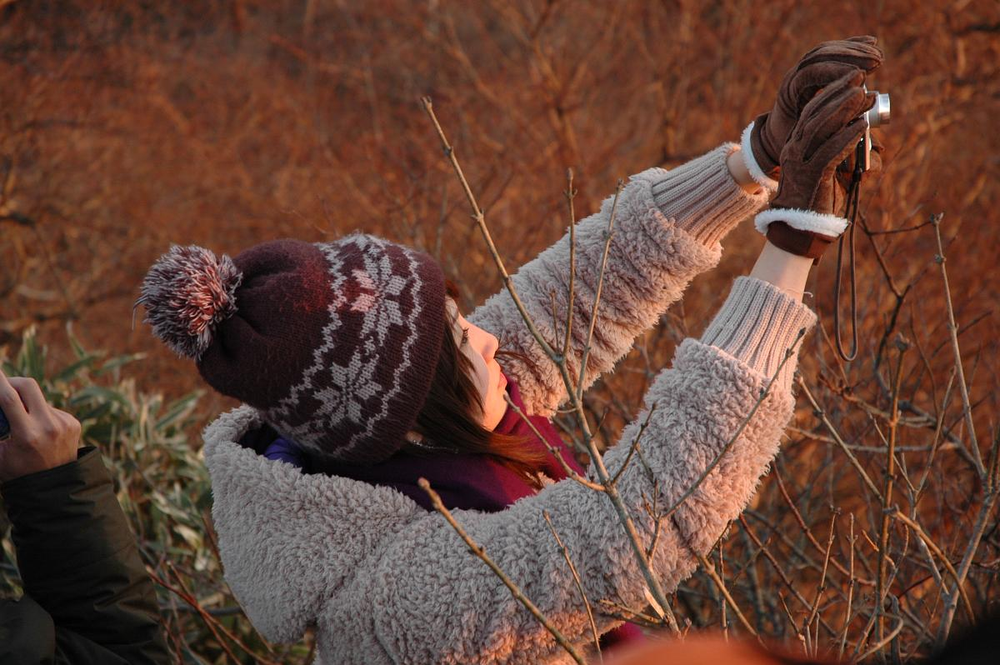

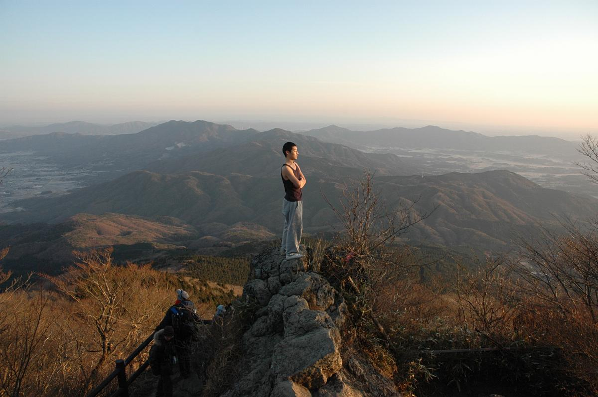

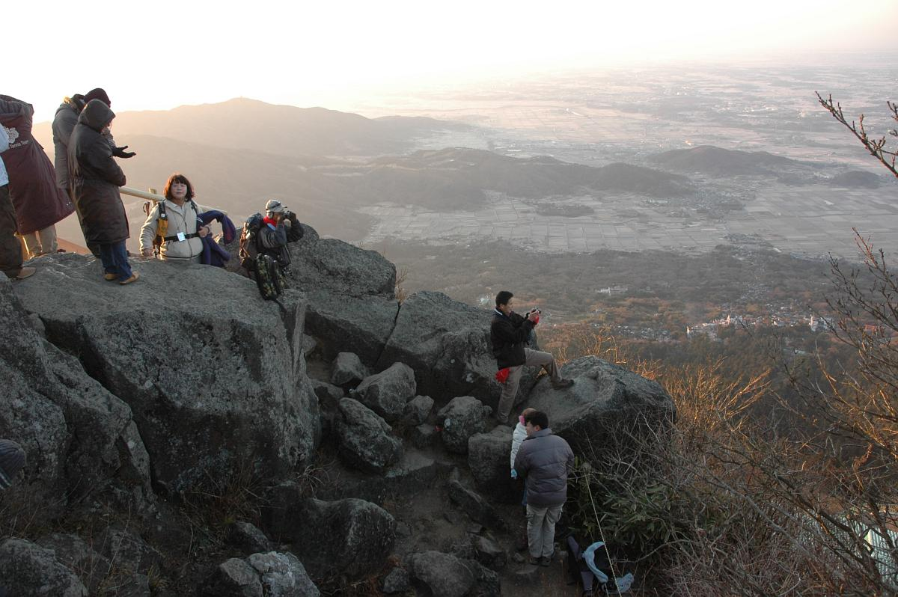

