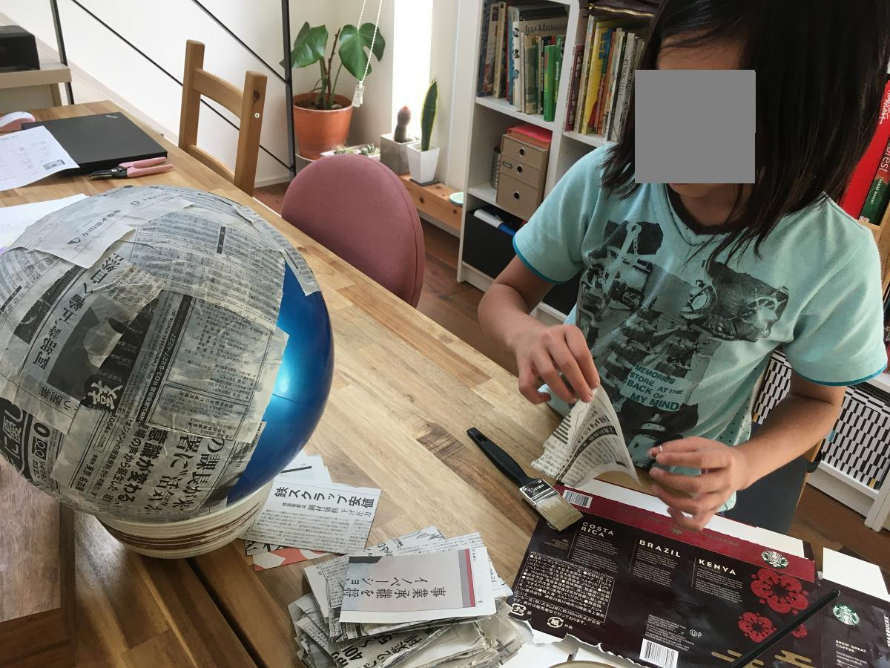

As we enter the third year of the Covid pandemic, I feel grateful that no one in the family has gotten Covid yet. It might be because we have avoided the [Three Cs](https://www.japan.go.jp/kizuna/2020/avoiding_the_three_cs.html) as much as we can, always used alcohol disinfectant and masks where appropriate and completely shunned eating out--not to mention getting two shots of the Covid vaccine.

But we also like to think it's because of the giant coronavirus *omamori* that we created during the height of the pandemic in 2020 protecting us from the real thing.

An *omamori* (お守り) is a Japanese amulet commonly sold at Shinto shrines and Buddhist temples that is believed to provide luck or protection ("mamoru" means "to protect").

During a few days of state of emergency in Japan in 2020 when everybody was holed up inside the house, we passed the time creating a 3,000,000x coronavirus replica made of paper mache (or papier-mâché, if you prefer). 

The 3,000,000x size is just about right: coronavirus [diameter is 100nm](https://www.ncbi.nlm.nih.gov/pmc/articles/PMC7224694/) and our replica is made from a 30cm ball.

While our *omamori* was not blessed by a Shinto or Buddhist priest, I'd like to think it is as potent as the real thing because it was a family project that made everyone realise the gravity of the pandemic and the need to protect oneself and others by taking preventive measures.

Not to mention it made a really cool decoration in the living room, where it still hangs.