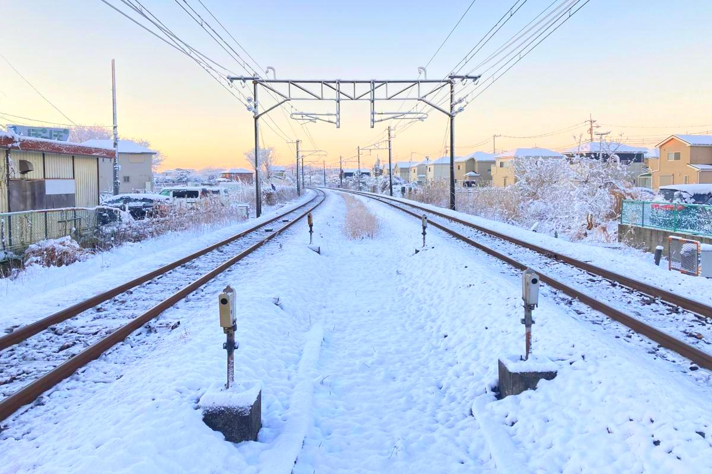
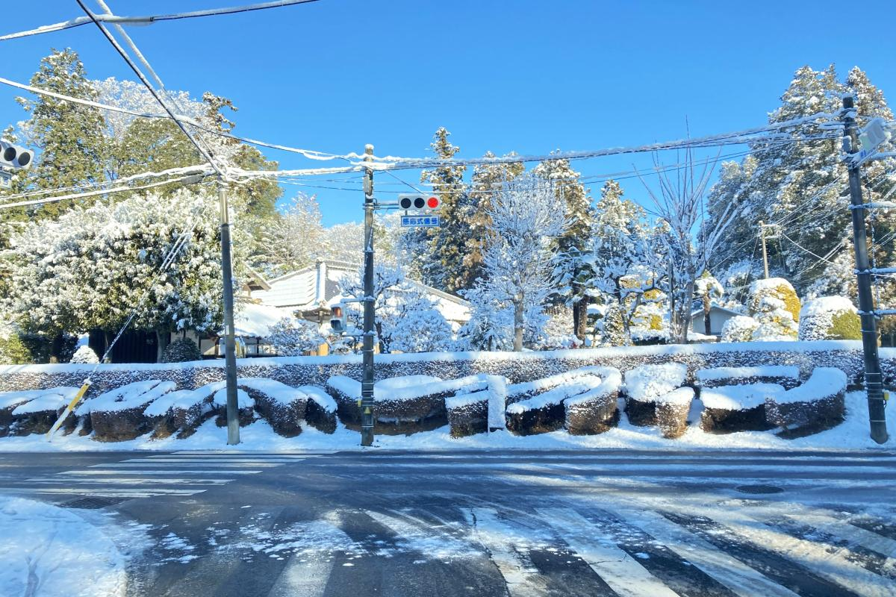

So Tokyo and the surrounding prefectures of the [Kantō area](/what-are-the-eight-regions-of-japan/#kantō-region) had an unusually [heavy snowfall](https://mainichi.jp/english/graphs/20220107/hpe/00m/0na/001000g/1) yesterday (first in 4 years), disrupting traffic and causing accidents and general inconvenience to motorists everywhere.

However, most of the snow have already melted at the end of the day, leaving just patches of dangerous hardened ice on shady places along the roads.

