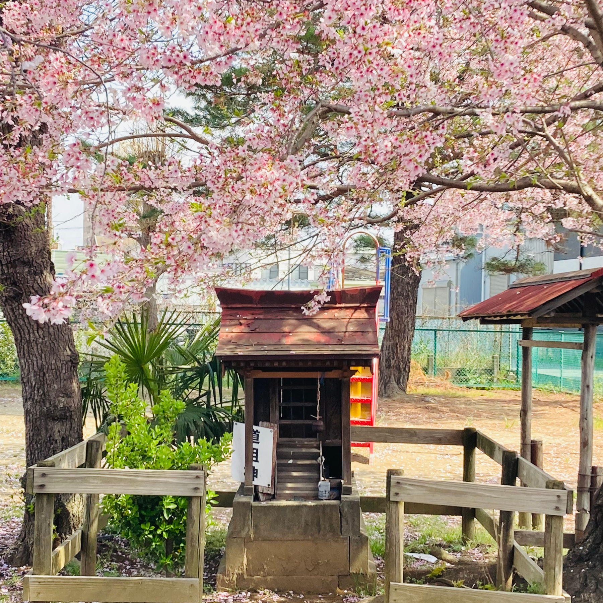

Bicycling on around Arakawaoki in Tsuchiura yesterday, we came upon this small shrine called *hokora*, which houses a Dōsojin 道祖神, Shinto deity believed to protect travellers and local communities from harm and evil spirits.

This particular *hokora* is inside a park and surrounded by sakura trees, now in full bloom in the spring sunshine.

Coincidentally, we were bicycling around the neighborhood in search of sakura trees, and when I saw these I instinctively turned my bicycle sharply, hitting a parked *kei* car and earning a slightly amused laughter from an *ojiisan* standing nearby. (The car was okay.)