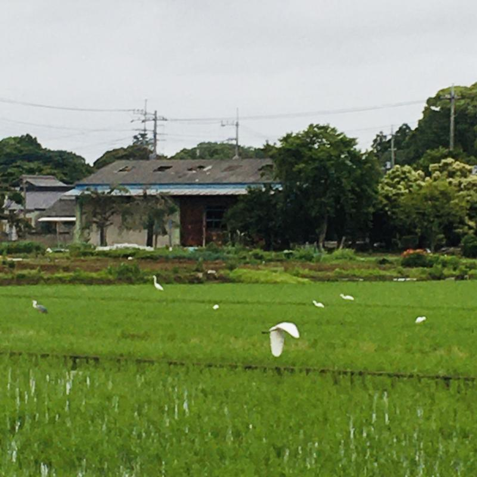

Kapag nilalabas ko ang basura sa umaga, tinitignan ko ang mga puting ibon sa bagong tanim na palayan (karamihan ay egret pero merong ding grey heron at ibang maliliit na ibon).

Iniisip kong ang main na pagkain nila ang mga palaka na maingay sa gabi pero tahimik sa umaga kapag nandito ang mga ibon na ito. Bukod sa palaka ay maliliit na insekto at crustacean.

Lately, hindi ko masyadong nakikita ang [green pheasant](https://timog.org/wiki/green-pheasant/) na laging pagala-gala sa paligid ng bahay tuwing umaga. Habang dumadami ang tao ay lalong lumiliit ang tirahan at hunting grounds ng mga ibon at maliliit na hayop.