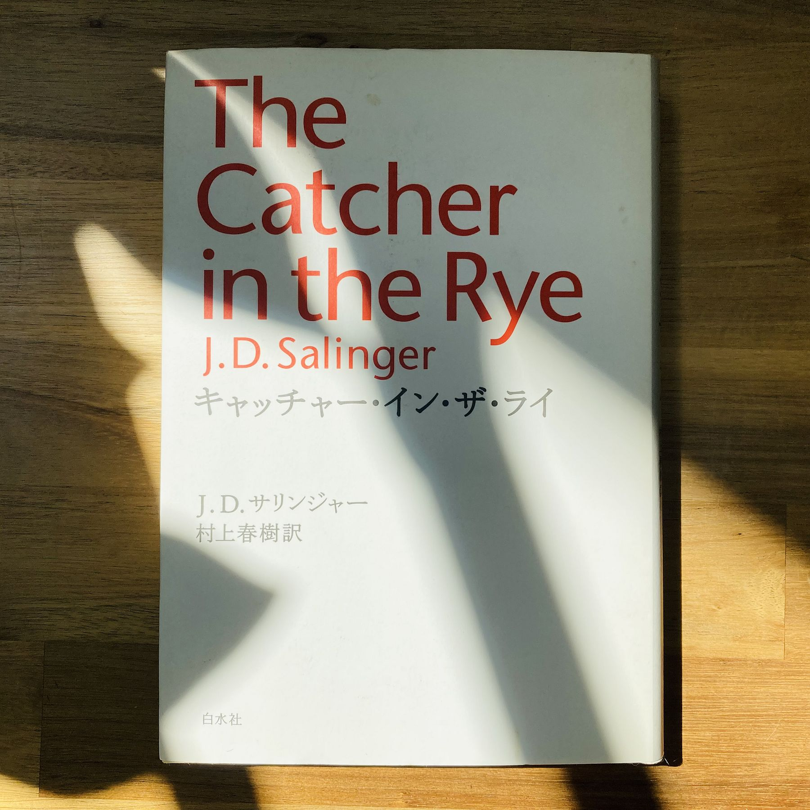

We've always had J. D. Salinger's novel in the house for as long as I can remember but I never got around to actually reading it until I came to Japan, and even then only because I bought the Japanese version (キャッチャー・イン・ザ・ライ) translated by Haruki Murakami.

I like to compare two versions of one book to see how the English is translated into Japanese, or vice versa. Here are the first sentences of the English version, and the translation in Japanese:	

>If you really want to hear about it, the first thing you'll probably want to know is where I was born, and what my lousy childhood was like, and how my parents were occupied and all before they had me, and all that David Copperfield kind of crap, but I don't feel like going into it, if you want to know the truth. In the first place, that stuff bores me, and in the second place, my parents would have about two hemorrhages apiece if I told anything pretty personal about them. They're quite touchy about anything like that, especially my father.

>こうして話を始めるとなると、君はまず最初に、僕はどこで生まれたかとか、どんなみっともない子ども時代を送ったかとか、僕が生まれる前に両親が何をしていたかとか、その手のデイヴィッド・カッパフィールド的なしょうもないあれこれを知りたがるかもしれない。でもはっきり言ってね、その手の話をする気になれないんだよ。そんなこと話したことろであくびが出るばっかりだし、それにだいたい僕がもしそういう家庭の内情みたいなのをちらっとでも持ち出したら、うちの両親はきっとそろって二度ずつ脳溢血を起こしちゃうと思う。そういうことに関してはなにしろ感じやすい人たちなんだ。とくに父親の方がね。

It's interesting to note that Murakami renders Charles Dickens’ David Copperfield as デイヴィッド・カッパフィールド when it's usually [デイヴィッド・コパフィールド](https://ja.wikipedia.org/wiki/%E3%83%87%E3%82%A4%E3%83%B4%E3%82%A3%E3%83%83%E3%83%89%E3%83%BB%E3%82%B3%E3%83%91%E3%83%95%E3%82%A3%E3%83%BC%E3%83%AB%E3%83%89) or even デイヴィッド・カッパーフィールド with the long vowel. Of course, he can probably do whatever he wants, being Murakami.

The Catcher in the Rye. It's a good book. It would have been even better if I read it in high school--but I was busy reading Steinbeck.