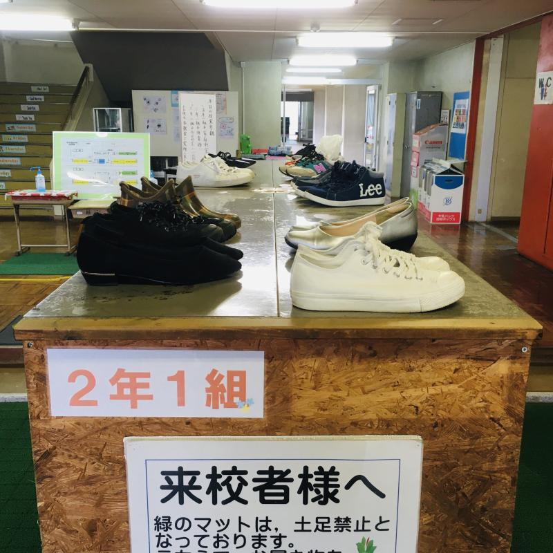
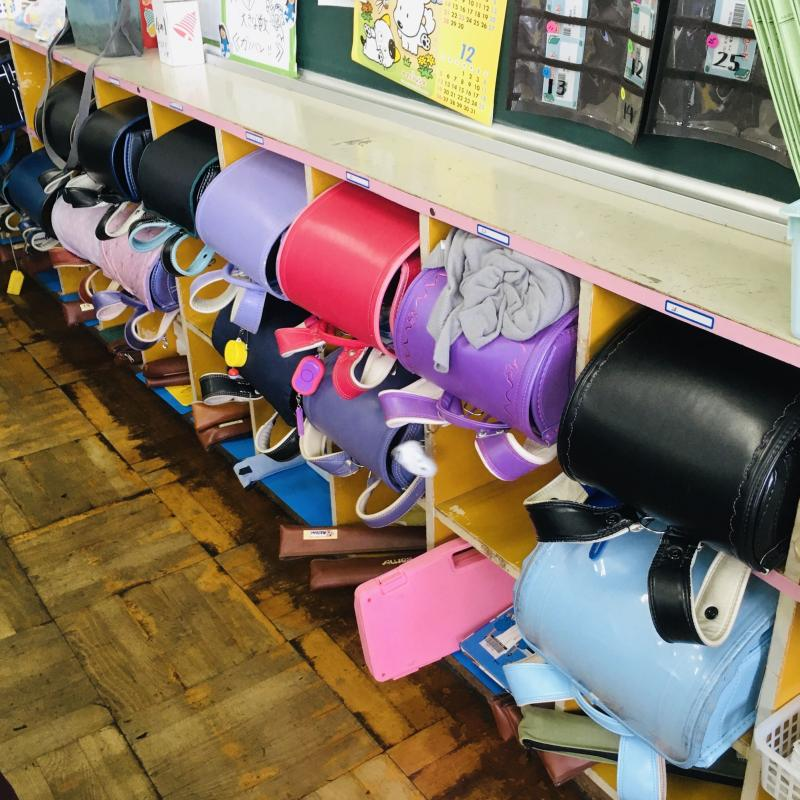
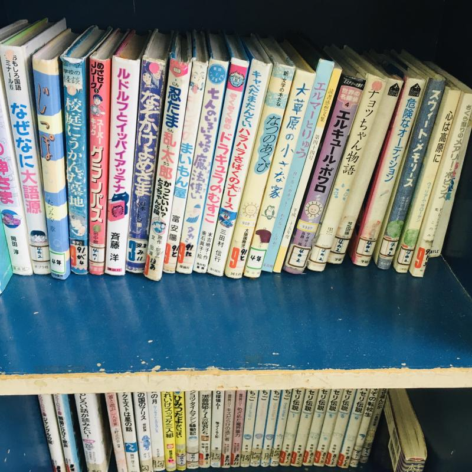

Wala akong dalang pampalit na sapatos o slippers kaya naglakad ako sa corridor nang nakamedyas lang.

*Randoseru*, melodica at recorder ng mga bata. Dati ay puro itim (lalaki) at pula (babae) lang ang mga ito; ngayon may iba't-ibang kulay na. 

Selection ng ba't-ibang libro sa shelves ng classroom.

- なぜなに大語源 (The Why-What Big Book of Word Origins)
- 校庭にうかんだ墓地 (Graveyard That Rose on the School Grounds)
- ルドルフとイッパイアッテナ (Rudolf and Ippaiattena)
- 忍たま乱太郎 (Nintama Rantaro)
- 七人のいろいろな魔法使い (The Seven Different Wizards)
- ドラキュラのむすこ (Dracula's Son)
- なつのあくび (Summer's Yawn)
- 大草原の小さな家 (Little House on the Prairie)
- エルマーとりゅう (Elmer and the Dragon)
- エルキュール・ポワロ (Hercule Poirot)
- チョッちゃん物語 (Chocchan's Story)
- 危険なオーディション (Dangerous Audition)
- スウィート・メモリーズ (Sweet Memories)
- 心は高原に (My Heart's in the Highlands)

**Plaza of the Heart:** Makakagawa ka ba ng mabuting bagay nang hindi nagdadalawang-isip？

Noong una nag-aalangan akong kumuha ng pictures habang nagka-klase pero naisip ko bakit hindi? basta hindi ko ipo-post sa Internet. Sensitive ang mga Hapon tungkol sa pagpopost sa Internet ng mga pictures at video na nakikita ang mukha o kahit na anong personal information.

Kaya siguro hindi masyadong popular sa Japan ang Facebook dahil sa mas private ang mga Hapon at estrikto ang pagpopost ng mga ganito sa Internet, hindi kagaya ng mga Pilipino na kung minsan kahit na baby pa lang ay may Facebook account na.